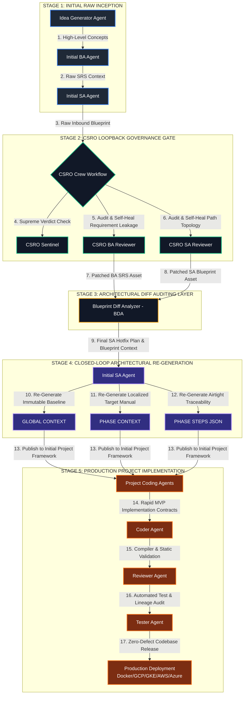

# 🌐 GLOBAL PIPELINE ARCHITECTURE

---

# CLOSED-LOOP RE-GENERATIVE AUTOMATED GOVERNANCE INFRASTRUCTURE

## 1. STAGE 1: INITIAL RAW INCEPTION
- **Idea Generator Agent**: Ingests high-level sector constraints, establishes the unique dynamic identity, generates target `technical_codename` identifiers, and compiles a lean MVP requirements overview as a baseline reference.
- **Initial BA Agent**: Ingests the ideation overview and expands it into the raw Software Requirements Specification (SRS), mapping functional and persistent attributes to systemic Tag IDs (`[REQ-XXX]`, `[DAT-XXX]`).
- **Initial SA Agent**: Parses the raw SRS to author the initial Global Context Blueprint baseline, establishing the early daily logs distribution matrix and workspace directory rules.

## 2. STAGE 2: CSRO PARALLEL ARBITRATION GATE
- **CSRO Sentinel**: Acts as the initial governance checkpoint, cross-checking timeline padding and chronologicalday ranges to instantly enforce systemic compliance gates.
- **CSRO BA Reviewer**: Conducts a line-by-line trace audit to intercept dropped features or creative scope-creep, outputting a clear evaluation report along with a clean, raw `patched BA` SRS asset.
- **CSRO SA Reviewer**: Audits path formatting rules and lower-case agent role anomalies, outputting an infrastructure compliance log along with a clean, raw `patched SA` blueprint asset.

## 3. STAGE 3: ARCHITECTURAL DIFF AUDITING LAYER
- **Blueprint Diff Analyzer (BDA)**: Intercepts the `patched BA` and `patched SA` assets from the preceding chặng. Executes cross-referencing comparisons between the original and modified baselines across three independent auditing layers (Traceability, Failure Mode, and Blind-Spot Sweeping), outputting the definitive engineering document: the **final SA** architectural context matrix containing the approved Hotfix Action Plan.

## 4. STAGE 4: CLOSED-LOOP ARCHITECTURAL RE-GENERATION
- **Initial SA Agent (Re-Generation Phase)**: Ingests the **final SA** evaluation contract from the BDA chặng as its absolute source-of-truth input. Runs an automated re-generation loop to rebuild the finalized technical specification architecture, publishing three pure, synchronized production contracts completely cleared of defects:
  * **GLOBAL CONTEXT**: The master repository blueprint governing overall stack boundaries and tech compliance.
  * **PHASE CONTEXT**: The localized phase-specific execution manual, dynamically embedded with verified descriptions and scope perimeters.
  * **PHASE STEPS JSON**: The high-density executable data framework lashing 100% full traceability parameters directly to Pydantic validation nodes.

## 5. STAGE 5: PRODUCTION PROJECT IMPLEMENTATION
- **Project Coding Agents**: Consume the published assets from the initial project framework directory to commence engineering activities.
- **Coder Agent**: Authors production-grade source code inside `./sources/`, inline-mapping the logic to the requirements tags and enforcing strict OWASP security guardrails.
- **Reviewer Agent**: Conducts static analysis and automated compiler verification loops over the codebase to eliminate structural path leaks or circular dependencies.
- **Tester Agent**: Processes semicolon-separated test pairs to run automated assertions (JUnit 5, Integration/E2E test beds), securing a 100% successful code coverage footprint over the specified requirement tags before clearing deployment hooks.
