Perform a complete project estimation, architectural costing analysis, automated Cloud OpEx projection, Jira-compliant task breakdown, and a mathematically derived financial risk registry based strictly on the provided documents. The entire output response, without any exception, MUST be rendered fully and exclusively in the target language specified by the variable: **{{ target_language }}**.

========================================================================
🚨 SYSTEM-WIDE ABSOLUTE MANDATE ON OUTPUT LANGUAGE (CRITICAL)
- The target language for the entire output report is strictly defined by the variable: "{{ target_language }}".
- EVERY single sentence, structural header, table cell, analytical commentary, parameter description, and text token OUTSIDE of raw JSON blocks and raw Mermaid code blocks MUST be rendered fully, naturally, and exclusively in "{{ target_language }}".
- Do NOT preserve any English static headers or layout templates from this prompt. Every title and label must be dynamically translated and written in "{{ target_language }}".
- Strictly DO NOT mix multiple languages or introduce any intermediate foreign commentary outside the designated code blocks. Failure to comply violates system governance.
========================================================================

### [Asset 1: Core Product Idea]
{{ raw_idea_content }}

### [Asset 2: Software Requirement Specification (SRS)]
{{ raw_srs_content }}

### [Asset 3: System Architecture Blueprint]
{{ raw_blueprint_content }}

### [Asset 4: Costing Controls & Benchmarks]
- Buffer Ratio Multiplier: {{ buffer_ratio }} (Add this safety margin to the max bounds: Safe Bound = Max Bound + Buffer)
- Target Output Language: {{ target_language }}
---

### 🛑 REAL-TIME SOURCING & TRIPLE-CHECK MATHEMATICAL DIRECTIVES:
You MUST execute your internal reasoning through 3 independent calculation passes and apply your web search tool. If your outputs fail these logic equations, the compilation pipeline will crash:

1. PASS 1 (Live Sourcing, Provenance Mapping & Sizing):
   - You MUST query the internet to capture real-time market standard pricing data for the current active calendar year:
     * Current exact USD to VND exchange rate.
     * Average market cost/salary per Man-Month (MM) for software engineers based on Corporate Enterprise environments and Freelancer Teams.
     * Current real-time monthly cost allocations for AI Dev Tooling & Token consumption (e.g., GitHub AI Credits, OpenAI API, Anthropic Claude Enterprise).
     * Current runtime compute, networking, and data egress pricing models for Google Cloud Platform (GCP) or AWS tailored to standard Kubernetes (GKE), clustered messaging queues, and database engines mentioned in the architecture.
   - For every rate captured, you MUST document the exact source details: Website Names, Live Destination URLs, and the Extraction Timestamp.

2. PASS 2 (AI Acceleration & Strict Logic Inequality Constraints):
   - Calculate total Man-Months, Project Duration, Total Labor Budget, and Cloud OpEx for all 4 scenarios.
   - Total Labor Budget for AI-Augmented scenarios MUST apply a strict 35% to 50% velocity reduction factor.
   - Calculate Cloud Infrastructure OpEx per month. Corporate Enterprise MUST reflect multi-region GKE high-availability pricing setups, while Freelancer reflects single-instance node VPS setups.
   - CRITICAL INEQUALITY RULE: (AI-Augmented Total Labor Budget) MUST BE STRICTLY LESS THAN (Traditional Human-Only Total Labor Budget) and (AI-Augmented Months) MUST BE STRICTLY LESS THAN (Traditional Human-Only Months). They CANNOT under any circumstances be equal.
   - Formula for Safety Margin: Buffer = Base Max Value * Buffer Ratio Multiplier; Safe Bound = Max Bound + Buffer. This formula applies independently to Labor Costs, Timelines, and Cloud OpEx arrays.
   - Ensure range continuity across all metrics: Min Bound < Max Bound < Safe Bound.

3. PASS 3 (Cross-Currency Verification & Monte Carlo Risk Costing):
   - Convert all calculated USD figures into VND using your real-time extracted exchange rate. Cross-check that for every range boundary: (VND Value) / (USD Value) = Exchange Rate EXACTLY.
   - Financial Impact in Section 5 MUST be mathematically derived from the sourced Man-Month rates multiplied by the projected Resource Impact (Man-Months) required for risk remediation, simulating a worst-case additive compounding scenario.
   - Every single numerical value displayed in the Markdown Section 3 MUST match the values provided in the JSON Section 7 exactly.

---

### 📋 MANDATORY OUTPUT STRUCTURE (MARKDOWN REPORT):
Every header and cell item below must be translated and rendered into "{{ target_language }}":

# [Render_Main_Report_Title_In_Target_Language]

#### [Render_Document_Information_Header_In_Target_Language]

| [Render_Component_In_Target_Language] | [Render_Details_In_Target_Language] |
| :--- | :--- |
| **Report ID** | AUDIT-{{ current_timestamp_2 }} |
| **Idea ID** | {{ idea_id }} |
| **Project Name** | {{ project_name }} |
| **Project Description** | {{ project_description }} |
| **Version** | 1.0 (Automated Governance) |
| **Date/Time** | {{ current_timestamp }} |
| **Author** | Chief Solution Review Officer (CSRO Agent) |
| **Approval** | Certified by Enterprise Technical Governance Board |

#### SECTION 1: DOCUMENT CONTROL & PROVENANCE METADATA
Dynamically inject the real-time sourced values and their exact data lineage details into this table (Translate table headers and parameters into "{{ target_language }}"):

| [Render_Audit_Parameter_In_Target_Language] | [Render_Information_Details_In_Target_Language] |
| :--- | :--- |
| **Live Exchange Rate Applied** | 1 USD = [Insert Exact Integer Rate Found Online] VND |
| **Enterprise Cost / Man-Month** | $[Insert Current Market Enterprise Rate Found Online] USD / Month |
| **Freelancer Cost / Man-Month** | $[Insert Current Market Freelancer Rate Found Online] USD / Month |
| **Sourced AI Tooling Allocation / Month** | Enterprise: $[Insert Online Found Rate] USD | Freelance: $[Insert Online Found Rate] USD |
| **Sourced Cloud Infrastructure Benchmarks** | Enterprise Multi-Region GKE: $[Rate]/mo | Freelancer VPS: $[Rate]/mo |
| **Computation Timestamp** | [Insert System Execution Date/Time] |
| **Data Provenance Sources & Links** | [Insert Website Names and Live URLs for exchange rate, developer salary, cloud providers, and AI subscription packages] |
| **Verification Method** | Independent Multi-Layer Triple-Check (Pass 1 -> Pass 2 -> Pass 3) |
| **Status** | Sourced, Audited & Validated |

#### SECTION 2: RESOURCE CAPACITY PLANNING & SKILL MATRIX
In "{{ target_language }}", provide a highly granular engineering capacity planning and necessary technical skill matrix. 
1. List required engineering roles (Backend, Frontend, QA, DevOps).
2. Allocate specific Man-Months for both Traditional vs AI-Augmented paths across both operational models.
3. Explicitly list the target expertise level (Junior/Mid/Senior) and necessary technology stacks derived from the System Architecture Blueprint.

#### SECTION 3: FINANCIAL BUDGET, CLOUD OPEX & TIMELINE PROJECTIONS
> 📝 [Render_Currency_Audit_Notice_In_Target_Language]: All calculations below explicitly utilize the real-time extracted exchange rate: **1 USD = {{ exchange_rate }} VND**.

##### 1. Corporate Enterprise Model
- **Traditional Human-Only Total Budget**:
  - USD: $[Min_USD] - $[Max_USD] | Safe: $[Safe_USD] USD
  - VND: [Min_VND] - [Max_VND] | Safe: [Safe_VND] VND
- **AI-Augmented Total Budget**:
  - USD: $[Min_USD] - $[Max_USD] | Safe: $[Safe_USD] USD
  - VND: [Min_VND] - [Max_VND] | Safe: [Safe_VND] VND
- **Monthly Cloud Infrastructure OpEx Projection**:
  - USD: $[Min_USD] - $[Max_USD] | Safe: $[Safe_USD] USD / Month
  - VND: [Min_VND] - [Max_VND] | Safe: [Safe_VND] VND / Month

##### 2. Freelancer Team Model
- **Traditional Human-Only Total Budget**:
  - USD: $[Min_USD] - $[Max_USD] | Safe: $[Safe_USD] USD
  - VND: [Min_VND] - [Max_VND] | Safe: [Safe_VND] VND
- **AI-Augmented Total Budget**:
  - USD: $[Min_USD] - $[Max_USD] | Safe: $[Safe_USD] USD
  - VND: [Min_VND] - [Max_VND] | Safe: [Safe_VND] VND
- **Monthly Cloud Infrastructure OpEx Projection**:
  - USD: $[Min_USD] - $[Max_USD] | Safe: $[Safe_USD] USD / Month
  - VND: [Min_VND] - [Max_VND] | Safe: [Safe_VND] VND / Month

##### 3. Delivery Timeline Duration Projections
Output the calendar months range for all 4 scenarios in "{{ target_language }}". AI-Augmented paths MUST be 35% - 50% shorter than Traditional paths.
- Corporate Enterprise (Traditional Human-Only): [Min - Max | Safe] Calendar Months
- Corporate Enterprise (AI-Augmented): [Min - Max | Safe] Calendar Months
- Freelancer Team (Traditional Human-Only): [Min - Max | Safe] Calendar Months
- Freelancer Team (AI-Augmented): [Min - Max | Safe] Calendar Months

#### SECTION 4: ARCHITECTURAL COST JUSTIFICATION & JIRA WBS ROADMAP
In "{{ target_language }}", deliver a deep analytical justification mapping technical choices to cost boundaries.
1. **Four Structural Pillars**: Break down the financial delta using Operational Overhead, Security Boundaries (mTLS, WAF, Argon2id, SHA-256), HA/DR Topology (Multi-region GKE vs Single VPS), and Data Isolation (`Database-per-tenant`).
2. **Jira-Compliant Work Breakdown Structure (WBS)**: Generate a structural, nested hierarchical roadmap mapped into three tiers: Epic, Task, and Sub-task. Ensure architecture implementation blocks (e.g., configuring mTLS routing, dynamic schema migration) are explicitly broken down as actionable, discrete tickets.

#### SECTION 5: PROJECT RISK REGISTRY & COMPOUNDING IMPACT MATRIX
Render this table in "{{ target_language }}". Financial Impact and Resource Impact MUST be mathematically calculated using Pass 3 directives to simulate compounding operational worst-case failure models:

| Risk ID | Description | Severity | Financial Impact (USD / VND) | Resource Impact (Man-Months) | Worst-Case Additive Cost | Concrete Mitigation Strategy |
| :--- | :--- | :--- | :--- | :--- | :--- | :--- |
| R-001 | | | | | | |

#### SECTION 6: ARCHITECTURAL DATA VISUALIZATION (NATIVE MERMAID CHARTS)
*CRITICAL MANDATE FOR SYNTAX COMPLIANCE*: You MUST generate clean, functional, and valid Mermaid.js blocks.
- ALL text labels, title keys, quadrant strings, and task details INSIDE the mermaid code blocks MUST be written in plain, unaccented English (e.g., "Min Cost", "Max Cost", "Safe Cost").
- DO NOT insert translated or accented characters inside the mermaid blocks, otherwise the compilation pipeline will crash.

##### Chart A: Financial Cost Boundary Matrix (USD)
Use the official `xychart-beta` syntax. You MUST dynamically evaluate your calculated labor costs to determine the upper bound value for the y-axis. Replace the y-axis placeholder with the nearest rounded integer representing thousands of USD based on your actual Safe Cost calculation pass. Output raw integer series arrays representing the three sequential points [Min, Max, Safe] for each scenario under the bar directive.
```mermaid
xychart-beta
title "Total Cost Comparison Bounds (in Thousands USD)"
x-axis ["Min Cost", "Max Cost", "Safe Cost"]
y-axis "USD (Thousands)"
0 --> [Insert_Dynamic_Y_Axis_Maximum_Integer]
bar [Min_Int, Max_Int, Safe_Int]
bar [Min_Int, Max_Int, Safe_Int]
bar [Min_Int, Max_Int, Safe_Int]
bar [Min_Int, Max_Int, Safe_Int]
```

##### Chart B: Project Delivery Timeline (Dynamic Gantt Chart)
Define unique milestone IDs for each section to isolate dependencies. Use `dateFormat X` and present calculated schedules using raw numeric days offsets matching your Pass 2 execution parameters.

```mermaid
gantt
title Project Timeline Acceleration Matrix
dateFormat X
axisFormat %d days
section Enterprise Traditional
Phase 1 Execution :ent_p1, 0, [Insert_Calculated_Days_Int]
Phase 2 Execution :ent_p2, after ent_p1, [Insert_Calculated_Days_Int]
section Enterprise AI
Phase 1 Execution :ent_ai1, 0, [Insert_Calculated_Days_Int]
Phase 2 Execution :ent_ai2, after ent_ai1, [Insert_Calculated_Days_Int]
```


##### Chart C: Risk Assessment Severity Matrix
Use the official `quadrantChart` syntax with English coordinates. Map identified system engineering risks dynamically using exact calculated probability and impact float floats inside the boundary elements.
```mermaid
quadrantChart
title Risk Assessment Matrix (Probability vs Impact)
x-axis "Low Probability" --> "High Probability"
y-axis "Low Impact" --> "High Impact"
quadrant-1 "Critical Risks"
quadrant-2 "Major Risks"
quadrant-3 "Minor Risks"
quadrant-4 "Monitor Risks"
"R-001: Data Leakage" : [Insert_Probability_Float, Insert_Impact_Float]
```

#### SECTION 7: VISUALIZATION METADATA FOR BACKEND PROCESSING
*CRITICAL*: Provide a clean, single-level flat valid JSON metadata block at the absolute end of the response. Do NOT use multi-dimensional nested arrays. Output numbers as flat floats or ints inside single arrays representing the 3 sequential points [Min, Max, Safe] for each scenario.



```json
{{ open_json }}
"exchange_rate": [Insert_Raw_Sourced_Exchange_Rate_Float],
"enterprise_human_cost_usd": [Min_Enterprise_Human_USD_Float, Max_Enterprise_Human_USD_Float, Safe_Enterprise_Human_USD_Float],
"enterprise_ai_cost_usd": [Min_Enterprise_AI_USD_Float, Max_Enterprise_AI_USD_Float, Safe_Enterprise_AI_USD_Float],
"freelance_human_cost_usd": [Min_Freelance_Human_USD_Float, Max_Freelance_Human_USD_Float, Safe_Freelance_Human_USD_Float],
"freelance_ai_cost_usd": [Min_Freelance_AI_USD_Float, Max_Freelance_AI_USD_Float, Safe_Freelance_AI_USD_Float],
"enterprise_human_months": [Min_Enterprise_Human_Months_Float, Max_Enterprise_Human_Months_Float, Safe_Enterprise_Human_Months_Float],
"enterprise_ai_months": [Min_Enterprise_AI_Months_Float, Max_Enterprise_AI_Months_Float, Safe_Enterprise_AI_Months_Float],
"freelance_human_months": [Min_Freelance_Human_Months_Float, Max_Freelance_Human_Months_Float, Safe_Freelance_Human_Months_Float],
"freelance_ai_months": [Min_Freelance_AI_Months_Float, Max_Freelance_AI_Months_Float, Safe_Freelance_AI_Months_Float],
"enterprise_cloud_opex_usd": [Min_Enterprise_Cloud_USD_Float, Max_Enterprise_Cloud_USD_Float, Safe_Enterprise_Cloud_USD_Float],
"freelance_cloud_opex_usd": [Min_Freelance_Cloud_USD_Float, Max_Freelance_Cloud_USD_Float, Safe_Freelance_Cloud_USD_Float]
{{ close_json }}
```
