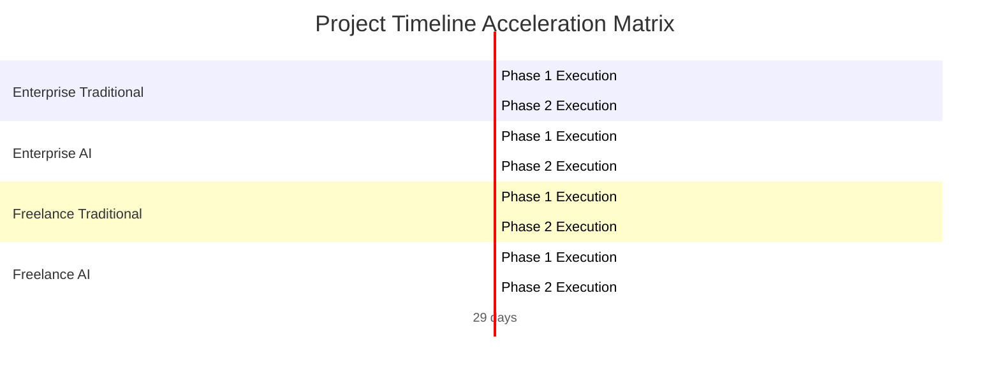

Perform a complete project estimation, architectural costing analysis, and financial risk registry based strictly on the provided documents. The entire output response, without a single exception, MUST be written fully and exclusively in the target language defined by the variable: **{{ target_language }}**.

========================================================================
🚨 SYSTEM GOVERNANCE MANDATE ON OUTPUT LANGUAGE (STRICT LOCKDOWN)
- The target language for this entire execution is: "{{ target_language }}".
- EVERY single word, header, table cell, analysis, and sentence OUTSIDE of raw JSON and Mermaid code blocks MUST be rendered fully and exclusively in "{{ target_language }}".
- CRITICAL FORMATTING RULE: When rendering currency or numbers in "{{ target_language }}", you MUST strictly use plain integer numbers or standard dot separators (e.g., write 2928580000 or 2.928.580.000). Never insert text artifacts, question marks, or broken symbols (like ?,?) inside tables or data parameters.
- Any output containing foreign language leakage or formatting corruption outside code blocks will fail the compilation audit.
========================================================================

### [Asset 1: Core Product Idea]
{{ raw_idea_content }}

### [Asset 2: Software Requirement Specification (SRS)]
{{ raw_srs_content }}

### [Asset 3: System Architecture Blueprint]
{{ raw_blueprint_content }}

### [Asset 4: Costing Controls & Benchmarks]
- Buffer Ratio Multiplier: {{ buffer_ratio }}
- Target Output Language: {{ target_language }}

---

### 🛑 REAL-TIME SOURCING & TRIPLE-CHECK MATHEMATICAL DIRECTIVES:
You MUST execute your internal reasoning through 3 independent calculation passes and apply your web search tool. If your outputs fail these logic equations, the compilation pipeline will crash:

1. PASS 1 (Live Sourcing & Provenance Mapping):
   - Query the internet to capture real-time market standard pricing data for the current calendar year: exact USD to VND exchange rate, average market cost/salary per Man-Month (MM) for engineers (Corporate vs Freelance), and real-time monthly cost allocations for AI Dev Tooling/Tokens.
   - Document the exact source details: Website Names, Live Destination URLs, and the Extraction Timestamp.

2. PASS 2 (AI Acceleration & Strict Logic Inequality Constraints):
   - Total Labor Budget for AI-Augmented scenarios MUST apply a strict 35% to 50% velocity reduction factor.
   - Calculate Monthly Cloud Infrastructure OpEx. Corporate Enterprise MUST reflect multi-region GKE HA pricing, while Freelancer reflects single-instance VPS setups.
   - CRITICAL INEQUALITY: (AI-Augmented Total Budget) < (Traditional Human-Only Total Budget) and (AI-Augmented Months) < (Traditional Human-Only Months). They CANNOT be equal.
   - Formula for Safety Margin: Buffer = Base Max Value * Buffer Ratio Multiplier; Safe Bound = Max Bound + Buffer.

3. PASS 3 (Cross-Currency Verification & Strict Number Formatting):
   - Convert all calculated USD figures into VND using your real-time extracted exchange rate. Cross-check that for every range boundary: (VND Value) / (USD Value) = Exchange Rate EXACTLY.
   - CRITICAL: Every numerical value displayed in the Markdown report tables MUST be written using pure plain digits or clear dot notations (e.g., 5336100000). Absolutely no corrupted symbols like "?" or ",?" are allowed. Values in Section 3 MUST match Section 7 exactly.

---

### 📋 MANDATORY OUTPUT STRUCTURE (MARKDOWN REPORT):
Every header and table parameter below MUST be translated and naturally rendered into "{{ target_language }}":

# PROJECT ESTIMATION & RISK REGISTRY REPORT

#### REPORT METADATA INFORMATION

| Parameter | Details |
| :--- | :--- |
| **Report ID** | AUDIT-{{ current_timestamp_2 }} |
| **Idea ID** | {{ idea_id }} |
| **Project Name** | {{ project_name }} |
| **Project Description** | {{ project_description }} |
| **Version** | 1.0 (Automated Governance) |
| **Date/Time** | {{ current_timestamp }} |
| **Author** | Chief Solution Review Officer (CSRO Agent) |
| **Approval** | Certified by Enterprise Technical Governance Board |

#### SECTION 1: DOCUMENT CONTROL & PROVENANCE METADATA
Dynamically inject the real-time sourced values and their exact data lineage details into this table (Translate table headers and parameters fully into "{{ target_language }}"):

| Audit Parameter | Information Details |
| :--- | :--- |
| **Live Exchange Rate Applied** | 1 USD = [Insert Raw Digit Rate] VND |
| **Enterprise Cost / Man-Month** | $[Insert Raw Digit Rate] USD / Month |
| **Freelancer Cost / Man-Month** | $[Insert Raw Digit Rate] USD / Month |
| **Sourced AI Tooling Allocation / Month** | Enterprise: $[Insert Raw Digit Rate] USD | Freelance: $[Insert Raw Digit Rate] USD |
| **Sourced Cloud Infrastructure Benchmarks** | Enterprise Multi-Region GKE: $[Rate]/mo | Freelancer VPS: $[Rate]/mo |
| **Computation Timestamp** | [Insert System Execution Date/Time] |
| **Status** | Sourced, Audited & Validated |

**Footnotes & Sources:**
- [Insert clean Markdown links for sources without lengthy raw URLs]

#### SECTION 2: RESOURCE CAPACITY PLANNING & SKILL MATRIX
In "{{ target_language }}", provide a highly granular engineering capacity planning and necessary technical skill matrix. List all required engineering roles (Backend, Frontend, QA, DevOps), allocate specific Man-Months for both Traditional vs AI-Augmented paths, and list the target expertise level (Junior/Mid/Senior) with tech stacks.

#### SECTION 3: FINANCIAL BUDGET, CLOUD OPEX & TIMELINE PROJECTIONS
> 📝 [Render Currency Audit Notice In "{{ target_language }}"]: All calculations below explicitly utilize the real-time extracted exchange rate: **1 USD = {{ exchange_rate }} VND**.

##### 1. Corporate Enterprise Model

| Scenario / Metric | Budget Range (USD) | Budget Range (VND) | Safe Bound (USD / VND) |
| :--- | :--- | :--- | :--- |
| **Traditional Human-Only Labor** | $[Min_USD] - $[Max_USD] | [Min_VND] - [Max_VND] | $[Safe_USD] USD / [Safe_VND] VND |
| **AI-Augmented Labor** | $[Min_USD] - $[Max_USD] | [Min_VND] - [Max_VND] | $[Safe_USD] USD / [Safe_VND] VND |
| **Monthly Cloud Infrastructure OpEx** | $[Min_USD] - $[Max_USD] / mo | [Min_VND] - [Max_VND] / mo | $[Safe_USD] USD / [Safe_VND] VND per mo |

##### 2. Freelancer Team Model

| Scenario / Metric | Budget Range (USD) | Budget Range (VND) | Safe Bound (USD / VND) |
| :--- | :--- | :--- | :--- |
| **Traditional Human-Only Labor** | $[Min_USD] - $[Max_USD] | [Min_VND] - [Max_VND] | $[Safe_USD] USD / [Safe_VND] VND |
| **AI-Augmented Labor** | $[Min_USD] - $[Max_USD] | [Min_VND] - [Max_VND] | $[Safe_USD] USD / [Safe_VND] VND |
| **Monthly Cloud Infrastructure OpEx** | $[Min_USD] - $[Max_USD] / mo | [Min_VND] - [Max_VND] / mo | $[Safe_USD] USD / [Safe_VND] VND per mo |

##### 3. Delivery Timeline Duration Projections
Output the calendar months range for all 4 scenarios in "{{ target_language }}". AI-Augmented paths MUST be 35% - 50% shorter than Traditional paths.
- Corporate Enterprise (Traditional Human-Only): [Min - Max | Safe] Calendar Months
- Corporate Enterprise (AI-Augmented): [Min - Max | Safe] Calendar Months
- Freelancer Team (Traditional Human-Only): [Min - Max | Safe] Calendar Months
- Freelancer Team (AI-Augmented): [Min - Max | Safe] Calendar Months

#### SECTION 4: ARCHITECTURAL COST JUSTIFICATION & JIRA WBS ROADMAP
In "{{ target_language }}", deliver a deep analytical justification mapping technical choices to cost boundaries. Break down the financial delta using Operational Overhead, Security Hardening Boundaries (mTLS, WAF, Argon2id, SHA-256), HA/DR Topology (Multi-region GKE vs Single VPS), and Data Isolation. Generate a structural, nested hierarchical roadmap mapped into three tiers: Epic, Task, and Sub-task as actionable Jira tickets.

#### SECTION 5: PROJECT RISK REGISTRY & COMPOUNDING IMPACT MATRIX
Render this table fully in "{{ target_language }}". Financial Impact and Resource Impact MUST be mathematically calculated using Pass 3 directives:

| Risk ID | Description | Severity | Financial Impact (USD / VND) | Resource Impact (Man-Months) | Worst-Case Additive Cost | Concrete Mitigation Strategy |
| :--- | :--- | :--- | :--- | :--- | :--- | :--- |
| R-001 | | | | | | |

#### SECTION 6: ARCHITECTURAL DATA VISUALIZATION (NATIVE MERMAID CHARTS)
*CRITICAL MANDATE FOR SYNTAX COMPLIANCE*: You MUST generate clean, functional, and valid Mermaid.js blocks.
- ALL text labels, title keys, quadrant strings, and task details INSIDE the mermaid code blocks MUST be written in plain, unaccented English (e.g., "Min Cost", "Max Cost", "Safe Cost").
- DO NOT insert translated or accented characters inside the mermaid blocks, otherwise the compilation pipeline will crash.
- CRITICAL MERMAID v11 SYNTAX RULE: The `bar` directive MUST NOT contain any brackets or parentheses. Each `bar` line MUST be followed immediately by exactly three comma-separated raw integer numbers representing thousands of USD without any string placeholders (e.g., bar 150, 220, 310).

##### Chart A: Financial Cost Boundary Matrix (USD)
```mermaid
xychart-beta
title "Total Cost Comparison Bounds (in Thousands USD)"
x-axis ["Min Cost", "Max Cost", "Safe Cost"]
y-axis "USD (Thousands)"
0 --> [Insert_Calculated_Max_Integer_Value_Here]
bar Insert_Min_Int, Insert_Max_Int, Insert_Safe_Int
bar Insert_Min_Int, Insert_Max_Int, Insert_Safe_Int
bar Insert_Min_Int, Insert_Max_Int, Insert_Safe_Int
bar Insert_Min_Int, Insert_Max_Int, Insert_Safe_Int
```

##### Chart B: Project Delivery Timeline (Dynamic Gantt Chart)


##### Chart C: Risk Assessment Severity Matrix
```mermaid
quadrantChart
title Risk Assessment Matrix (Probability vs Impact)
x-axis "Low Probability" --> "High Probability"
y-axis "Low Impact" --> "High Impact"
quadrant-1 "Critical Risks"
quadrant-2 "Major Risks"
quadrant-3 "Minor Risks"
quadrant-4 "Monitor Risks"
"R-001: Data Leakage" : [[Insert_Probability_Float], [Insert_Impact_Float]]
```

#### SECTION 7: VISUALIZATION METADATA FOR BACKEND PROCESSING
*CRITICAL*: Provide a clean, single-level flat valid JSON metadata block at the absolute end of the response. Output numbers as flat floats or ints inside single arrays representing the 3 sequential points [Min, Max, Safe] for each scenario.
CRITICAL ENFORCEMENT RULE: The "exchange_rate" key MUST contain a raw single float number value only (e.g., 25500.0). Do NOT wrap the exchange_rate value inside brackets.



```json
{{ open_json }}
"exchange_rate": Insert_Raw_Sourced_Exchange_Rate_Float_Directly,
"enterprise_human_cost_usd": [Min_Enterprise_Human_USD_Float, Max_Enterprise_Human_USD_Float, Safe_Enterprise_Human_USD_Float],
"enterprise_ai_cost_usd": [Min_Enterprise_AI_USD_Float, Max_Enterprise_AI_USD_Float, Safe_Enterprise_AI_USD_Float],
"freelance_human_cost_usd": [Min_Freelance_Human_USD_Float, Max_Freelance_Human_USD_Float, Safe_Freelance_Human_USD_Float],
"freelance_ai_cost_usd": [Min_Freelance_AI_USD_Float, Max_Freelance_AI_USD_Float, Safe_Freelance_AI_USD_Float],
"enterprise_human_months": [Min_Enterprise_Human_Months_Float, Max_Enterprise_Human_Months_Float, Safe_Enterprise_Human_Months_Float],
"enterprise_ai_months": [Min_Enterprise_AI_Months_Float, Max_Enterprise_AI_Months_Float, Safe_Enterprise_AI_Months_Float],
"freelance_human_months": [Min_Freelance_Human_Months_Float, Max_Freelance_Human_Months_Float, Safe_Freelance_Human_Months_Float],
"freelance_ai_months": [Min_Freelance_AI_Months_Float, Max_Freelance_AI_Months_Float, Safe_Freelance_AI_Months_Float],
"enterprise_cloud_opex_usd": [Min_Enterprise_Cloud_USD_Float, Max_Enterprise_Cloud_USD_Float, Safe_Enterprise_Cloud_USD_Float],
"freelance_cloud_opex_usd": [Min_Freelance_Cloud_USD_Float, Max_Freelance_Cloud_USD_Float, Safe_Freelance_Cloud_USD_Float]
{{ close_json }}
```
