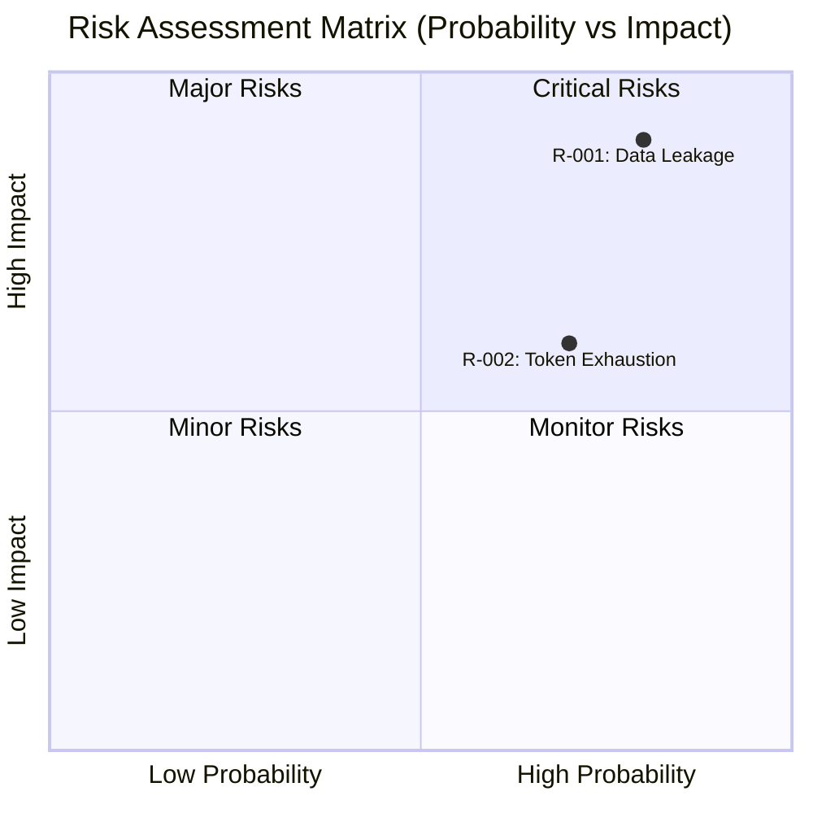

Perform a complete project estimation and risk registry for the project based on these documents. The entire report MUST be outputted in **{{ target_language }}**:

### 💡 [Asset 1: Core Product Idea]
{{ raw_idea_content }}

### 📄 [Asset 2: Software Requirement Specification (SRS)]
{{ raw_srs_content }}

### 📐 [Asset 3: System Architecture Blueprint]
{{ raw_blueprint_content }}

### 📊 [Asset 4: Costing Controls & Benchmarks]
- **Buffer Ratio Multiplier**: {{ buffer_ratio }} (e.g., 0.25 means adding a 25% safety margin to the max bounds)
- **AI Tooling & API Token Cost Allocation**: $350 USD per calendar month for Enterprise / $100 USD for Freelance
- **Target Language**: {{ target_language }}

---

### 🛑 TRIPLE-CHECK MATHEMATICAL DIRECTIVES:
You MUST execute your internal reasoning through 3 independent calculation passes and strictly enforce these mathematical logic rules:

1. **Pass 1 (Live Sourcing & Sizing)**: Call web search to fetch live exchange rates and cost parameters. 
2. **Pass 2 (AI Acceleration & Logic Constraints)**: Calculate the effort for all 4 scenarios. 
   - *CRITICAL INEQUALITY RULE 1*: For both Enterprise and Freelancer models, the AI-Augmented scenario MUST have a significantly lower total Man-Months and shorter Project Duration than the Traditional Human-Only scenario (typically 35% to 50% reduction due to AI-assisted coding/testing). 
   - *CRITICAL INEQUALITY RULE 2*: Total Cost and Project Duration for AI-Augmented MUST NOT, under any circumstances, be equal to Traditional Human-Only. If they are equal, your calculation is fundamentally broken.
   - *Formula*: Buffer = Base Cost * Buffer Ratio Multiplier; Safe = Max + Buffer.
3. **Pass 3 (Cross-Currency Verification)**: Convert all calculated USD figures into VND using your live exchange rate. Cross-check that VND Value / USD Value = Exchange Rate exactly for every range boundary to eliminate calculation drift.

---

### 📋 MANDATORY OUTPUT STRUCTURE (MARKDOWN REPORT):
Your response MUST start directly with the main title header and follow this layout strictly in **{{ target_language }}**:

#### 📊 DOCUMENT INFORMATION / THÔNG TIN TÀI LIỆU

| Item / Thành phần | Details / Chi tiết |
| :--- | :--- |
| **Report ID** | AUDIT-{{ current_timestamp_2 }} |
| **Idea ID** | {{ idea_id }} |
| **Project Name** | {{ project_name }} |
| **Project Description** | {{ project_description }} |
| **Version** | 1.0 (Automated Governance) |
| **Date/Time** | {{ current_timestamp }} |
| **Author** | Chief Solution Review Officer (CSRO Agent) |
| **Approval** | Certified by Enterprise Technical Governance Board |

#### 📑 SECTION 1: DOCUMENT CONTROL & PROVENANCE METADATA
You MUST extract the data from your live search and inject it precisely into this table:

| Audit Parameter | Information Details |
| :--- | :--- |
| **Live Exchange Rate Applied** | 1 USD = [Insert The Exact Rate You Found] VND |
| **Discovered Enterprise Cost / Man-Month** | $[Insert Rate] USD / Month |
| **Discovered Freelancer Cost / Man-Month** | $[Insert Rate] USD / Month |
| **Rate & Cost Extraction Date/Time** | [Insert Date/Time of Your Online Search] |
| **Data Provenance Sources** | [Insert Website Names/URLs for Live Data Mapping] |
| **Verification Method** | Independent Multi-Layer Triple-Check |
| **Status** | Audited & Validated |

#### 👥 SECTION 2: RESOURCE CAPACITY PLANNING (MAN-MONTHS)
Provide a granular breakdown of required engineering roles (Backend, Frontend, QA, DevOps).

#### 💰 SECTION 3: FINANCIAL BUDGET & TIMELINE ESTIMATION PROJECTIONS
> 📝 **AUDIT NOTICE ON CURRENCY**: All calculations below explicitly utilize the real-time extracted exchange rate: **1 USD = {{ exchange_rate }} VND**.

##### 1. Corporate Enterprise Model (Mô hình Doanh nghiệp tập đoàn)
- **Traditional Human-Only Total Budget**:
  - USD: $[Min_USD - Max_USD | Safe_USD] USD
  - VND: [Min_VND - Max_VND | Safe_VND] VND
- **AI-Augmented Total Budget** (MUST be cheaper and have less man-months than Traditional):
  - USD: $[Min_USD - Max_USD | Safe_USD] USD
  - VND: [Min_VND - Max_VND | Safe_VND] VND

##### 2. Freelancer Team Model (Mô hình Nhóm Freelancer tự do)
- **Traditional Human-Only Total Budget**:
  - USD: $[Min_USD - Max_USD | Safe_USD] USD
  - VND: [Min_VND - Max_VND | Safe_VND] VND
- **AI-Augmented Total Budget** (MUST be cheaper and have less man-months than Traditional):
  - USD: $[Min_USD - Max_USD | Safe_USD] USD
  - VND: [Min_VND - Max_VND | Safe_VND] VND

##### 3. Delivery Timeline Duration Projections (So sánh Thời gian hoàn thành dự án)
You MUST calculate and explicitly output the calendar months range for all 4 scenarios below. Remember that AI-Augmented paths MUST be significantly shorter than Traditional paths.
- **Corporate Enterprise (Traditional Human-Only)**: [Min - Max | Safe] Calendar Months
- **Corporate Enterprise (AI-Augmented)**: [Min - Max | Safe] Calendar Months (MUST be 35% - 50% shorter)
- **Freelancer Team (Traditional Human-Only)**: [Min - Max | Safe] Calendar Months
- **Freelancer Team (AI-Augmented)**: [Min - Max | Safe] Calendar Months (MUST be 35% - 50% shorter)

#### 🛡️ 🔥 SECTION 4: ARCHITECTURAL COST JUSTIFICATION (GIẢI TRÌNH BIÊN ĐỘ CHI PHÍ)
*CRITICAL MANDATE*: You MUST deliver a deep, comprehensive architectural and financial analysis explaining the massive cost variance between the Corporate Enterprise Model and the Freelancer Team Model. You MUST explicitly justify why Enterprise costing is significantly higher by breaking down the following structural pillars based on the SA Blueprint:
1. **Operational & Management Overhead**: Contrast corporate taxes, insurance, QA/QC infrastructure, Project Management layers, and premium software tooling licenses against zero-overhead freelance execution.
2. **Security Hardening Boundaries**: Explain the cost impact of implementing enterprise-grade features found in the blueprint (e.g., mTLS service-to-service communication, Envoy API Gateway with custom WAF rules, Argon2id hashing overhead, and SHA-256 hash-chained immutable logging).
3. **High Availability & Disaster Recovery (HA/DR) Infrastructure**: Justify the budget needed to achieve strict enterprise SLAs (RTO ≤ 30 mins, RPO ≤ 5 mins) using multi-region Google Kubernetes Engine (GKE) deployments and clustered/mirrored RabbitMQ topologies compared to a standard, single-instance freelance VPS deployment.
4. **Data Isolation Strategy (Multi-Tenancy)**: Explain how a physical isolation architecture (`Database-per-tenant` using encrypted dynamic routing strings) demands intensive engineering effort and operational cost compared to standard, cheap logical multi-tenancy.

#### 🚨 SECTION 5: PROJECT RISK REGISTRY & MITIGATION STRATEGY
- **Risk ID | Description | Severity (High/Med/Low) | Concrete Mitigation Strategy**

#### 📊 SECTION 6: ARCHITECTURAL DATA VISUALIZATION (NATIVE MERMAID CHARTS)
- **Chart A**: Financial Cost Boundary Matrix (`xychart-beta` or `bar` code comparing all 4 scenarios).
- **Chart B**: Project Delivery Timeline (`gantt` comparing Enterprise vs Freelance schedules).
- **Chart C**: Risk Assessment Severity Matrix (`quadrantChart`).

*CRITICAL MANDATE FOR SYNTAX COMPLIANCE*: You MUST generate clean, functional, and strictly valid Mermaid.js code blocks. 
- ALL text labels, title keys, quadrant strings, and task details INSIDE the mermaid code blocks MUST be written in plain, unaccented English (e.g., use "Probability", "Impact", "Budget", "Duration"). 
- DO NOT insert Vietnamese or accented characters inside the mermaid blocks, otherwise the compilation pipeline will crash.

##### Chart A: Financial Cost Boundary Matrix (USD)
You MUST use the official `xychart-beta` syntax. The y-axis values MUST be raw integers representing thousands of USD (do not include dollar signs or ranges in the y-axis data rows).
Format exactly like this example template:


```mermaid
xychart-beta
    title "Total Cost Comparison Bounds (in Thousands USD)"
    x-axis ["Min Cost", "Max Cost", "Safe Cost"]
    y-axis "USD (Thousands)" 0 --> 300
    bar [180, 270, 330]
    bar [120, 180, 210]
```

##### Chart B: Project Delivery Timeline (Dynamic Gantt Chart)
You MUST define unique milestone IDs for each section to prevent overlap.
Format exactly like this example template:


```mermaid
gantt
    title Project Timeline Acceleration Matrix
    dateFormat  X
    axisFormat %d days
    
    section Enterprise Team
    Phase 1 Execution :ent_p1, 0, 15
    Phase 2 Execution :ent_p2, after ent_p1, 20
    
    section Freelance Team
    Phase 1 Execution :free_p1, 0, 8
    Phase 2 Execution :free_p2, after free_p1, 12
```

##### Chart C: Risk Assessment Severity Matrix
You MUST use the official `quadrantChart` syntax with English coordinates.
Format exactly like this example template:


#### 📊 SECTION 7: VISUALIZATION METADATA FOR BACKEND PROCESSING
*CRITICAL*: Update the JSON layout to include both Corporate and Freelancer metrics for precise automated image chart generation.


```json
{{ open_json }}
  "exchange_rate": [Insert raw float rate you found online],
  "enterprise_cost_usd": [[Min_USD], [Max_USD], [Safe_USD]],
  "freelance_cost_usd": [[Min_USD], [Max_USD], [Safe_USD]],
  "enterprise_months": [[Min_Months], [Max_Months], [Safe_Months]],
  "freelance_months": [[Min_Months], [Max_Months], [Safe_Months]]
{{ close_json }}
```
