Perform a complete project estimation and risk registry for the project based on these documents:

### 💡 [Asset 1: Core Product Idea / Requirements]
{{ raw_idea_content }}

### 📄 [Asset 2: Software Requirement Specification (SRS)]
{{ raw_srs_content }}

### 📐 [Asset 3: System Architecture Blueprint]
{{ raw_blueprint_content }}

### 📊 [Asset 4: Costing Benchmarks & Controls]
- **Buffer Ratio Multiplier**: {{ buffer_ratio }} (e.g., 0.25 means adding a 25% safety margin to the max bounds)
- **Average Human Cost per Man-Month**: $4,500 USD
- **AI Tooling & API Token Cost Allocation**: $350 USD per calendar month

---
### 🛑 TRIPLE-CHECK MATHEMATICAL DIRECTIVES:
You MUST execute your internal reasoning through 3 independent calculation passes:
1. **Pass 1 (Base Sizing)**: Calculate the raw Man-Months required for each standard software engineering role (Backend, Frontend, QA, DevOps) based on granularity analysis. Split into Traditional Human-Only and AI-Augmented paradigms.
2. **Pass 2 (Buffer & Financial Boundary Math)**: Compute the absolute development cost ranges.
   - Calculate the Buffer Margin: Base Cost * Buffer Ratio Multiplier.
   - Calculate the Safe Cost: Max Cost + Buffer Margin.
3. **Pass 3 (Cross-Currency Verification)**: Convert all calculated USD figures (Min, Max, Safe) into VND using the live exchange rate found online. Cross-check that VND Value / USD Value = Exchange Rate exactly for every range boundary to eliminate any calculation drift.

---
### 📋 MANDATORY OUTPUT STRUCTURE (MARKDOWN REPORT):
Your response MUST start directly with '# Project Sizing, Cost Estimation & Risk Registry Report' and contain these exact sections and components:

#### 📊 0. DOCUMENT INFORMATION

| Item | Details |
| :--- | :--- |
| **Report ID** | AUDIT-{{ current_timestamp_2 }} |
| **Idea ID** | {{ idea_id }} |
| **Project Name** | {{ project_name }} |
| **Project Description** | {{ project_description }} |
| **Version** | 1.0 (Automated Governance) |
| **Date/Time** | {{ current_timestamp }} |
| **Author** | Chief Solution Review Officer (CSRO Agent) |
| **Approval** | Certified by Enterprise Technical Governance Board |

#### 📑 SECTION 1: DOCUMENT CONTROL & PROVENANCE METADATA

| Audit Parameter | Information Details |
| :--- | :--- |
| **Live Exchange Rate Applied** | 1 USD = [Insert The Exact Rate You Found] VND |
| **Rate Extraction Date/Time** | [Insert Date/Time of Your Online Search] |
| **Rate Provenance Source** | [Insert Website Name/URL Where Rate Was Extracted] |
| **Verification Method** | Independent Multi-Layer Triple-Check |
| **Status** | Audited & Validated |

#### 👥 SECTION 2: RESOURCE CAPACITY PLANNING (MAN-MONTHS)
Provide a granular breakdown of required engineering roles.
- Traditional Human-Only: `[Min - Max \| Safe]` Man-Months.
- AI-Augmented: `[Min - Max \| Safe]` Man-Months.

#### 💰 SECTION 3: FINANCIAL BUDGET PROJECTIONS (DUAL-CURRENCY MAPPING)
- **Traditional Human-Only Total Budget**:
  - **USD**: `$[Min - Max \| Safe]` USD
  - **VND**: `[Min - Max \| Safe]` VND
- **AI-Augmented Total Budget**:
  - **USD**: `$[Min - Max \| Safe]` USD
  - **VND**: `[Min - Max \| Safe]` VND

#### 🚨 SECTION 4: PROJECT RISK REGISTRY & MITIGATION STRATEGY
- **Risk ID \| Description \| Severity (High/Med/Low) \| Concrete Mitigation Strategy**

#### 📊 SECTION 5: ARCHITECTURAL DATA VISUALIZATION (NATIVE MERMAID CHARTS)
You MUST generate clean, functional, and syntactically correct **Mermaid.js** code blocks inside this section.

##### Chart A: Financial Cost Boundary Matrix (USD vs VND)
Use a Mermaid `xychart-beta` block to compare Min, Max, and Safe budgets for both Human-Only and AI-Augmented models. Inject your exact calculated figures.

##### Chart B: Project Delivery Timeline (Dynamic Gantt Chart)
*CRITICAL MANDATE*: You MUST dynamically read the total number of phases or milestones from the provided project documents. DO NOT assume a fixed 5-phase schedule. You MUST write explicit Gantt chart sections for each phase found, comparing the traditional baseline duration against the accelerated AI-Augmented duration.
Format your Mermaid code exactly like this template structure:

```mermaid
gantt
    title Project Timeline Acceleration Matrix
    dateFormat  X
    axisFormat %d days
    
    section Traditional Human-Only [Phase Name/ID 1]
    Execution Duration :active, 0, [Calculated_Days]
    section AI-Augmented [Phase Name/ID 1]
    Accelerated Duration :crit, 0, [Calculated_Days]
    
    %% Repeat dynamically for each additional phase found in the documents...
```


##### Chart C: Risk Assessment Severity Matrix
Use a Mermaid `quadrantChart` or block diagram to visually map your registered project risks based on Impact vs Probability.

#### 📊 SECTION 6: VISUALIZATION METADATA FOR BACKEND PROCESSING
```json
{ {
  "exchange_rate": [Insert raw float rate you found online],
  "human_cost_usd": [[Min_USD], [Max_USD], [Safe_USD]],
  "ai_cost_usd": [[Min_USD], [Max_USD], [Safe_USD]],
  "human_months": [[Min_Months], [Max_Months], [Safe_Months]],
  "ai_months": [[Min_Months], [Max_Months], [Safe_Months]]
} }
```
