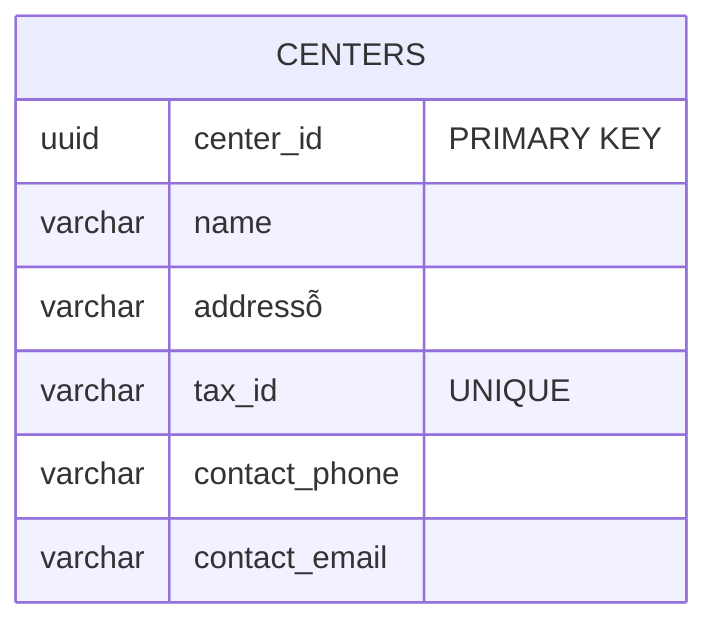
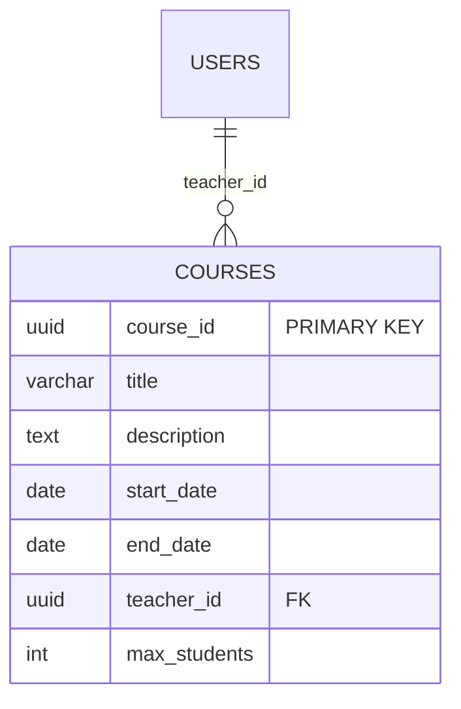
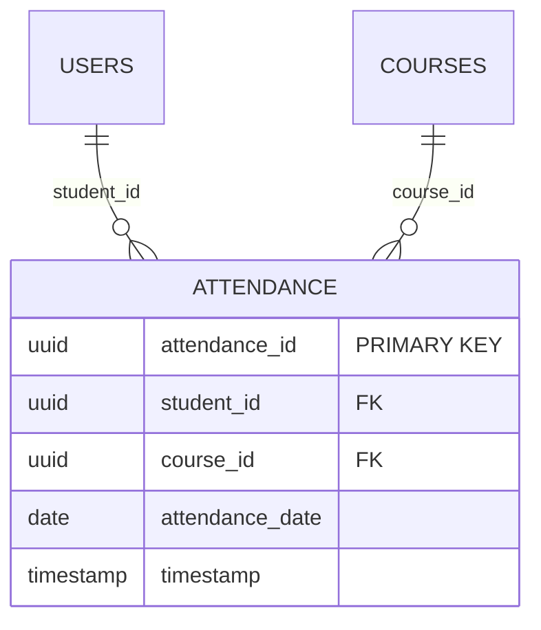
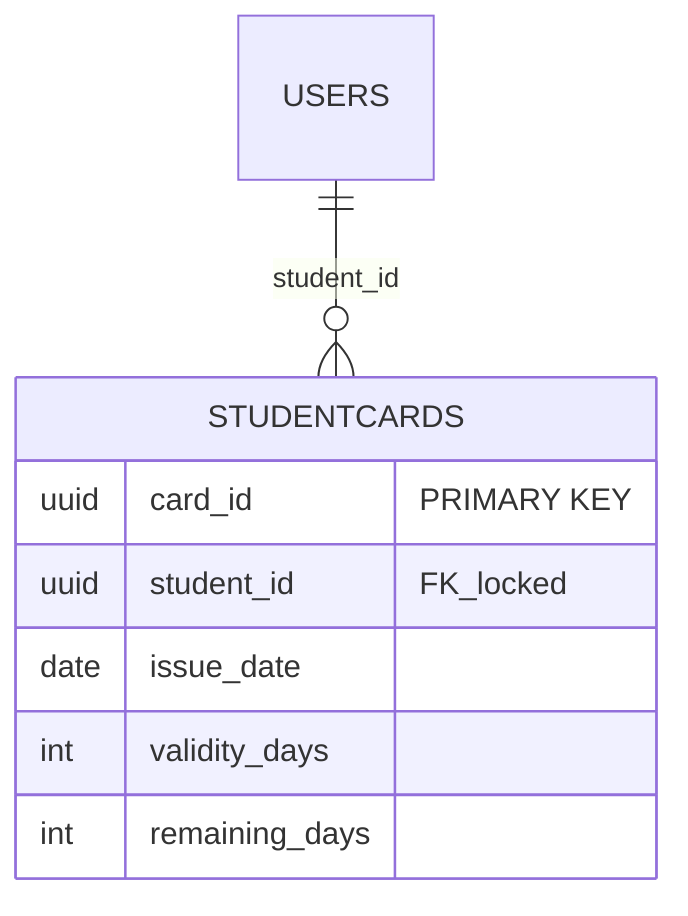
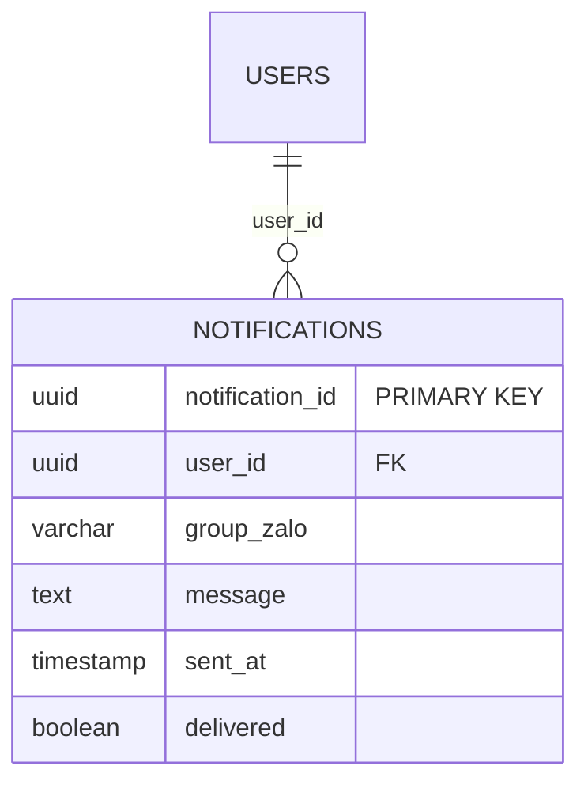
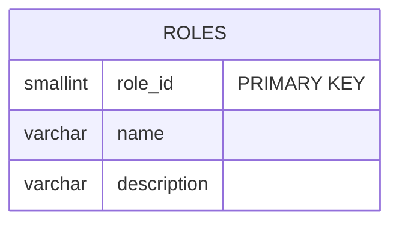
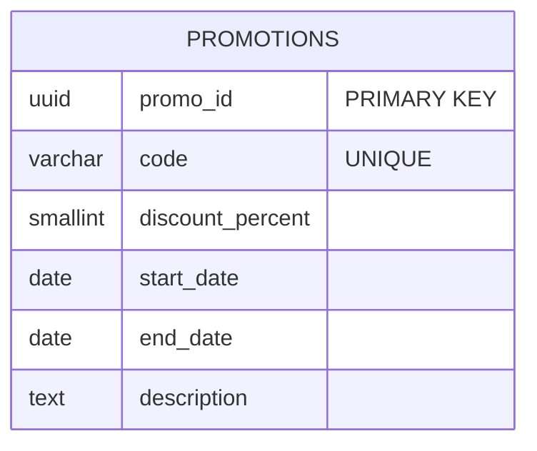
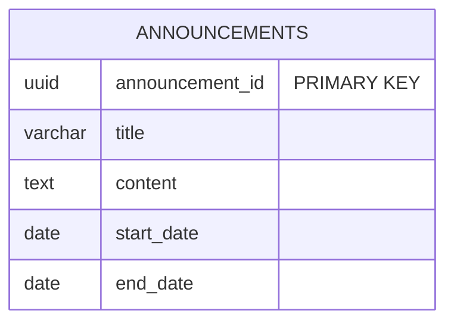
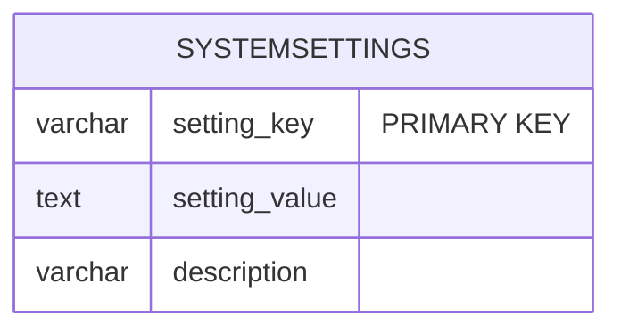

# SOFTWARE REQUIREMENTS SPECIFICATION: membership-hub

## 1. Tổng quan dự án & Kiến trúc tổng thể

**Mục tiêu sản phẩm**  
- Cung cấp nền tảng quản lý thành viên đa trung tâm.  
- Ghi nhận điểm danh thời gian thực qua quét mã QR.  
- Cung cấp thẻ thành viên kỹ thuật số tính số ngày còn lại.  
- Hỗ trợ giao tiếp đa kênh (web, mobile, Zalo).  
- Đảm bảo độ tin cậy, khả năng mở rộng, bảo mật và trải nghiệm người dùng đa ngôn ngữ.

**Nhân khẩu học người dùng**  
- Quản trị viên hệ thống (System Admin)  
- Quản trị viên trung tâm (Center Admin)  
- Trưởng phòng (Manager)  
- Giáo viên (Teacher)  
- Học sinh (Student)  
- Người dùng mobile (tương tự các vai trò trên)

**Quyền truy cập dựa trên vai trò (RBAC)**  
| Vai trò | Quyền hạn chính |
|---------|-----------------|
| System Admin | Truy cập toàn hệ thống, tạo/đổi/ xóa trung tâm, gán vai trò |
| Center Admin | Quản lý nội dung trên trung tâm, gán quản trị viên |
| Manager | Tạo thông báo, quản lý học sinh, gán học sinh cho khoá học |
| Teacher | Xem khoá học, danh sách học sinh, lịch học (đọc‑chỉ) |
| Student | Duyệt khoá học, đăng ký khoá học phaham, xem thẻ thành viên |
| Mobile App.Env | Hiển thị giao diện tương ứng với vai trò |

**Kiến trúc tổng thể**  
- **Mikro dịch vụ Java Quarkus** triển khai trên **GKE** (Kubernetes).  
- **API Gateway** (Kong) xử lý xác thực JWT, phân phối yêu cầu.  
- **PostgreSQL 15** cho dữ liệu chính, **Redis** cho kho lưu tạm thời, **Elasticsearch** cho tìm kiếm.  
- **Firebase Cloud Messaging (FCM)** cho push, **Zalo API** cho thông báo nhóm.  
- **Next.js** (React) cho web, **React Native** cho mobile.  
- **CI/CD Rudy**: GitHub Actions → Docker → GKE.

**Các yếu tố kiến trúc (ARC tags)**  
- [ARC-001] Thủ quyền toàn hệ thống.  
- [ARC-002] Hạn chế quyền trung tâm.  
- [ARC-003] Quyền của Manager.  
- [ARC-004] Quyền đọc‑chỉ cho Teacher.  
- [ARC-005] Quyền hạn dành cho Student.  
- [ARC-006] Xác thực email/mật khẩu, Firebase, Google, Facebook → JWT 15 điểm, refresh 7 ngày.  
- [ARC-007] Xử lý quét QR: nhận student_id + khóa học + dấu thời gian, kiểm tra và ghi nhận điểm danh (idempotent).  
- [ARC-008] Gửi thông báo push và Zalo.  
- [ARC-009] Tích hợp backend Next.js, caching offline.

## 2. Mô-đun chức năng (Epic)

### 2.1 Quản lý người dùng

#### [REQ-001] Đăng ký người dùng
> Người dùng tiềm năng cần đăng ký bằng email & mật khẩu (hoặc social).  
**Tiêu chí chấp nhận**  
- **Given** người dùng nhập email duy nhất, mật khẩu ≥ 8 ký tự, kích hoạt checkbox điều khoản,  
- **When** gửi biểu mẫu,  
- **Then** hệ thống kiểm tra dữ liệu, tạo bản ghi `Users` với role `Student` (hoặc `Teacher` khi mời), trả về JWT và refresh token.  

#### [REQ-002] Xác thực xã hội
> Đăng nhập/đăng ký bằng Firebase, Google, Facebook.  
**Tiêu chí chấp nhận**  
- **Given** người dùng chọn nhà cung cấp,  
- **When** nhận mã OAuth2, trao đổi token, lấy thông tin người dùng,  
- **Then** tạo hoặc cập nhật bản ghi `Users`, phát JWT.  

#### [REQ-003] Gán vai tròhost
> Quản trị viên thay đổi vai trò người dùng.  
**Tiêu chí chấp nhận**  
- **Given** admin chọn người dùng & vai trò mới,  
- **When** xác nhận,  
- **Then** cập nhật cột `role_id`, ghi nhật ký audit.  

---

### 2.2 Quản lý trung tâm

#### [REQ-004] Xem danh sách trung tâm
> Người dùng xem danh sách `Centers` với địa chỉ, mã số thuế, liên hệ.  

#### [REQ-005] Tạo/Chỉnh sửa/Xóa trung tâm
> Chỉ System Admin thao tác.  
**Tiêu chí chấp nhận**  
- **Given** center details (name, address, tax ID, contact),  
- **When** lưu,  
- **Then** lưu record, tránh tax ID trùng (hỗ trợ lỗi 409).  

#### [REQ-006] Gán/Thu hồi quản trị trung tâm
> System Admin gán/huỷ `Center Admin	gui.  

---

### 2.3 Quản lý khoá học

#### [REQ-007] Xem danh sách khoá học
> Hiển thị ID, tiêu đề, ngày bắt đầu/ kết thúc, giáo viên.  

#### [REQ-008] Tạo/Chỉnh sửa/Xóa khoá học (tránh trùng lịch)
> System Admin & Center Admin.  
**Tiêu chí chấp lần**  
- **Given** title, start/end, teacher,  
- **When** lưu,  
- **Then** kiểm tra trùng lịch giáo viên/địa điểm (đồng bộ DB trigger).  

#### [REQ-009] Gán/Thu hồi giáo viên cho khoá học
> System Admin.  

---

### 2.4 Đăng ký & tuyển sinh học sinh

#### [REQ-010] Xem khoá học chưa đăng ký
> Trình bày danh sách có capacity, lịch, loại trừ khóa học đã đăng ký.  

#### [REQ-011] Đăng ký khoá học (tự động tạo tài khoản)
> Student chọn khóa, backend tạo `Enrollments`, tạo tài khoản nếuуруш.  

---

### 2.5 Điểm danh & quét QR

#### [REQ-012] Ghi nhận điểm danh bằng QR
> Student quét QR, backend xác minh, tạo `Attendance`, duy trì idempotent.  

#### [REQ-013] Đảm bảo idempotent
> Nhiều lần quét cùng ngày cho cùng khóa học → chỉ một bản ghi.  

---

### 2.6 Quản lý thẻ thành viên

#### [REQ-014] Hiển thị thẻ thành viên
> Show total days, used days, remaining.signal.  

#### [REQ-015] Gia hạn thẻ RESULT
> Student chọn ngày gia hạn, thanh toán, backend cập nhật `end_date`, gửi thông báo.  

---

### 2.7 Thông báo & giao tiếp

#### [REQ-016] Trigger thông báo
> Khi admin tạo announcement, gán teacher, đăng ký student → nội dung push & Zalo.  

---

### 2.8 Khuyến mãi & thông báo

#### [REQ-017] Quản lý khuyến mãi
> Center Admin/Manager tạo, sửa, xoá khuyến mãi.  

#### [REQ-018] Quản lý thông báo
> Center Admin/Manager tạo, sửa, xoá thông báo có thời hạn.  

---

### 2.9 Chatbot dịch vụ khách hàng AI

#### [REQ-019] Tích hợp chatbot
> Đặt câu hỏi → trả lời AI, nếu độ tin cậy thấp → chuyển sang support.  

---

### 2.10 Tính năng mobile

#### [REQ-020] UI tùy vai trò
> Mobile hiển thị menu theo role.  

#### [REQ-021] Push notifications
> Nhận push cho attendance, announcement, remind.  

---

### 2.11 Đa ngôn ngữ & SEO

#### [REQ-022] Phát hiện ngôn ngữ mặc định
> Dựa vào lưu trữ, hoặc Accept-Language, cập nhật UI.  

#### [REQ-023] SEO đa ngôn ngữ
> Mỗi trang bao gồm `<html lang="vi">` và `hreflang`.  

---

### 2.12 Báo cáo & Analytics

#### [REQ-024] Tạo báo cáo điểm danh
> Admin chọn trung tâm & ngày, xuất CSV.  

#### [REQ-025] Dashboard tuyển sinh
> Hiển thị số học.Invalid students, courses, upcoming sessions.  

---

## 3. Mô tả dữ liệu

### [DAT-001] USERS
| Field | Data Type | Constraints | Mô tả |
|-------|-----------|-------------|-------|
| user_id | uuid | PK "PRIMARY KEY" | ID duy เดือน |
| email | varchar | NOT NULL UNIQUE | Email đăng nhập |
| password_hash | char | NOT NULL | Mã hash bcrypt |
| full_name | varchar | NOT NULL | Họ tên |
| role_id | smallint | NOT NULL FK "UNIQUE" | Mã vai trò |
| provider | varchar | NOT NULL DEFAULT "local" | Phương thức đăng nhập |
| created_at | timestamp | NOT NULL DEFAULT now() | Ngày tạo |
| updated_at | timestamp | NOT NULL DEFAULT now() | Ngày cập nhật |

```mermaid
erDiagram
    USERS {
        uuid user_id "PRIMARY KEY"
        varchar email Jordan
        char password_hash
        varchar full_name
        smallint role_id "FK"
        varchar provider
        timestamp created_at
        timestamp updated_at
    }
    ROLES {
        smallint role_id "PRIMARY KEY"
        varchar name
        varchar description
    }
    USERS ||--|| ROLES : role_id
```

### [DAT-002] CENTERS
| Field | Data Type | Constraints | Mô tả |
|-------|-----------|-------------|-------|
| center_id | uuid | PK "PRIMARY KEY" | ID trungpad |
| name | varchar | NOT NULL | Tên trung tâm |
| address | varchar | NOT NULL | Địa chỉ |
| tax_id | varchar | NOT NULL UNIQUE | Mã số thuế |
| contact_phone | varchar | | Điện thoại liên hệ |
| contact_email | varchar | | Email liên hệ |



### [DAT-003] COURSES
| Field | Data Type | Constraints | Mô tả |
|-------|-----------|-------------|-------|
| course_id | uuid | PK "PRIMARY KEY" | ID khoá học |
| title | varchar | NOT NULL | Tiêu đề |
| description | text | | Mô tả |
| start_date | date | NOT NULL | Ngày bắt đầu |
| end_date | date | NOT NULL | Ngày kết thúc |
| teacher_id | uuid | NOT NULL FK "UNIQUE" | Giáo viên |
| max_students | int | DEFAULT 30 | Giới hạn |



### [DAT-004] ENROLLMENTS
| Field | Data Type | Constraints | Mô tả |
|-------|-----------|-------------|-------|
| enrollment_id | uuid | PK "PRIMARY KEY" | ID đăng ký |
| student_id | uuid | NOT NULL FK "UNIQUE" | Học sinh |
| course_id | uuid | NOT NULL FK "UNIQUE" | Khoá học |
| enrollment_date | timestamp | DEFAULT now() | Ngày ghi danh |

```mermaid
erDiagram
    ENROLLMENTS {
        uuid enrollment_id "PRIMARY KEY"
        uuid student_id "FK"
        uuid course_id "FK"
        timestamp enrollment_date Built-in
    }
    USERS ||--o{ ENROLLMENTS : student_id
    COURSES ||--o{ ENROLLMENTS : course_id
```

### [DAT-005] ATTENDANCE
| Field | debido | Constraints | Mô tả |
|-------|--------|-------------|-------|
| attendance_id | uuid | PK "PRIMARY KEY" | ID điểm danh |
| student_id | uuid | NOT NULL FK "UNIQUE" | Học sinh |
| course_id | uuid | NOT NULL FK "UNIQUE" | Khoá học |
| attendance_date | date | NOT NULL | Ngày điểm danh |
| timestamp | timestamp | DEFAULT now() | Thời gian ghi nhận |



### [DAT-006] STUDENTCARDS
| Field | Data Type | Constraints | Mô tả |
|-------|-----------|-------------|ీవ|
| card_id | uuid | PK "PRIMARY KEY" | ID thẻ |
| student_id | uuid | NOT NULL FK "UNIQUE" | Học sinh |
| issue_date | date | NOT NULL | Ngày phát hành |
| validity_days | int | NOT NULL | Tổng ngày hợp lệ |
| remaining_days | int | | Ngày còn lại (tính) |



### [DAT-007] NOTIFICATIONS
| Field | Data Type | Constraints | Mô tả |
|-------|-----------|-------------|-------|
| notification_id | uuid | PK "PRIMARY KEY" | ID thông báo |
| user_id | uuid | FK | Người dùng (tùy chọn) |
| group_zalo | varchar | | Nhóm Zalo |
| message | text | NOT NULL | Nội dung |
| sent_at | timestamp | DEFAULT now() | Thời gian gửi |
| delivered | boolean | DEFAULT false | Trạng thái |



### [DAT-008] ROLES
| Field | Data Type | Constraints | Mô tả |
|-------|-----------|-------------|-------|
| role_id | smallint | PK "PRIMARY KEY" | Mã vai trò |
| name | varchar | UNIQUE | Tên vai trò |
| description | varchar | | Mô tả |



### [DAT-009] PROMOTIONS
| Field | Data Type | Constraints | Mô tả |
|-------|-----------|-------------|-------|
| promo_id | uuid | PK "PRIMARY KEY" | ID khuyến mãi |
| code | varchar | UNIQUE | Mã giảm giá |
| discount_percent | smallint | NOT NULL | % giảm |
| start_date | date | | Ngày bắt đầu |
| end_date | date | | Ngày kết thúc |
| description | text | | Chi tiết |



### [DAT-010] ANNOUNCEMENTS
| Field | Data Type | Constraints | Mô tả |
|-------|-----------|-------------|-------|
| announcement_id | uuid | PK "PRIMARY KEY" | ID thông báo |
| title | varchar | NOT NULL | Tiêu đề |
| content | text | NOT NULL | Nội dung |
| start_date | date | | Hiệu lực bắt đầu |
| end_date | date | | Hiệu lực kết thúc |



### [DAT-011] SYSTEMSETTINGS
| Field | Data Type | Constraints | Mô tả |
|-------|-----------|-------------|-------|
| setting_key | varchar | PK "PRIMARY KEY" | Khóa |
| setting_value | text | NOT NULL | Giá trị |
| description | varchar | | Mô tả |



---

## 4. Phân khối ngoại lệ (Exception flows)

### [EXC-001] Kết nối mạng mất trong quét QR  
- **Given** student quét QR nhưng mạng offline,  
- **When** mạng được khôi phục,  
- **Then** điểm danh được ghi nhận.  

### [EXC-002] Đăng ký điểm danh trùng lặp  
- **Given** student quét nhiều lần cùng ngày,  
- **When** hệ thống nhận,  
- **Then** trả về thành công với cờ `duplicate`.  

### [EXC-003] Thông báo không thể chuyển tiếp  
- **Given** push thất bại (token sai),  
- **When** thử lại 3 lần,  
- **Then** ghi log & đánh dấu `failed`.  

### [EXC-004] Xác thực đầu vào sai  
- **Given** email/đầy đủ không đúng,  
- **When** gửi,  
- **Then** thông báo lỗi chi tiết.  

### [EXC-005] Phục hồi sau gián đoạn hệ thống  
- **Given** dịch vụ ngừng,  
- **When** khởi động lại,  
- **Then** xử lý điểm danh cũ theo FIFO & thông báo.

---

## 5. Yêu cầu phi chức năng (NFR)

### [NFR-001] Hiệu năng  
- Phản hồi API trung bình ≤ 200 ms.  
- Chỉ mục cho queries, hỗ trợ 10,000 user đồng thời.  

### [NFR-002] Tính sẵn sàng  
- 99.9 % uptime, failover tự động GKE.  

### [NFR-003] Bảo mật  
- TLS 1.3, AES‑256 on‑disk.  
- JWT 15 điểm, refresh 7 ngày.  
- OWASP Top 10: SQLi, XSS, CSRF.  

### [NFR-004] Mở rộng & HA  
- HPA Kubernetes: CPU > 70 % hoặc latency > 300 ms.  
- Replicas PostgreSQL cho báo cáo.  

### [NFR-005] Kích thước Docker  
- Base < 200 MB, final < 500 MB.  

### [NFR-006] Ghi log & audit  
- Lưu hành động 1 năm, thời gian, user, haem.  

### [NFR-007] Đa ngôn ngữ  
- Từ khoá externalized, switching without reload.  

### [NFR-008] GDPR/CCPA  
- Xóa dữ liệu khi yêu cầu, export JSON, quản lý đồng ý.  

### [NFR-009] Backup & DR  
- Backup PostgreSQL hàng ngày, PITR 24 h.  
- Backup cluster GKE region phân tách.

--- 

[EXECUTION_REMEDIATION_PAYLOAD_START]  
{"technical_codename":"membership-hub","descriptive_name":"Membership Hub","brand_name":"YourBrand","requirement_tags":["[REQ-001]","[REQ-002]","[REQ-003]","[REQ-004]","[REQ-005]","[REQ-006]","[REQ-007]","[REQ-008]","[REQ-009]","[REQ-010]","[REQ-011]","[REQ-012]","[REQ-013]","[REQ-014]","[REQ-015]","[REQ-016]","[REQ-017]","[REQ-IODevice?]","[REQ-018]","[REQ-019]","[REQ-020]","[REQ-021]","[REQ-022]","[REQ-023]","[REQ-024]","[REQ-025]","[ARC-001]","[ARC-002]","[ARC-003]","[ARC-004]","[ARC-005]","[ARC-006]","[ARC-007]","[ARC-008]","[ARC-009]","[EXC-001]","[EXC-002]","[EXC-003]","[EXC-004]","[EXC-005]","[NFR-001]","[NFR-002]","[NFR-003]","[NFR-004]","[NFR-005]","[NFR-006]","[NFR-007]","[NFR-008]","[NFR-009]","[DAT-001]","[DAT-002]","[DAT-003]","[DAT-004]","[DAT-005]","[DAT-006]","[DAT-007]","[DAT-008]","[DAT-009]","[DAT-010]","[DAT-011]"]}