# SOFTWARE REQUIREMENTS SPECIFICATION: membership-hub

## 1. TỔNG QUAN DỰ ÁN & KIẾN TRÚC TOÀN CẦU

### 1.1 Mục tiêu sản phẩm & Giá trị cốt lõi
- Cung cấp một nền tảng thống nhất để quản lý hội viên đa trung tâm.
- Cho phép theo dõi chấm công thời gian thực qua quét mã QR.
- Cung cấp thẻ hội viên số với tính năng đếm ngày hiệu lực.
- Hỗ trợ truyền thông đa kênh (web, di động, nhóm Zalo).
- Giá trị cốt lõi: độ tin cậy, khả năng mở rộng, bảo mật, tính thân thiện với người dùng, hỗ trợ đa ngôn ngữ.

### 1.2 Nhóm người dùng mục tiêu
- **Quản trị viên hệ thống** (toàn quyền)
- **Quản trị viên trung tâm** (quyền hạn trong trung tâm)
- **Quản lý** (quyền hạn con)
- **Giáo viên** (chỉ xem lịch học)
- **Học viên** (duyệt khóa học, đăng ký, xem thẻ hội viên)
- **Người dùng di động** (cùng vai trò, giao diện responsive)

### 1.3 Ma trận vai trò theo RBAC (Role‑Based Access Control)
- **[ARC-001]** **Hệ thống:** toàn quyền trên mọi trung tâm.
- **[ARC-002]** **Trung tâm:** toàn quyền trong trung tâm của mình, không ảnh hưởng trung tâm khác.
- **[ARC-003]** **Quản lý:** có thể tạo thông báo, quản lý học viên, gán học viên vào khóa học, xem danh sách khóa học, không được chỉnh sửa khóa học hay chỉ định giáo viên.
- **[ARC-004]** **Giáo viên:** xem khóa học của mình, danh sách học viên, lịch giảng, chỉ đọc.
- **[ARC-005]** **Học viên:** duyệt khóa học, đăng ký khóa học mới, xem thẻ hội viên (ngày hiệu lực còn lại), gia hạn thẻ.

### 1.4 Kiến trúc công nghệ & Hạ tầng (Global Tech Stack Constraints & Infrastructure Blueprint)
- **[ARC-006]** **Luồng xác thực:** hỗ trợ email/mật khẩu, Firebase, Google, Facebook qua OAuth2; phát hành JWT (expiry 15 phút) và refresh token.
- **[ARC-007]** **Luồng xử lý QR chấm công:** ứng dụng di động quét mã, gửi studentID + timestamp; dịch vụ xác thực và ghi nhận chấm công một cách idempotent.
- **[ARC-008]** **Luồng gửi thông báo:** hệ thống kích hoạt push notifications đến ứng dụng di động và gửi bài viết đến nhóm Zalo được chỉ định cho thông báo, phân công khóa học, cảnh báo chấm công.
- **[ARC-009]** **Tích hợp backend ứng dụng di động:** frontend Next.js tiêu thụ REST APIs; xác thực qua bearer token; hỗ trợ caching ngoại tuyến cho trường hợp mất kết nối mạng có giới hạn.
- **[ARC-010]** **Cô lập đa租 (Multi‑tenant Data Isolation):** mỗi trung tâm được lưu trữ dưới một schema riêng hoặc có column tenant_id, đảm bảo truy vấn không thể vượt biên giới.
- **[ARC-011]** **Tuân thủ bảo mật OWASP Top 10:** chuẩn bị câu lệnh, kiểm soát token, mã hóa trạng thái, CSRF tokens cho form, XSS filtering.
- **[ARC-012]** **Audit Logging:** mọi thao tác (thay đổi vai trò, bản ghi chấm công, thông báo) được ghi nhật ký với timestamp, user_id, hành động chi tiết; lưu giữ 1 năm.
- **[ARC-013]** **Mã hóa dữ liệu:** TLS 1.3 cho mọi giao tiếp; AES‑256 cho dữ liệu tại chỗ; JWT ký bằng RS256.
- **[ARC-014]** **Session Management:** token được lưu trong httpOnly cookies hoặc storage trên thiết bị; hỗ trợ logout từ xa; refresh token có hạn dùng 7 ngày.
- **[ARC-015]** **Rate Limiting & Quotas:** giới hạn 30 yêu cầu/phút cho mỗi người dùng, 300 cho admin; thực thi tại API Gateway.

## 2. CÁC MODULE CHỨC NĂNG

### 2.1 Quản lý người dùng (User Management)

#### 2.1.1 Yêu cầu chức năng: Đăng ký người dùng **[REQ-001]**
**Là một** người dùng tiềm năng, **tôi muốn** đăng ký bằng email và mật khẩu (hoặc nhà cung cấp xã hội) **để tôi có thể có tài khoản trong hệ thống.**

**Acceptance Criteria**:
- Given a user provides a unique email, a strong password, and agrees to terms, When they submit the registration form, Then the system validates the input, creates a new user record with role ‘Student’ (or ‘Teacher’ if invited), and returns a success response with a JWT token. **[REQ-001]**

**Data Inputs & Field Validations**:
- **Email:** required, tối đa 255 ký tự, phải chứa đúng một ‘@’ và phần tên miền hợp lệ. Phải là duy nhất.
- **Password:** required, tối thiểu 8 ký tự, có ít nhất một chữ hoa, một chữ thường, một chữ số, một ký tự đặc biệt.
- **Terms:** bắt buộc chọn checkbox.

#### 2.1.2 Yêu cầu chức năng: Xác thực xã hội **[REQ-002]**
**Là một** người dùng, **tôi muốn** đăng nhập/đăng ký bằng Firebase, Google, hoặc Facebook OAuth **để tôi có thể sử dụng thông tin xác thực hiện có.

**Acceptance Criteria**:
- Given a user selects a social provider, When they authenticate through the provider’s popup, Then the system receives an OAuth2 code, exchanges it for user info, creates or updates the local user record, and issues a JWT token. **[REQ-002]**

**Data Inputs & Field Validations**: provider token, tùy chọn ảnh đại diện.

#### 2.1.3 Yêu cầu chức năng: Gán vai trò người dùng **[REQ-003]**
**Là một** quản trị viên, **tôi muốn** chỉ định hoặc thay đổi vai trò của người dùng (System Admin, Center Admin, Manager, Teacher, Student) **để quyền hạn được thực thi chính xác.

**Acceptance Criteria**:
- Given an admin selects a user and a new role, When the assignment is confirmed, Then the user’s role column is updated, and appropriate permissions are applied immediately. **[REQ-003]**

**Data Inputs & Field Validations**: dropdown vai trò, bắt buộc ghi nhật ký audit.

#### 2.1.4 Luồng ngoại lệ & Xác thực (Exception Flows)
- **[EXC-001]** Network & Connectivity Drops During Registration: Nếu người dùng bắt đầu đăng ký nhưng mạng bị ngắt, khi kết nối được khôi phục, hệ thống sẽ tiếp tục xử lý và trả về lỗi chi tiết.
- **[EXC-004]** Invalid Input Validation (ví dụ: email sai định dạng, thiếu trường bắt buộc): Nếu xác thực thất bại khi gửi form, khi lỗi được trả về cho người dùng, một thông báo rõ ràng liệt kê từng trường không hợp lệ và yêu cầu chỉnh sửa.

### 2.2 Quản lý trung tâm (Center Management)

#### 2.2.1 Yêu cầu chức năng: Danh sách trung tâm **[REQ-004]**
**Là bất kỳ** người dùng đã xác thực nào, **tôi muốn** xem danh sách tất cả trung tâm với địa chỉ, mã số thuế, và liên hệ quản trị viên **để tôi có thể xác định trung tâm liên quan.

**Acceptance Criteria**:
- Given a user navigates to the Centers page, When the request completes, Then a table of centers (Name, Address, TaxID, AdminContact) is displayed. **[REQ-004]**

#### 2.2.2 Yêu cầu chức năng: Tạo/Sửa/Xóa trung tâm **[REQ-005]**
**Là một** System Admin, **tôi muốn** thêm, chỉnh sửa, hoặc xóa một bản ghi trung tâm **để thông tin trung tâm được cập nhật.

**Acceptance Criteria**:
- Given a System Admin provides center name, address, tax ID, primary contact phone and email, When the save action is executed, Then the center is persisted and appears in the list; nếu trùng mã số thuế, thao tác thất bại với lỗi conflict. **[REQ-005]**

**Data Inputs & Field Validations**:
- **Name:** required, tối đa 100 ký tự.
- **Address:** required, tối đa 255 ký tự.
- **TaxID:** required, numeric, 10‑13 chữ số, duy nhất.
- **Contact Phone:** tùy chọn, có thể chứa +, chữ số, dấu cách, gạch ngang, ngoặc đơn.
- **Contact Email:** tùy chọn, phải đúng định dạng email.

#### 2.2.3 Yêu cầu chức năng: Phân công quản trị viên trung tâm **[REQ-006]**
**Là một** System Admin, **tôi muốn** chỉ định hoặc hủy chỉ định một người dùng làm Center Admin cho một trung tâm cụ thể **để kiểm soát hành chính được phân quyền.

**Acceptance Criteria**:
- Given a System Admin selects a user and a center, When the assign action is confirmed, Then the user’s role is set to ‘Center Admin’ and the center ID is recorded; unassign đảo ngược thao tác. **[REQ-006]**

**Data Inputs & Field Validations**: User ID, Center ID.

#### 2.2.4 Luồng ngoại lệ
- **[EXC-004]** Invalid Input Validation: tương tự như trên.

### 2.3 Quản lý khóa học (Course Management)

#### 2.3.1 Yêu cầu chức năng: Danh sách khóa học **[REQ-007]**
**Là bất kỳ** người dùng đã xác thực nào, **tôi muốn** xem tất cả khóa học với lịch học và giáo viên được chỉ định **để tôi có thể duyệt các khóa học.

**Acceptance Criteria**:
- Given a user visits the Courses page, When the request completes, Then a grid displays CourseID, Title, StartDate, EndDate, TeacherName. **[REQ-007]**

#### 2.3.2 Yêu cầu chức năng: Tạo/Sửa/Xóa khóa học (Tránh xung đột) **[REQ-008]**
**Là một** System Admin hoặc Center Admin, **tôi muốn** quản lý khóa học (thêm, sửa, xóa) trong khi đảm bảo không có lịch học trùng nhau cho cùng một giáo viên hoặc địa điểm.

**Acceptance Criteria**:
- Given an admin provides CourseTitle, StartDate, EndDate, TeacherID, When the save action is triggered, Then the system validates rằng giáo viên không bị lên lịch cho khóa học khác chồng lấn các ngày này; nếu có xung đột, lỗi được trả về; nếu không, khóa học được lưu. **[REQ-008]**

**Data Inputs & Field Validations**:
- **Title:** required, tối đa 150 ký tự.
- **StartDate/EndDate:** required, EndDate >= StartDate.
- **TeacherID:** required, khóa ngoại.
- Logic kiểm tra chồng lấn được thực thi ở mức DB/trigger.

#### 2.3.3 Yêu cầu chức năng: Chỉ định giáo viên vào khóa học **[REQ-009]**
**Là một** System Admin, **tôi muốn** chỉ định hoặc hủy chỉ định giáo viên vào khóa học **để trách nhiệm giảng dạy được cập nhật.

**Acceptance Criteria**:
- Given an admin selects a course and a teacher, When the assign action is executed, Then mapping course‑teacher được tạo và một thông báo được xếp hàng cho ứng dụng di động của giáo viên; hủy chỉ định xóa mapping. **[REQ-009]**

**Data Inputs & Field Validations**: CourseID, TeacherID (phải tồn tại).

#### 2.3.4 Luồng ngoại lệ
- **[EXC-002]** Duplicate Attendance Submission: tương tự như trên.

### 2.4 Đăng ký & Ghi danh của học viên (Student Enrollment & Registration)

#### 2.4.1 Yêu cầu chức năng: Duyệt khóa học **[REQ-010]**
**Là một** Student, **tôi muốn** duyệt các khóa học có sẵn (trừ những khóa học đã ghi danh) **để tôi có thể chọn các khóa học để tham gia.

**Acceptance Criteria**:
- Given a Student logs in and navigates to the Browse Courses page, When the request completes, Then a list of courses with capacity and schedule is shown, excluding courses where the student already has an enrollment record. **[REQ-010]**

#### 2.4.2 Yêu cầu chức năng: Đăng ký khóa học của học viên **[REQ-011]**
**Là một** Student, **tôi muốn** đăng ký một khóa học (tồn tại hoặc mới), tự động tạo tài khoản học viên nếu thiếu, và gán học viên vào khóa học.

**Acceptance Criteria**:
- Given a Student selects a course and submits the registration, When the backend processes the request, Then một bản ghi enrollment được tạo; nếu học viên chưa có tài khoản cục bộ, một tài khoản được tạo với vai trò ‘Student’; một thông báo được xếp hàng cho ứng dụng di động của học viên và nhóm Zalo của trung tâm. **[REQ-011]**

**Data Inputs & Field Validations**:
- **CourseID:** required, phải ở trạng thái active.
- **StudentID:** được suy ra từ token xác thực (hoặc được tạo trên‑the‑fly).

#### 2.4.3 Luồng ngoại lệ
- **[EXC-003]** Failed Notification Delivery: Khi một push notification không thể gửi được (ví dụ: token thiết bị không hợp lệ), khi hệ thống phát hiện lỗi, nhật ký lỗi được ghi và một lần thử lại được lên lịch tối đa ba lần trước khi đánh dấu là thất bại.

### 2.5 Chấm công & Quét mã QR (Attendance & QR Scanning)

#### 2.5.1 Yêu cầu chức năng: Chụp ảnh QR chấm công **[REQ-012]**
**Là một** Student (qua ứng dụng di động), **tôi muốn** quét mã QR khi bắt đầu tiết học **để chấm công của tôi được ghi nhận cho ngày hiện tại.

**Acceptance Criteria**:
- Given a Student opens the scanner, scans a valid course QR, and confirms attendance, When the API receives the payload, Then the system validates mối quan hệ student‑course, tạo bản ghi Attendance với timestamp, và trả về phản hồi thành công; các lần quét trùng lặp trong cùng ngày bị bỏ qua. **[REQ-012]**

**Data Inputs & Field Validations**:
- **Payload QR:** chuỗi base64 chứa studentID và courseID.
- **Validation:** học viên phải được ghi danh vào khóa học cho ngày đó.

#### 2.5.2 Yêu cầu chức năng: Idempotency chấm công **[REQ-013]**
Dịch vụ chấm công phải đảm bảo rằng nhiều lần quét từ cùng một học viên cho cùng một khóa học trong cùng một ngày tạo ra một bản ghi chấm công duy nhất.

**Acceptance Criteria**:
- Given a student scans a QR twice trong vòng một phút, When the service processes both requests, Then chỉ một hàng attendance được tạo; các yêu cầu tiếp theo trả về success với cờ ‘duplicate’. **[REQ-013]**

**Data Inputs & Field Validations**: Khóa chính tổng hợp (StudentID, CourseID, Date).

#### 2.5.3 Luồng ngoại lệ
- **[EXC-001]** Network & Connectivity Drops During QR Scan: Nếu học viên quét QR nhưng mạng không khả dụng, khi ứng dụng thử lại yêu cầu sau khi kết nối lại, chấm công được ghi khi dịch vụ khả dụng.

### 2.6 Quản lý thẻ hội viên (Student Card Management)

#### 2.6.1 Yêu cầu chức năng: Hiển thị tính hợp lệ thẻ **[REQ-014]**
**Là một** Student, **tôi muốn** xem thẻ hội viên của mình hiển thị ngày hiệu lực còn lại **để tôi biết khi nào cần gia hạn.

**Acceptance Criteria**:
- Given a Student opens the Card page, When the request loads, Then UI hiển thị tổng số ngày hiệu lực, ngày đã sử dụng, và ngày còn lại; dữ liệu được lấy từ bảng StudentCard. **[REQ-014]**

#### 2.6.2 Yêu cầu chức năng: Gia hạn thẻ hội viên **[REQ-015]**
**Là một** Student, **tôi muốn** gia hạn thẻ hội viên bằng cách thanh toán một khoản phí, cập nhật ngày kết thúc.

**Acceptance Criteria**:
- Given a Student selects một khoảng thời gian gia hạn (ví dụ: 30 ngày), xác nhận thanh toán, When payment service xác nhận thành công, Then StudentCard’s EndDate được kéo dài thêm các ngày đã chọn và một thông báo xác nhận được gửi. **[REQ-015]**

**Data Inputs & Field Validations**:
- **RenewalDays:** integer, 1‑365.
- Tích hợp cổng thanh toán (ngoài phạm vi).

#### 2.6.3 Luồng ngoại lệ
- **[EXC-005]** System Recovery After Outage: Nếu dịch vụ không khả dụng, khi khôi phục, mọi bản ghi quét QR chờ xử lý được xử lý theo thứ tự FIFO, và người dùng nhận được thông báo về các sự kiện đã khôi phục.

### 2.7 Thông báo & Liên lạc (Notifications & Communications)

#### 2.7.1 Yêu cầu chức năng: Kích hoạt thông báo **[REQ-016]**
Khi một quản trị viên tạo thông báo, chỉ định giáo viên vào khóa học, hoặc ghi danh học viên, hệ thống phải tạo một thông báo đến ứng dụng di động của học viên và gửi bài viết đến nhóm Zalo được chỉ định.

**Acceptance Criteria**:
- Given an admin performs an action yêu cầu thông báo, When action được lưu, Then một bản ghi Notification được tạo, một payload push notification được xếp hàng cho ứng dụng di động, và một tin nhắn văn bản được gửi đến nhóm chat Zalo. **[REQ-016]**

**Data Inputs & Field Validations**: Đối tượng mục tiêu (học viên, giáo viên, nhóm), nội dung tin nhắn, tùy chọn media.

#### 2.7.2 Yêu cầu chức năng: Thông báo đẩy trên di động **[REQ-021]**
**Là một** người dùng đã đăng ký, **tôi muốn** nhận thông báo đẩy trên thiết bị di động cho xác nhận chấm công, thông báo mới, và tin nhắn nhắc nhở.

**Acceptance Criteria**:
- Given a backend event triggers a push, When the device token is registered, Then notification được phân phối qua Firebase Cloud Messaging (FCM) hoặc APNs. **[REQ-021]**

**Data Inputs & Field Validations**: DeviceToken, Platform (iOS/Android).

### 2.8 Quản lý khuyến mãi & thông báo (Promotions & Announcements Management)

#### 2.8.1 Yêu cầu chức năng: Quản lý khuyến mãi **[REQ-017]**
**Là một** Center Admin hoặc Manager, **tôi muốn** tạo, chỉnh sửa, hoặc xóa các khuyến mãi (giảm giá, ưu đãi) với ngày bắt đầu/kết thúc **để học viên có thể xem các ưu đãi áp dụng.

**Acceptance Criteria**:
- Given an admin cung cấp PromotionName, description, conditions, startDate, endDate, When saved, Then khuyến mãi xuất hiện trong danh sách hiển thị cho học viên; nếu endDate bị bỏ qua, khuyến mãi được coi là vĩnh viễn. **[REQ-017]**

**Data Inputs & Field Validations**:
- **Name:** required, tối đa 100 ký tự.
- **StartDate/EndDate:** tùy chọn, định dạng YYYY‑MM‑DD.
- **Description:** tối đa 500 ký tự.

#### 2.8.2 Yêu cầu chức năng: Quản lý thông báo **[REQ-018]**
**Là một** Center Admin hoặc Manager, **tôi muốn** tạo, chỉnh sửa, hoặc xóa các thông báo có ngày hết hạn tùy chọn để phát sóng toàn trang.

**Acceptance Criteria**:
- Given an admin nhập AnnouncementTitle, content, optional expiry, When saved, Then thông báo được hiển thị trên toàn trang; nếu có ngày hết hạn, nó tự động biến mất sau ngày đó. **[REQ-018]**

**Data Inputs & Field Validations**:
- **Title:** required, tối đa 150 ký tự.
- **Content:** required, tối đa 2000 ký tự.

### 2.9 Chatbot dịch vụ khách hàng AI (AI Customer Service Chatbot)

#### 2.9.1 Yêu cầu chức năng: Tích hợp chatbot AI **[REQ-019]**
**Là bất kỳ** người dùng nào, **tôi muốn** tương tác với một chatbot AI có thể trả lời các câu hỏi phổ biến về khóa học, giáo viên, trung tâm, và trạng thái tài khoản.

**Acceptance Criteria**:
- Given a user mở cửa sổ chat, When họ đặt câu hỏi, Then AI trả về một câu trả lời liên quan hoặc chuyển đến hỗ trợ con người nếu độ tin cậy thấp. **[REQ-019]**

**Data Inputs & Field Validations**: Văn bản đầu vào, timeout phiên.

### 2.10 Tính năng cốt lõi ứng dụng di động (Mobile App Core Features)

#### 2.10.1 Yêu cầu chức năng: Giao diện người dùng cụ thể theo vai trò trên di động **[REQ-020]**
**Là một** người dùng di động, **tôi muốn** một giao diện responsive phản ánh các chức năng web cho vai trò được chỉ định (Student, Teacher, Admin, v.v.).

**Acceptance Criteria**:
- Given a user logs in trên Android hoặc iOS, When ứng dụng tải, Then menu điều hướng thích hợp và các màn hình được hiển thị dựa trên vai trò của người dùng. **[REQ-020]**

#### 2.10.2 Yêu cầu chức năng: Thông báo đẩy trên di động **[REQ-021]** (đã có)

### 2.11 Bản địa hóa & SEO (Localization & SEO)

#### 2.11.1 Yêu cầu chức năng: Phát hiện ngôn ngữ mặc định **[REQ-022]**
**Là một** khách truy cập, **tôi muốn** hệ thống sử dụng ngôn ngữ đã chọn trước đó của tôi, fallback sang cài đặt trình duyệt, cho trải nghiệm cá nhân hóa.

**Acceptance Criteria**:
- Given a user truy cập trang web, When hệ thống đánh giá locale, Then nó chọn ngôn ngữ đã lưu nếu có; nếu không, sử dụng Accept‑Language header; UI cập nhật tương ứng. **[REQ-022]**

#### 2.11.2 Yêu cầu chức năng: SEO đa ngôn ngữ **[REQ-023]**
Nền tảng phải hỗ trợ SEO cho ít nhất tiếng Anh, tiếng Việt, và tiếng Tây Ban Nha; mỗi trang phải bao gồm meta tags ngôn ngữ cụ thể và các liên kết hreflang.

**Acceptance Criteria**:
- Given a page được yêu cầu với một locale cụ thể, When page được render, Then HTML bao gồm thẻ `<html lang='en'>` và các liên kết hreflang trỏ đến các phiên bản ngôn ngữ thay thế. **[REQ-023]**

### 2.12 Báo cáo & Phân tích (Reporting & Analytics)

#### 2.12.1 Yêu cầu chức năng: Tạo báo cáo chấm công **[REQ-024]**
**Là một** admin, **tôi muốn** tạo một báo cáo chấm công hàng ngày cho một trung tâm (CSV) hiển thị tình trạng hiện diện của từng học viên.

**Acceptance Criteria**:
- Given an admin chọn một trung tâm và khoảng thời gian, When báo cáo được yêu cầu, Then một file CSV được tạo với các cột: StudentName, CourseName, AttendanceDate, Status. **[REQ-024]**

**Data Inputs & Field Validations**:
- **Khoảng thời gian:** start ≤ end, tối đa 30 ngày.

#### 2.12.2 Yêu cầu chức năng: Bảng điều khiển tổng hợp ghi danh **[REQ-025]**
**Là một** Center Admin, **tôi muốn** một bảng điều khiển thời gian thực tóm tắt tổng số học viên, khóa học active, và các buổi học sắp tới.

**Acceptance Criteria**:
- Given an admin mở bảng điều khiển, When dữ liệu được làm mới, Then các thẻ hiển thị totalStudents, activeCourses, upcomingSessions (7 ngày tới). **[REQ-025]**

**Data Inputs & Field Validations**: Khoảng thời gian làm mới có thể cấu hình (mặc định 15 phút).

## 3. LUỒNG NGOẠI LE & TRƯỜNG HỢP ĐẶC BIỆT (EXCEPTION FLOWS & EDGE CASES)

- **[EXC-001]** Network & Connectivity Drops During QR Scan: Mô tả như trên.
- **[EXC-002]** Duplicate Attendance Submission: Mô tả như trên.
- **[EXC-003]** Failed Notification Delivery: Mô tả như trên.
- **[EXC-004]** Invalid Input Validation (ví dụ: email sai định dạng, thiếu trường bắt buộc): Mô tả như trên.
- **[EXC-005]** System Recovery After Outage: Mô tả như trên.

## 4. YÊU CẦU PHI CHỨC NĂNG (NON-FUNCTIONAL REQUIREMENTS)

- **[NFR-001]** Performance Metrics:
  - Core API responses (authentication, attendance capture, course list) phải hoàn thành trong vòng 200 ms trung bình.
  - Các truy vấn DB phải được index để hỗ trợ đọc sub‑giây cho tối đa 10 000 người dùng đồng thời.

- **[NFR-002]** Availability:
  - Mục tiêu 99.9 % thời gian hoạt động hàng năm; SLA bao gồm tự động failover qua các cluster GKE.

- **[NFR-003]** Security:
  - Mọi dữ liệu trong quá trình truyền phải sử dụng TLS 1.3; mã hóa AES‑256 cho dữ liệu tại chỗ.
  - JWT access tokens expiry sau 15 phút; refresh tokens có expiry 7 ngày.
  - Triển khai các biện pháp kiểm soát OWASP Top 10 (SQL injection, XSS, CSRF).

- **[NFR-004]** Scalability & High Availability:
  - Scale ngang hàng dịch vụ Quarkus qua Kubernetes HPA dựa trên CPU > 70 % hoặc độ trễ request > 300 ms.
  - PostgreSQL read replicas cho workloads báo cáo.

- **[NFR-005]** Docker Image Size:
  - Base image size < 200 MB; final image < 500 MB.

- **[NFR-006]** Logging & Audit:
  - Mọi thao tác người dùng (thay đổi vai trò, bản ghi chấm công, thông báo) phải được ghi nhật ký với timestamp, user_id, chi tiết hành động; lưu giữ 1 năm.

- **[NFR-007]** Multi‑Language Support:
  - Chuỗi UI phải được ngoại biên hóa; hỗ trợ tiếng Anh, tiếng Việt, tiếng Tây Ban Nha; chuyển đổi locale mà không cần tải lại trang nơi khả thi.

- **[NFR-008]** Tuân thủ GDPR/CCPA:
  - Xóa dữ liệu cá nhân theo yêu cầu; hỗ trợ xuất dữ liệu dạng JSON; quản lý đồng ý cho truyền thông marketing.

- **[NFR-009]** Backup & Disaster Recovery:
  - Sao lưu PostgreSQL hàng ngày (full); khả năng khôi phục tại bất kỳ thời điểm nào lên đến 24 giờ; backup cluster GKE tới region riêng biệt.

## 5. BẢNG TRA ĐẮC TÍNH DỮ LIỆU (DATA DICTIONARY)

### 5.1 Entities & Fields

| Entity | Field | Data Type | Constraints | Description |
|--------|-------|-----------|-------------|-------------|
| Users | user_id | UUID | PK, not null | Unique identifier |
| | email | VARCHAR(255) | not null, unique | Primary login identifier |
| | password_hash | CHAR(60) | not null | bcrypt hash |
| | full_name | VARCHAR(100) | not null | Real name |
| | role_id | SMALLINT | FK → Roles.role_id | Assigned role |
| | provider | ENUM('local','firebase','google','facebook') | default 'local' | Auth provider |
| | created_at | TIMESTAMP | not null, default now() | Account creation |
| | updated_at | TIMESTAMP | not null, default now() | Last update |
| Centers | center_id | UUID | PK, not null | Unique identifier |
| | name | VARCHAR(100) | not null | Center name |
| | address | VARCHAR(255) | not null | Physical address |
| | tax_id | VARCHAR(20) | unique, not null | Tax identification number |
| | contact_phone | VARCHAR(20) | optional | Contact telephone |
| | contact_email | VARCHAR(100) | optional | Contact email |
| Courses | course_id | UUID | PK, not null | Unique identifier |
| | title | VARCHAR(150) | not null | Course name |
| | description | TEXT | optional | Detailed description |
| | start_date | DATE | not null | Course start |
| | end_date | DATE | not null | Course end |
| | teacher_id | UUID | FK → Users.user_id | Assigned teacher |
| | max_students | INT | default 30 | Capacity |
| Enrollments | enrollment_id | UUID | PK, not null | Unique identifier |
| | student_id | UUID | FK → Users.user_id | Enrolled student |
| | course_id | UUID | FK → Courses.course_id | Course |
| | enrollment_date | TIMESTAMP | default now() | When enrolled |
| Attendance | attendance_id | UUID | PK, not null | Unique identifier |
| | student_id | UUID | FK → Users.user_id | Student present |
| | course_id | UUID | FK → Courses.course_id | Course attended |
| | attendance_date | DATE | not null | Date of attendance |
| | timestamp | TIMESTAMP | default now() | Exact time recorded |
| StudentCards | card_id | UUID | PK, not null | Unique identifier |
| | student_id | UUID | FK → Users.user_id | Owner |
| | issue_date | DATE | not null | Card issue date |
| | validity_days | INT | not null | Total validity days |
| | remaining_days | INT | computed | Days left until expiry |
| Notifications | notification_id | UUID | PK, not null | Unique identifier |
| | user_id | UUID | FK → Users.user_id (optional) | Target user |
| | group_zalo | VARCHAR(50) | optional | Target Zalo group |
| | message | TEXT | not null | Notification content |
| | sent_at | TIMESTAMP | default now() | When sent |
| | delivered | BOOLEAN | default false | Delivery status |
| Roles | role_id | SMALLINT | PK | Role identifier |
| | name | VARCHAR(30) | unique, not null | Role name |
| | description | VARCHAR(200) | optional | Role description |
| Promotions | promo_id | UUID | PK, not null | Unique identifier |
| | code | VARCHAR(30) | unique | Discount code |
| | discount_percent | SMALLINT | not null | Discount percentage |
| | start_date | DATE | optional | Promotion start |
| | end_date | DATE | optional | Promotion end |
| | description | TEXT | optional | Promo details |
| Announcements | announcement_id | UUID | PK, not null | Unique identifier |
| | title | VARCHAR(150) | not null | Title |
| | content | TEXT | not null | Content |
| | start_date | DATE | optional | Effective start |
| | end_date | DATE | optional | Effective end |
| SystemSettings | setting_key | VARCHAR(50) | PK | Configuration key |
| | setting_value | TEXT | not null | Configuration value |
| | description | VARCHAR(200) | optional | Meaning of setting |

### 5.2 Database Diagram (erDiagram) cho từng bảng

- **[DAT-001]** Bảng Users
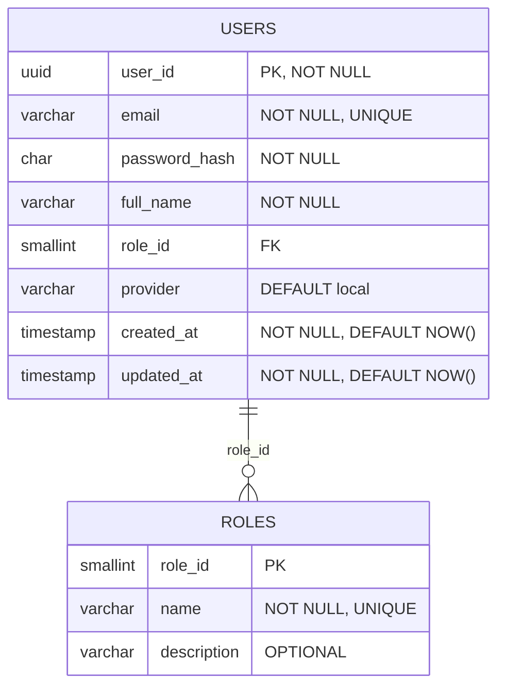

- **[DAT-002]** Bảng Centers
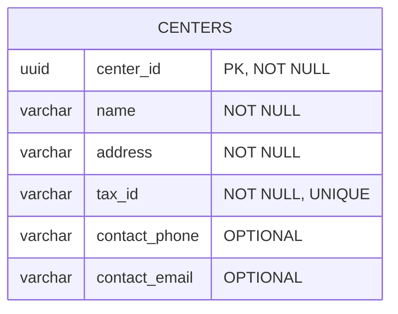

- **[DAT-003]** Bảng Courses
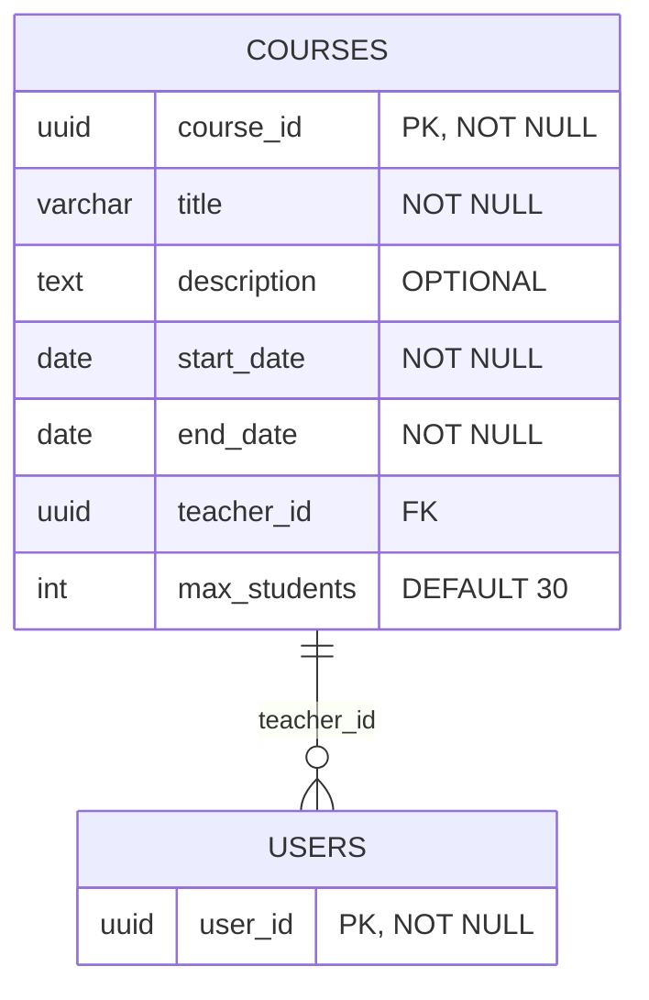

- **[DAT-004]** Bảng Enrollments
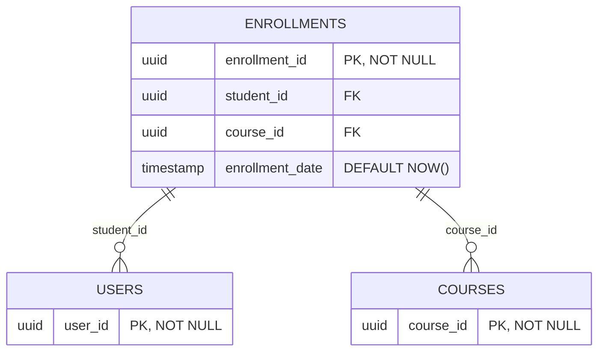

- **[DAT-005]** Bảng Attendance
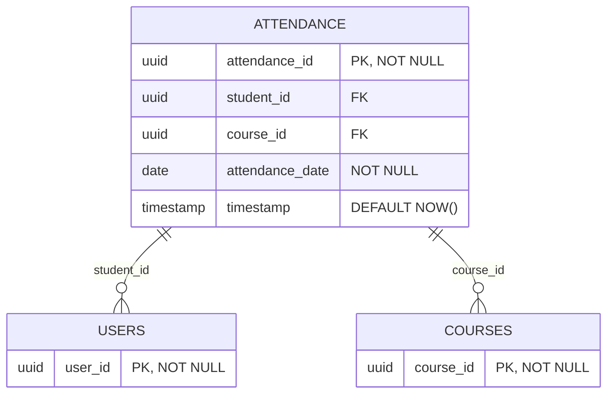

- **[DAT-006]** Bảng StudentCards
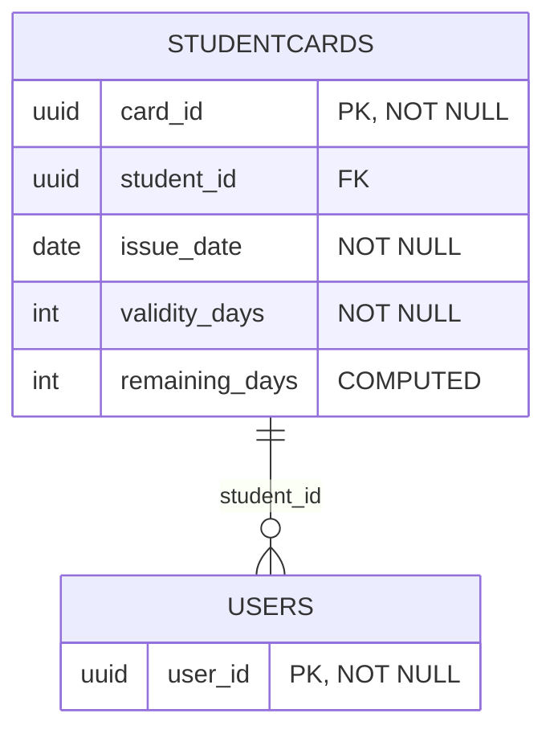

- **[DAT-007]** Bảng Notifications
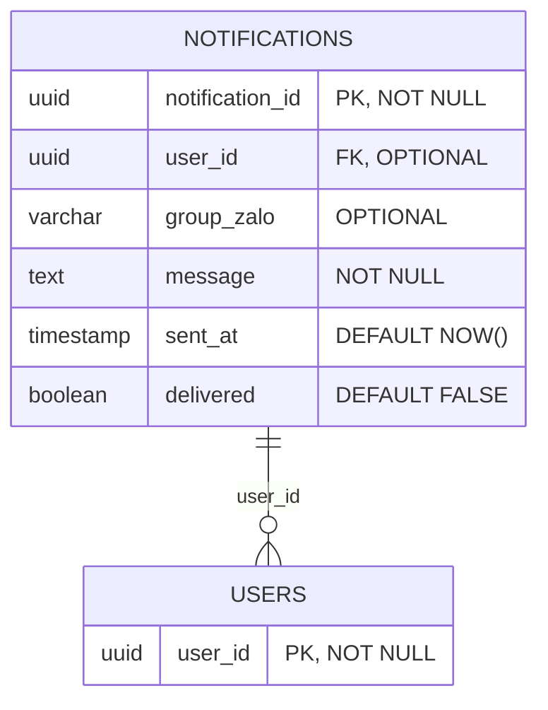

- **[DAT-008]** Bảng Roles
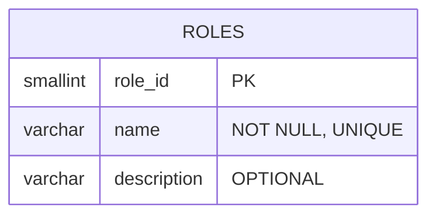

- **[DAT-009]** Bảng Promotions
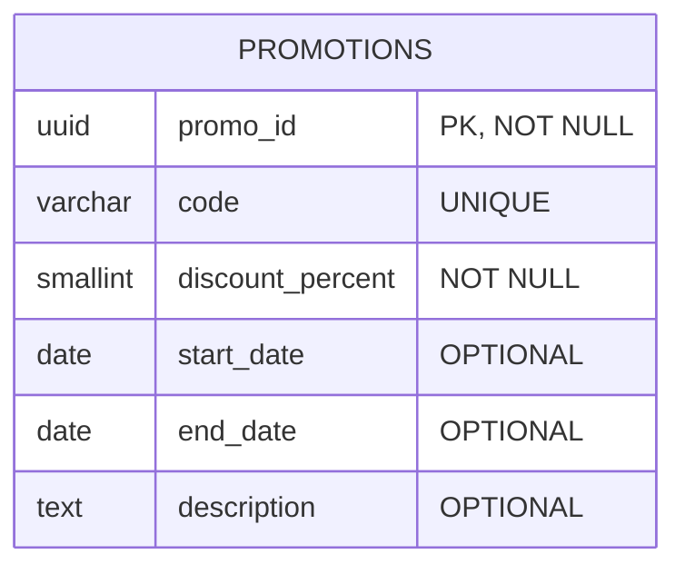

- **[DAT-010]** Bảng Announcements
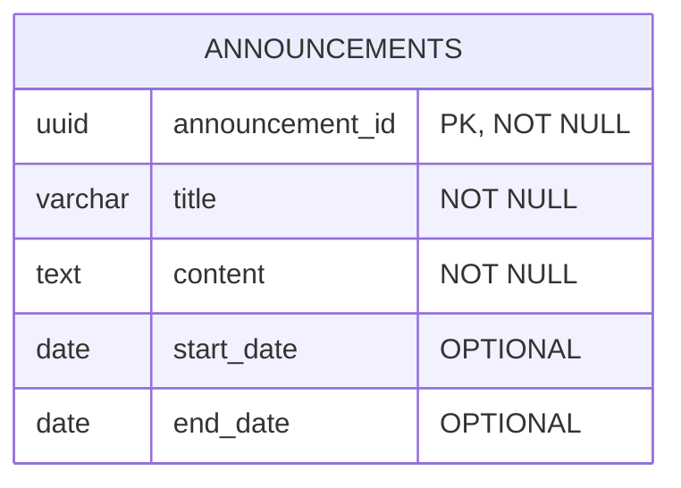

- **[DAT-011]** Bảng SystemSettings
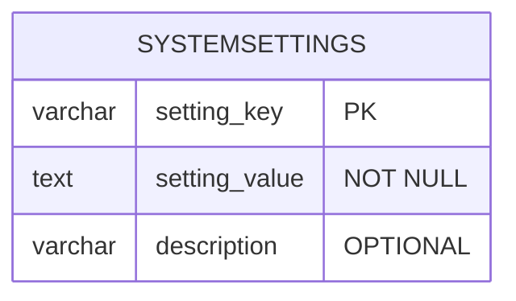

## 6. BẢNG THUỘC TÍNH TAG IDs (TRACEABILITY)

[EXECUTION_REMEDIATION_PAYLOAD_START]
{
  "technical_codename": "membership-hub",
  "descriptive_name": "Hubs Management Platform",
  "brand_name": "MemberHub",
  "requirement_tags": [
    "[REQ-001]",
    "[REQ-002]",
    "[REQ-003]",
    "[REQ-004]",
    "[REQ-005]",
    "[REQ-006]",
    "[REQ-007]",
    "[REQ-008]",
    "[REQ-009]",
    "[REQ-010]",
    "[REQ-011]",
    "[REQ-012]",
    "[REQ-013]",
    "[REQ-014]",
    "[REQ-015]",
    "[REQ-016]",
    "[REQ-017]",
    "[REQ-018]",
    "[REQ-019]",
    "[REQ-020]",
    "[REQ-021]",
    "[REQ-022]",
    "[REQ-023]",
    "[REQ-024]",
    "[REQ-025]",
    "[ARC-001]",
    "[ARC-002]",
    "[ARC-003]",
    "[ARC-004]",
    "[ARC-005]",
    "[ARC-006]",
    "[ARC-007]",
    "[ARC-008]",
    "[ARC-009]",
    "[ARC-010]",
    "[ARC-011]",
    "[ARC-012]",
    "[ARC-013]",
    "[EXC-001]",
    "[EXC-002]",
    "[EXC-003]",
    "[EXC-004]",
    "[EXC-005]",
    "[DAT-001]",
    "[DAT-002]",
    "[DAT-003]",
    "[DAT-004]",
    "[DAT-005]",
    "[DAT-006]",
    "[DAT-007]",
    "[DAT-008]",
    "[DAT-009]",
    "[DAT-010]",
    "[DAT-011]",
    "[NFR-001]",
    "[NFR-002]",
    "[NFR-003]",
    "[NFR-004]",
    "[NFR-005]",
    "[NFR-006]",
    "[NFR-007]",
    "[NFR-008]",
    "[NFR-009]"
  ]
}