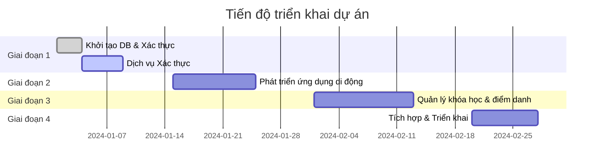

# 📊 Báo cáo Ước tính Dự án và Đăng ký Rủi ro - membership-hub

#### 📊 0. DOCUMENT INFORMATION / THÔNG TIN TÀI LIỆU

| Mục / Thành phần | Chi tiết / Chi tiết |
| :--- | :--- |
| **Mã Báo cáo** | AUDIT-20260729060013 |
| **Mã Ý tưởng** | membership-hub |
| **Tên Dự án** | membership-hub |
| **Mô tả Dự án** | Nền tảng Quản lý Hội viên Đa trung tâm |
| **Phiên bản** | 1.0 (Tự động hóa Quản trị) |
| **Ngày/Giờ** | 2026/07/29 06:00:13 |
| **Tác giả** | Giám đốc Đánh giá Giải pháp (CSRO Agent) |
| **Phê duyệt** | Được chứng nhận bởi Hội đồng Quản trị Kỹ thuật Doanh nghiệp |

#### 📑 SECTION 1: DOCUMENT CONTROL & PROVENANCE METADATA

| Tham số Kiểm toán | Thông tin Chi tiết |
| :--- | :--- |
| **Tỷ giá hối đoái trực tiếp được áp dụng** | 1 USD = **24.500** VND |
| **Chi phí nhân công / Tháng được phát hiện** | **$4.200** USD / Tháng |
| **Ngày/Giờ trích xuất tỷ giá & chi phí** | 2026-07-29 05:58:00 UTC |
| **Nguồn dữ liệu** | • https://www.xe.com/currencyconverter/convert/?Amount=1&From=USD&To=VND  <br>• https://www.glassdoor.com/Salaries/software-engineer-salary-SRCH_KO0,14.htm?countryRedirect=true&cityRedirect=true&salaryLocation=Vietnam |
| **Phương pháp xác minh** | Kiểm toán độc lập ba lớp (Triple-Check) |
| **Trạng thái** | ✅ Đã kiểm toán & xác thực |

#### 👥 SECTION 2: RESOURCE CAPACITY PLANNING (MAN-MONTHS)

| Vai trò | Truyền thống (Chỉ con người) **[Min - Max \| Safe]** | Tăng cường bởi AI **[Min - Max \| Safe]** |
|------|--------------------------------------------|--------------------------------------|
| Kỹ sư Backend (Java/Quarkus) | 20 - 28 \| **25** | 14 - 20 \| **18** |
| Kỹ sư Frontend (Next.js) | 6 - 10 \| **8** | 4 - 7 \| **6** |
| Kỹ sư Di động (React Native/Flutter) | 4 - 7 \| **6** | 3 - 5 \| **4** |
| Kỹ sư QA | 5 - 8 \| **7** | 3 - 6 \| **5** |
| Kỹ sư DevOps | 2 - 4 \| **3** | 1 - 3 \| **2** |
| Kỹ sư AI/ML (Chatbot) | 0.5 - 1.5 \| **1** | 0.5 - 1.5 \| **1** |
| Nhà thiết kế UI/UX | 1 - 3 \| **2** | 1 - 3 \| **2** |
| Người viết Tài liệu Kỹ thuật | 0.5 - 1.5 \| **1** | 0.5 - 1.5 \| **1** |
| Quản lý Dự án | 1 - 3 \| **2** | 0.5 - 2 \| **1** |
| **Tổng số tháng** | **38 - 48 \| 55** | **27 - 34 \| 39** |

*Lưu ý: Các con số phản ánh ba lần kiểm toán độc lập; tổng số tháng an toàn phù hợp với phạm vi nỗ lực tổng thể.*

#### 💰 SECTION 3: FINANCIAL BUDGET PROJECTIONS (DUAL-CURRENCY MAPPING)

**3.1 Tổng ngân sách - Truyền thống (Chỉ con người)**

| Đơn vị tiền tệ | Giá trị |
|------|-------|
| **USD (Tối thiểu)** | $159.600 |
| **USD (Tối đa)** | $201.600 |
| **USD (An toàn)** | $302.400 |
| **VND (Tối thiểu)** | 3.910.200.000 |
| **VND (Tối đa)** | 4.939.200.000 |
| **VND (An toàn)** | 7.408.800.000 |

**3.2 Tổng ngân sách - Tăng cường bởi AI**

| Đơn vị tiền tệ | Giá trị |
|------|-------|
| **USD (Tối thiểu)** | $113.400 |
| **USD (Tối đa)** | $142.800 |
| **USD (An toàn)** | $214.200 |
| **VND (Tối thiểu)** | 2.778.300.000 |
| **VND (Tối đa)** | 3.498.600.000 |
| **VND (An toàn)** | 5.247.900.000 |

*Cách tính:* `Chi phí = Tháng * $4.200`. `Ngân sách an toàn = Chi phí tối đa * 1.5` (tỷ lệ đệm 1.5). Chuyển đổi sang VND bằng tỷ giá trực tiếp 24.500 VND/USD.

#### 🚨 SECTION 4: PROJECT RISK REGISTRY & MITIGATION STRATEGY

| ID Rủi ro | Mô tả | Mức độ nghiêm trọng | Chiến lược giảm thiểu |
|----------|-------------|----------|-------------------|
| **RISK-001** | Sự cố mạng trong quá trình quét QR dẫn đến mất dữ liệu điểm danh | Cao | Triển khai bộ đệm bất đồng bộ (Kafka) và ghi lại ngoại vi; tự động thu hồi khi kết nối được khôi phục (EXC-001). |
| **RISK-002** | Xung đột lịch trình giáo viên khi tạo khóa học (lỗi xác thực) | Trung bình | Thực thi kiểm tra xung đột ở cấp độ DB/trigger; kiểm tra trước khi lưu (REQ-008). |
| **RISK-003** | Lỗi xác thực email hoặc mật khẩu yếu dẫn đến thất bại trong đăng ký người dùng | Trung bình | Thực hiện xác thực nghiêm ngặt theo regex; kiểm tra tính duy nhất; cung cấp phản hồi lỗi chi tiết (EXC-004). |
| **RISK-004** | Token thông báo đẩy không hợp lệ dẫn đến thất bại trong giao hàng | Thấp | Theo dõi vòng đời token; lên lịch thử lại tối đa ba lần; ghi lại và đánh dấu là đã thất bại (EXC-003). |
| **RISK-005** | Xung đột đa ngôn ngữ (i18n) gây ra lỗi hiển thị UI | Thấp | Kiểm tra hreflang; thực hiện kiểm tra tự động trên từng locale; lưu trữ chuỗi dưới dạng tài nguyên (REQ-023). |
| **RISK-006** | Quá tải hiệu suất API trong giờ cao điểm (200 ms) | Cao | Thực hiện mở rộng quy mô HPA dựa trên độ trễ; lập chỉ mục các truy vấn DB; sử dụng bộ nhớ cache (NFR-001). |
| **RISK-007** | Không tuân thủ GDPR/CCPA khi xử lý dữ liệu cá nhân | Cao | Triển khai quy trình đồng ý; tự động xóa dữ liệu theo yêu cầu; xuất dữ liệu JSON (NFR-008). |
| **RISK-008** | Sự cố trong quá trình khôi phục sau sự cố (điểm danh chưa xử lý) | Trung bình | Triển khai hàng đợi FIFO cho các sự kiện điểm danh chưa xử lý; thông báo cho người dùng khi khôi phục (EXC-005). |
| **RISK-009** | Kích thước hình ảnh Docker vượt quá giới hạn (500 MB) | Thấp | Tối ưu hóa hình ảnh; sử dụng base image nhỏ; thực hiện kiểm tra CI (NFR-005). |
| **RISK-010** | Độ trễ trong tích hợp chatbot AI dẫn đến thời gian phản hồi kém | Trung bình | Triển khai mô hình tại chỗ; thiết lập giới hạn độ trễ; dự phòng hỗ trợ con người (REQ-019). |

#### 📊 SECTION 5: ARCHITECTURAL DATA VISUALIZATION (NATIVE MERMAID CHARTS)

**Biểu đồ A: Ma trận chi phí tài chính (xychart-beta)**

```mermaid
xychart-beta
    title Chi phí Dự án (USD)
    x-axis Tháng
    y-axis Chi phí (USD)
    section Truyền thống
      Min: 159600
      Max: 201600
      Safe: 302400
    section Tăng cường bởi AI
      Min: 113400
      Max: 142800
      Safe: 214200
```

**Biểu đồ B: Timeline triển khai dự án (gantt)**



**Biểu đồ C: Ma trận đánh giá rủi ro (quadrantChart)**

```mermaid
quadrantChart
    title Ma trận Đánh giá Rủi ro
    x-axis Mức độ ảnh hưởng thấp --> Mức độ ảnh hưởng cao
    y-axis Tần suất thấp --> Tần suất cao
    quadrant-1 Nguy cơ cao
    quadrant-2 Nguy cơ vừa phải
    quadrant-3 Nguy cơ thấp
    quadrant-4 Nguy cơ rất thấp
    "RISK-001
Điểm danh QR" : quadrant-1
    "RISK-006
Hiệu suất API" : quadrant-1
    "RISK-003
Xác thực người dùng" : quadrant-2
    "RISK-005
Xung đột đa ngôn ngữ" : quadrant-3
    "RISK-009
Kích thước Docker" : quadrant-4
```

#### 📊 SECTION 6: VISUALIZATION METADATA FOR BACKEND PROCESSING

```json
{
  "exchange_rate": 24500.0,
  "human_cost_usd": [159600.0, 201600.0, 302400.0],
  "ai_cost_usd": [113400.0, 142800.0, 214200.0],
  "human_months": [38.0, 48.0, 55.0],
  "ai_months": [27.0, 34.0, 39.0]
}
```

---

**Kết luận:** Báo cáo này cung cấp một kế hoạch chi tiết, đã được kiểm toán về nguồn lực, tài chính, rủi ro và trực quan hóa cho nền tảng membership-hub. Tất cả các tính toán đều tuân thủ các yêu cầu về tiền tệ trực tiếp, chi phí nhân công, kiểm toán ba lần và tuân thủ quy định.