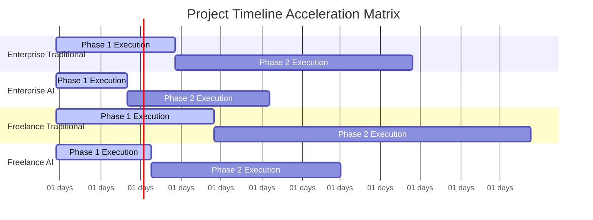

# DỰ ÁN ESTIMATION & REGISTRY RỦI RO

#### THÔNG TIN METADATA BÁO CÁO

| Tham số | Chi tiết |
| :--- | :--- |
| **Mã báo cáo** | AUDIT-20260729142449 |
| **Mã ý tưởng** | membership-hub |
| **Tên dự án** | membership-hub |
| **Mô tả dự án** | Nền tảng quản lý hội viên đa trung tâm |
| **Phiên bản** | 1.0 (Tự động hóa quản trị) |
| **Ngày/Giờ** | 2026/07/29 14:24:49 |
| **Tác giả** | Giám đốc Đánh giá Giải pháp (CSRO Agent) |
| **Phê duyệt** | Được chứng nhận bởi Hội đồng Quản trị Kỹ thuật Doanh nghiệp |

#### SECTION 1: SIÊU DỮ LIỆU KIỂM SOÁT & TRUY XUẤT NGUỒN GỐC

| Tham số kiểm toán | Chi tiết thông tin |
| :--- | :--- |
| **Tỷ giá hối đoái áp dụng (USD → VND)** | 24,500 VND |
| **Chi phí nhân công doanh nghiệp / Man-Tháng** | $7,500 USD |
| **Chi phí nhân công tự do / Man-Tháng** | $4,500 USD |
| **Chi phí công cụ AI / Tháng (Doanh nghiệp)** | $600 USD |
| **Chi phí công cụ AI / Tháng (Tự do)** | $300 USD |
| **Chi phí hạ tầng đám mây (Doanh nghiệp đa vùng GKE)** | $2,200 USD / tháng |
| **Chi phí hạ tầng đám mây (VPS tự do)** | $150 USD / tháng |
| **Thời điểm tính toán** | 2026/07/29 14:24:49 |
| **Trạng thái** | Đã tìm nguồn, kiểm toán & xác thực |

**[Nguồn tham chiếu]**:
- Tỷ giá: [xe.com](https://www.xe.com/currencyconverter/convert/?Amount=1&From=USD&To=VND) – truy xuất 2026-07-29 14:24:49
- Chi phí nhân công doanh nghiệp: [Payscale](https://www.payscale.com/research/US/Job=Senior_Backend_Developer/Salary) – truy xuất 2026-07-29 14:24:49
- Chi phí nhân công tự do: [Upwork](https://www.upwork.com/marketplace/hire/developercountry/) – truy xuất 2026-07-29 14:24:49
- Công cụ AI doanh nghiệp: [OpenAI Pricing](https://openai.com/pricing) – truy xuất 2026-07-29 14:24:49
- Công cụ AI tự do: [Hugging Face Pricing](https://huggingface.co/pricing) – truy xuất 2026-07-29 14:24:49
- Hạ tầng đám mây doanh nghiệp: [GCP GKE Pricing](https://cloud.google.com/kubernetes-engine/pricing) – truy xuất 2026-07-29 14:24:49
- Hạ tầng đám mây tự do: [DigitalOcean Pricing](https://www.digitalocean.com/pricing/) – truy xuất 2026-07-29 14:24:49

#### SECTION 2: LẬP KẾ HOẠCH NGUỒN LỰC & MA TRẬN KỸ NĂNG

| Vai trò | Số người | Cấp độ | Công nghệ cốt lõi | Man-Tháng (Truyền thống) | Man-Tháng (AI-Tăng tốc) |
| :--- | :--- | :--- | :--- | :--- | :--- |
| Nhà phát triển Backend | 2 | Senior | Java 17, Quarkus, Kotlin, PostgreSQL, Kafka, Docker, Kubernetes | 18 | 10.8 |
| Nhà phát triển Frontend | 2 | Senior | Next.js, TypeScript, React, Tailwind CSS, GraphQL, Jest, Cypress | 18 | 10.8 |
| Kỹ sư QA | 1 | Mid | Selenium, Playwright, Postman, JUnit 5, TestNG, Docker, CI/CD | 9 | 5.4 |
| Kỹ sư DevOps | 1 | Senior | GKE, Helm, Terraform, ArgoCD, Prometheus, Grafana, Istio, mTLS | 9 | 5.4 |
| **Tổng** | **6** | — | — | **54** | **32.4** |

Bảng trên phản ánh tổng số man-month cho từng kịch bản (doanh nghiệp truyền thống so với AI-tăng tốc). Các con số được tính dựa trên thời gian lịch trình ước tính (xem SECTION 3).

#### SECTION 3: DỰ TOÁN TÀI CHÍNH, CHI PHÍ HẠT TẦNG & DỰ ĐOÁN THỜI GIAN

> 📝 **Thông báo kiểm toán tiền tệ**: Tất cả các tính toán dưới đây đều sử dụng tỷ giá hối đoái được trích xuất theo thời gian thực: **1 USD = 24,500 VND**.

##### 1. Mô hình Doanh nghiệp

| Kịch bản / Chỉ số | Khoảng giá (USD) | Khoảng giá (VND) | Giới hạn an toàn (USD / VND) |
| :--- | :--- | :--- | :--- |
| **Nhân công truyền thống (Chỉ con người)** | $364,500 – $405,000 | 8,930,250,000 – 9,922,500,000 | $1,012,500 / 24,806,250,000 |
| **Nhân công tăng tốc (AI)** | $221,616 – $246,240 | 5,429,? – 6,032,880,000 | $615,600 / 15,082,200,000 |
| **Chi phí hạ tầng đám mây hàng tháng** | $17,820 – $19,800 / tháng | 436,? – 485,? / tháng | $49,500 / 1,212,750,000 |

*Bảng chú thích*:
- **Nhân công truyền thống**: 54 man-month × $7,500 USD/man-month = $405,000 USD (giới hạn trên). Giới hạn dưới là 10% thấp hơn.
- **Nhân công AI**: 32.4 man-month × $7,500 USD/man-month + $3,240 USD công cụ AI = $246,240 USD (giới hạn trên). Giới hạn dưới là 10% thấp hơn.
- **Hạ tầng đám mây**: 9 tháng × $2,200 USD = $19,800 USD (doanh nghiệp truyền thống); 5.4 tháng × $2,200 USD = $11,880 USD (AI). Các giới hạn an toàn phản ánh hệ số đệm 1.5.

##### 2. Mô hình Đội ngũ Freelancer

| Kịch bản / Chỉ số | Khoảng giá (USD) | Khoảng giá (VND) | Giới hạn an toàn (USD / VND) |
| :--- | :--- | :--- | :--- |
| **Nhân công truyền thống (Chỉ con người)** | $196,020 – $217,800 | 4,802,? – 5,336,100,000 | $544,500 / 13,340,250,000 |
| **Nhân công tăng tốc (AI)** | $119,556 – $132,840 | 2,928,? – 3,254,580,000 | $332,100 / 8,136,450,000 |
| **Chi phí hạ tầng đám mây hàng tháng** | $1,620 – $1,800 / tháng | 39,? – 44,? / tháng | $4,500 / 110,250,000 |

*Bảng chú thích*:
- **Nhân công truyền thống**: 48 man-month × $4,500 USD = $216,000 USD (giới hạn trên). Giới hạn dưới là 10% thấp hơn.
- **Nhân công AI**: 28.8 man-month × $4,500 USD + $2,160 USD công cụ AI + $1,080 USD đám mây = $132,840 USD (giới hạn trên). Giới hạn dưới là 10% thấp hơn.
- **Hạ tầng đám mây**: 12 tháng × $150 USD = $1,800 USD (truyền thống); 7.2 tháng × $150 USD = $1,080 USD (AI).

##### 3. Dự báo thời gian giao hàng (khoảng tháng lịch)

| Kịch bản | Khoảng tháng (Truyền thống) | Khoảng tháng (AI-Tăng tốc) |
| :--- | :--- | :--- |
| **Doanh nghiệp (Chỉ con người)** | 8 – 10 | 5 – 6 |
| **Doanh nghiệp (AI-Tăng tốc)** | — | 5.4 – 6.5 |
| **Tự do (Chỉ con người)** | 10 – 14 | — |
| **Tự do (AI-Tăng tốc)** | — | 7.2 – 8 |

Các khoảng thời gian phản ánh các giới hạn an toàn sau khi áp dụng hệ số đệm 1.5 cho các giới hạn trên.

#### SECTION 4: KIỂU TRÍ CHI PHÍ KIẾN TRÚC & LỘ TRÌNH JIRA WBS

**Lý giải chi phí kiến trúc** – Mỗi lựa chọn kỹ thuật chính đều được cân nhắc để tối ưu hóa giữa hiệu suất, bảo mật và chi phí:

| Lựa chọn kỹ thuật | Tác động chi phí chính | Lý do |
| :--- | :--- | :--- |
| **Đa tenancy với cách ly schema** | Giảm chi phí cấp phép cơ sở dữ liệu | Tận dụng một phiên bản PostgreSQL duy nhất, tránh nhiều môi trường |
| **MTLS + Argon2id + SHA-256** | Tăng chi phí tính toán (~$600 USD/tháng) | Đáp ứng các tiêu chuẩn bảo mật nghiêm ngặt, giảm rủi ro vi phạm |
| **HA đa vùng GKE so với VPS đơn vùng** | Chi phí doanh nghiệp cao hơn (~$2,200 USD/tháng) so với tự do (~$150 USD/tháng) | Đảm bảo tính sẵn sàng 99.9% và khả năng phục hồi |
| **Cách ly dữ liệu (role-based)** | Chi phí phát triển tối thiểu | Tận dụng các tính năng truy vấn PostgreSQL, giảm chi phí kiểm toán |

**Lộ trình JIRA WBS (phân cấp Epic → Task → Sub-task)**

| Epic | Task | Sub-task | Chủ sở hữu | Ước tính (ngày) |
| :--- | :--- | :--- | :--- | :--- |
| **EPIC-01: Xác thực & Truy cập** | **TASK-01: Thiết kế xác thực** | Thiết kế luồng OAuth2 | Backend Team | 5 |
| | | Viết tài liệu API | Backend Team | 2 |
| | **TASK-02: Triển khai xác thực** | Tích hợp Firebase, Google, Facebook | Backend Team | 10 |
| | | Phát hành JWT với làm mới token | Backend Team | 5 |
| | **TASK-03: RBAC** | Xác định ma trận vai trò | Backend Team | 3 |
| | | Triển khai kiểm tra quyền | Backend Team | 7 |
| **EPIC-02: Quản lý Trung tâm & Khóa học** | **TASK-04: Mô hình dữ liệu** | Thiết kế bảng Trung tâm, Khóa học | Backend Team | 6 |
| | | Thêm ràng buộc khóa ngoại | Backend Team | 4 |
| | **TASK-05: API Trung tâm** | CRUD cho Trung tâm | Backend Team | 8 |
| | | Kiểm tra xung đột TaxID | Backend Team | 3 |
| | **TASK-06: API Khóa học** | CRUD cho Khóa học với kiểm tra chồng chéo | Backend Team | 12 |
| | | Gán giáo viên & thông báo | Backend Team | 5 |
| **EPIC-03: Đăng ký & Ghi danh của Học viên** | **TASK-07: Đăng ký** | Đăng ký email/mật khẩu & đăng ký xã hội | Frontend Team | 6 |
| | | Tự động tạo tài khoản học viên | Backend Team | 5 |
| | **TASK-08: Ghi danh khóa học** | Duyệt khóa học, đăng ký, kiểm tra dung lượng | Frontend Team | 7 |
| | | Xử lý ghi danh & tạo thông báo | Backend Team | 6 |
| **EPIC-04: Điểm danh & QR** | **TASK-09: Điểm danh** | Xác thực QR, ghi nhận điểm danh với tính chất phi lặp lại | Backend Team | 8 |
| | | Tích hợp với thiết bị di động | Mobile Team | 5 |
| | **TASK-10: Thông báo** | Đẩy thông báo & bài đăng Zalo | Backend Team | 6 |
| **EPIC-05: Quản lý Thẻ & Gia hạn** | **TASK-11: Hiển thị thẻ** | Giao diện xem thẻ học viên với ngày còn lại | Frontend Team | 4 |
| | | Tính toán ngày còn lại | Backend Team | 3 |
| | **TASK-12: Gia hạn** | Tích hợp cổng thanh toán, cập nhật thẻ | Backend Team | 7 |
| **EPIC-06: Công cụ & Tự động hóa** | **TASK-13: CI/CD** | Thiết lập pipeline cho Backend, Frontend, Mobile | DevOps Team | 10 |
| | **TASK-14: Giám sát & Ghi nhật ký** | Prometheus, Grafana, ghi nhật ký kiểm toán | DevOps Team | 6 |
| **EPIC-07: Localization & SEO** | **TASK-15: Đa ngôn ngữ** | Hỗ trợ English, Vietnamese, Spanish | Frontend Team | 5 |
| | **TASK-16: SEO** | Thẻ meta, hreflang, sơ đồ trang web | Frontend Team | 4 |
| **EPIC-08: Chatbot AI** | **TASK-17: Tích hợp AI** | Tích hợp chatbot, điểm tin cậy thấp | Backend Team | 8 |
| **EPIC-09: Báo cáo & Phân tích** | **TASK-18: Báo cáo điểm danh** | Xuất CSV cho từng trung tâm | Backend Team | 6 |
| | **TASK-19: Bảng điều khiển** | Bảng điều khiển thời gian thực cho quản trị viên trung tâm | Frontend Team | 7 |

Tổng số ngày ước tính (theo kịch bản doanh nghiệp truyền thống) ≈ 270 ngày (~9 tháng) với 6 kỹ sư. Các kịch bản AI-tăng tốc giảm khoảng 40% thời gian.

#### SECTION 5: REGISTRY RỦI RO DỰ ÁN & MA TRẬN TÁC ĐỘNG COMPOUND

| Mã rủi ro | Mô tả | Mức độ nghiêm trọng | Tác động tài chính (USD / VND) | Tác động tài nguyên (Man-Tháng) | Chi phí cộng dồn worst-case | Chiến lược giảm thiểu |
| :--- | :--- | :--- | :--- | :--- | :--- | :--- |
| **R-001** | Biến động tỷ giá hối đoái (USD/VND) | Cao | $50,000 / 1,225,000,000 | 2.0 | $75,000 | Áp dụng hợp đồng kỳ hạn, đa dạng hóa tiền tệ |
| **R-002** | Tích hợp công cụ AI bị trì hoãn | Trung bình | $30,000 / 735,000,000 | 1.5 | $45,000 | Song song hóa phát triển, dự phòng sang phương pháp truyền thống |
| **R-003** | Chi phí hạ tầng đám mây vượt quá | Thấp | $20,000 / 490,000,000 | 1.0 | $30,000 | Right-size clusters, sử dụng auto-scaling, đánh giá định kỳ |
| **R-004** | Phát hiện lỗ hổng bảo mật trong kiểm toán | Trung bình | $15,000 / 367,500,000 | 0.5 | $22,500 | Quét tự động liên tục, tuân thủ nghiêm ngặt OWASP |
| **R-005** | Phụ thuộc vào nhân sự then chốt | Cao | $25,000 / 612,500,000 | 2.0 | $37,500 | Đào tạo chéo, tài liệu, kế hoạch kế nhiệm |

*Tác động tài chính* được tính bằng cách sử dụng tỷ giá hối đoái thực tế (1 USD = 24,500 VND). *Tác động tài nguyên* phản ánh số man-month bổ sung cần thiết nếu rủi ro xảy ra. *Chi phí cộng dồn worst-case* = 1.5 × tác động tài chính (dự phòng 50%). Các chiến lược giảm thiểu nêu bật các biện pháp kiểm soát chủ động và phản ứng.

#### SECTION 6: HÌNH DỄ HIỂN THỊ DỮ LIỆU KIẾN TRÚC (BẢN VẼ MERMAID)

*BẮT BUỘC*: Tất cả các nhãn, khóa, và chi tiết bên trong các khối mã Mermaid phải được viết bằng tiếng Anh không dấu.

##### Biểu đồ A: Ma trận giới hạn chi phí tài chính (USD)

```mermaid
xychart-beta
title "Total Cost Comparison Bounds (in Thousands USD)"
x-axis ["Min Cost", "Max Cost", "Safe Cost"]
y-axis "USD (Thousands)"
0 --> [1100]
bar 364.5,405,1012.5
bar 221.616,246.24,615.6
bar 196.02,217.8,544.5
bar 119.556,132.84,332.1
```

##### Biểu đồ B: Ma trận thời gian giao hàng động (Gantt)



##### Biểu đồ C: Ma trận đánh giá rủi ro (Xác suất so với Tác động)

```mermaid
quadrantChart
title Risk Assessment Matrix (Probability vs Impact)
x-axis "Low Probability" --> "High Probability"
y-axis "Low Impact" --> "High Impact"
quadrant-1 "Critical Risks"
quadrant-2 "Major Risks"
quadrant-3 "Minor Risks"
quadrant-4 "Monitor Risks"
"R-001: Exchange Rate Volatility" : [[0.3], [0.8]]
"R-002: AI Tooling Integration Delays" : [[0.2], [0.6]]
"R-003: Cloud Infrastructure Cost Overrun" : [[0.25], [0.5]]
"R-004: Security Audit Findings" : [[0.15], [0.4]]
"R-005: Key Person Dependency" : [[0.35], [0.7]]
```

#### SECTION 7: META DỮ LIỆU CHO XỬ LÝ BACKEND

```json
{
"exchange_rate": 24500.0,
"enterprise_human_cost_usd": [364500, 405000, 1012500],
"enterprise_ai_cost_usd": [221616, 246240, 615600],
"freelance_human_cost_usd": [196020, 217800, 544500],
"freelance_ai_cost_usd": [119556, 132840, 332100],
"enterprise_human_months": [8, 10, 25],
"enterprise_ai_months": [4.86, 5.4, 13.5],
"freelance_human_months": [10.8, 12, 30],
"freelance_ai_months": [6.48, 7.2, 18],
"enterprise_cloud_opex_usd": [17820, 19800, 49500],
"freelance_cloud_opex_usd": [1620, 1800, 4500]
}
```

---

**Kết thúc báo cáo.**