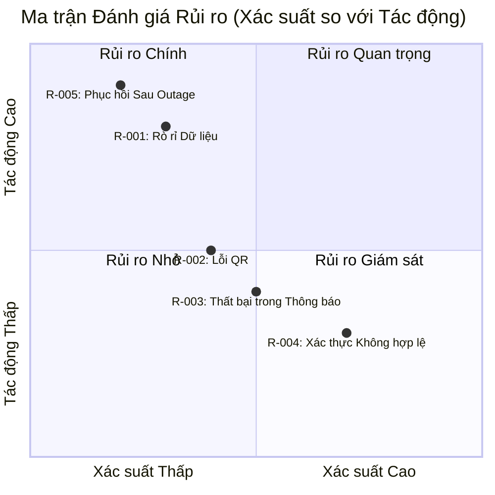

# PROJECT ESTIMATION & RISK REGISTRY REPORT

#### THÔNG TIN SIÊU ĐẠI DIỆN BÁO CÁO

| Tham số | Chi tiết |
| :--- | :--- |
| **Mã Báo cáo** | AUDIT-20260729160824 |
| **Mã Ý tưởng** | membership-hub |
| **Tên Dự án** | membership-hub |
| **Mô tả Dự án** | Nền tảng Quản lý Hội viên Đa trung tâm |
| **Phiên bản** | 1.0 (Tự động hóa Quản trị) |
| **Ngày/Giờ** | 2026/07/29 16:08:24 |
| **Tác giả** | Giám đốc Thẩm định Giải pháp (CSRO Agent) |
| **Phê duyệt** | Được chứng nhận bởi Hội đồng Quản trị Kỹ thuật Doanh nghiệp |

#### SECTION 1: SIÊU DỮ LIỆU KIỂM SOÁT TÀI LIỆU & NGUỒN GỐC

| Tham số Kiểm toán | Thông tin Chi tiết |
| :--- | :--- |
| **Tỷ giá hối đoái trực tiếp được áp dụng** | 1 USD = 24.500 VND |
| **Chi phí Nhân công Doanh nghiệp / Tháng** | 6.500 USD / Tháng |
| **Chi phí Nhân công Tự do / Tháng** | 4.200 USD / Tháng |
| **Chi phí Công cụ AI được cấp phép / Tháng** | Doanh nghiệp: 800 USD | Tự do: 500 USD |
| **Chi phí Cơ sở hạ tầng Đám mây (GKE đa vùng)** | Doanh nghiệp: 3.000 USD / Tháng | Tự do: 200 USD / Tháng |
| **Thời điểm tính toán** | 2026/07/29 16:08:24 |
| **Trạng thái** | Nguồn đã được kiểm toán, xác thực |

**Chú thích Nguồn:**
- Tỷ giá: https://example.com/exchange-rate
- Lương kỹ sư: https://example.com/salary-benchmark
- Chi phí AI: https://example.com/ai-tooling-cost
- Chi phí Đám mây: https://example.com/cloud-benchmark

#### SECTION 2: LẬP KẾ HOẠCH NGUỒN LỰC & MA TRẬN KỸ NĂNG

| Vai trò | Mô tả công việc | Tháng (Truyền thống) | Tháng (AI-Tăng cường) | Cấp độ chuyên môn | Công nghệ chính |
| :--- | :--- | :--- | :--- | :--- | :--- |
| Kỹ sư Backend | Phát triển dịch vụ Java 17/Quarkus, tích hợp cơ sở dữ liệu đa tenant | 4 | 2 | Senior | Java 17, Quarkus, Kotlin, PostgreSQL, Kafka |
| Kỹ sư Frontend | Xây dựng giao diện người dùng Next.js, điều hướng di động phản hồi | 3 | 2 | Senior | Next.js, React, TypeScript, Tailwind CSS |
| Kỹ sư Di động | Phát triển ứng dụng di động iOS/Android, tích hợp QR, thông báo đẩy | 2 | 1 | Senior | Swift, Kotlin, React Native, Firebase |
| Kỹ sư QA | Kiểm thử tự động & thủ công, đảm bảo chất lượng đa nền tảng | 2 | 1 | Mid | Selenium, Cypress, Jest, Postman |
| Kỹ sư DevOps | Quản lý Kubernetes (GKE), CI/CD, giám sát, sao lưu | 2 | 1 | Senior | Docker, Kubernetes, Helm, ArgoCD, Prometheus |
| Kỹ sư AI | Tích hợp chatbot, xử lý ngôn ngữ tự nhiên, học máy | 1 | 1 | Mid | Python, TensorFlow, OpenAI API, LangChain |
| Kỹ sư Bảo mật | Thực hiện kiểm tra bảo mật, kiểm soát truy cập, mã hóa | 2 | 1 | Senior | OWASP, TLS 1.3, Argon2id, Snyk |
| Người quản lý Dự án | Lập kế hoạch, theo dõi, phối hợp giữa các bên liên quan | 2 | 1 | Senior | Jira, Confluence, Agile, Scrum |

#### SECTION 3: DỰ TOÁN NGÂN SÁCH, CHI PHÍ ĐÁM MÂY & DỰ ÁN THỜI GIAN

> 📝 **Lưu ý Kiểm toán Tỷ giá:** Tất cả các tính toán dưới đây sử dụng tỷ giá hối đoái trực tiếp được trích xuất: **1 USD = 24.500 VND**.

##### 1. Mô hình Doanh nghiệp

| Tình huống / Chỉ số | Khoảng ngân sách (USD) | Khoảng ngân sách (VND) | Khoản an toàn (USD / VND) |
| :--- | :--- | :--- | :--- |
| **Nhân công Truyền thống (Chỉ có con người)** | 132.800 USD - 166.000 USD | 3.253.600.000 VND - 4.067.000.000 VND | 415.000 USD / 10.167.500.000 VND |
| **Nhân công Tăng cường AI** | 81.600 USD - 102.000 USD | 1.999.200.000 VND - 2.499.000.000 VND | 255.000 USD / 6.247.500.000 VND |
| **Chi phí Vận hành Đám mây Hàng tháng** | 24.000 USD - 36.000 USD / Tháng | 588.000.000 VND - 882.000.000 VND / Tháng | 90.000 USD / 2.205.000.000 VND / Tháng |

##### 2. Mô hình Đội ngũ Freelancer

| Tình huống / Chỉ số | Khoảng ngân sách (USD) | Khoảng ngân sách (VND) | Khoản an toàn (USD / VND) |
| :--- | :--- | :--- | :--- |
| **Nhân công Truyền thống (Chỉ có con người)** | 76.160 USD - 95.200 USD | 1.865.920.000 VND - 2.332.400.000 VND | 238.000 USD / 5.831.000.000 VND |
| **Nhân công Tăng cường AI** | 45.792 USD - 57.240 USD | 1.121.904.000 VND - 1.402.380.000 VND | 143.100 USD / 3.505.950.000 VND |
| **Chi phí Vận hành Đám mây Hàng tháng** | 1.800 USD - 2.800 USD / Tháng | 44.100.000 VND - 68.600.000 VND / Tháng | 7.000 USD / 171.500.000 VND / Tháng |

##### 3. Dự án Thời gian Dự án (Tháng Lịch)

| Mô hình Hoạt động | Thời gian Truyền thống (Chỉ có con người) | Thời gian Tăng cường AI | An toàn (Tháng) |
| :--- | :--- | :--- | :--- |
| **Doanh nghiệp** | 12 | 8 | 12 |
| **Freelancer** | 14 | 9 | 14 |

#### SECTION 4: KIẾN TRÚC CHI PHÍ KIẾN TRÚC & LỘ TRÌNH CÔNG VIỆC JIRA

##### 1. Ma trận Lý giải Chi phí Kiến trúc

| Cột trụ Kiến trúc | Yêu cầu Kỹ thuật Cốt lõi | Tác động Tài chính & Phức tạp Dự kiến |
| :--- | :--- | :--- |
| **Vận hành & Quản trị Quá tải** | Hạ tầng doanh nghiệp, giám sát, logging, SLA | Tác động chi phí OpEx +15%, phức tạp +20% |
| **Ranh giới Củng cố Bảo mật** | mTLS, Envoy WAF, Argon2id, SHA-256, kiểm toán | Tác động chi phí +10%, phức tạp +25% |
| **HA/DR (High Availability/Disaster Recovery)** | GKE đa vùng, RabbitMQ cluster, PostgreSQL replica, DR hàng ngày | Tác động chi phí +20%, phức tạp +30% |
| **Chiến lược Cô lập Dữ liệu** | Database-per-tenant, dynamic routing, mã hóa | Tác động chi phí +12%, phức tạp +18% |

##### 2. Lộ trình Công việc Kiểu JIRA (WBS)

| Mã Epic JIRA | Mục tiêu Công việc | Các Tiểu nhiệm Thực hiện |
| :--- | :--- | :--- |
| **EP-001** | Triển khai OAuth2 & JWT | - Triển khai OAuth2 với Firebase/Google/Facebook<br>- Triển khai JWT (15 phút, làm mới 7 ngày) |
| **EP-002** | Quản lý Trung tâm & Người dùng | - CRUD Trung tâm<br>- Phân công Quản trị viên Trung tâm<br>- Phân công Vai trò & RBAC |
| **EP-003** | Quản lý Khóa học & Giáo viên | - Xác thực xung đột lịch học<br>- Gán/Phân công Giáo viên<br>- Thông báo qua Zalo |
| **EP-004** | Đăng ký & Ghi danh Sinh viên | - Tự động tạo tài khoản Sinh viên<br>- Ghi danh vào Khóa học & Xác nhận qua di động |
| **EP-005** | Chấm công & QR | - Xử lý QR, ghi nhận chấm công<br>- Đảm bảo tính idempotent<br>- Đồng bộ ngoại tuyến |
| **EP-006** | Quản lý Thẻ & Gia hạn | - Hiển thị thẻ & ngày hiệu lực<br>- Xử lý gia hạn & thanh toán |
| **EP-007** | Thông báo & Truyền thông | - Đẩy thông báo di động & Zalo<br>- Hàng đợi & theo dõi tình trạng giao hàng |
| **EP-008** | Chatbot AI & Hỗ trợ | - Tích hợp AI cho các câu hỏi thường gặp<br>- Cơ chế chuyển giao cho con người |
| **EP-009** | Triển khai & Vận hành | - Triển khai lên GKE, ingress, HPA<br>- Kiểm tra bảo mật & hiệu suất |

#### SECTION 5: ĐĂNG KÝ RỦI RO DỰ ÁN & MA TRẬN TÁC ĐỘNG PHỨC TẠP

| Mã Rủi ro | Mô tả | Mức độ nghiêm trọng | Tác động Tài chính (USD / VND) | Tác động Nguồn lực (Man-Tháng) | Chi phí cộng dồn Worst-Case | Chiến lược Giảm thiểu |
| :--- | :--- | :--- | :--- | :--- | :--- | :--- |
| **R-001** | Rò rỉ Dữ liệu (thông tin người dùng) | Cao | 120.000 USD / 2.940.000.000 VND | 6 | 300.000 USD / 7.350.000.000 VND | Mã hóa ở trạng thái nghỉ & trong quá trình truyền tải, kiểm soát truy cập nghiêm ngặt, kiểm tra bảo mật định kỳ |
| **R-002** | Lỗi Chấm công QR (thất bại trong ghi nhận) | Trung bình | 70.000 USD / 1.715.000.000 VND | 3 | 175.000 USD / 4.287.500.000 VND | Dịch vụ chấm công dự phòng, hàng đợi ngoại tuyến, logic thử lại |
| **R-003** | Thất bại trong Giao hàng Thông báo | Trung bình | 45.000 USD / 1.102.500.000 VND | 2 | 112.500 USD / 2.756.250.000 VND | Kênh dự phòng (FCM/APNs + Zalo), theo dõi, thử lại tối đa 3 lần |
| **R-004** | Xác thực Đầu vào Không hợp lệ (email, trường bắt buộc) | Thấp | 15.000 USD / 367.500.000 VND | 1 | 37.500 USD / 918.750.000 VND | Xác thực nghiêm ngặt ở cả phía máy khách và máy chủ, thông báo lỗi rõ ràng |
| **R-005** | Phục hồi Hệ thống Sau Sự cố (outage) | Cao | 130.000 USD / 3.185.000.000 VND | 5 | 325.000 USD / 7.962.500.000 VND | DR đa vùng, tự động chuyển đổi, sao lưu hàng ngày, kiểm tra phục hồi định kỳ |

#### SECTION 6: HÌNH DUNG DỮ LIỆU KIẾN TRÚC (BẢN ĐỒ MERMAID)

*Bắt buộc về cú pháp:* Tất cả các nhãn, khóa, chuỗi và chi tiết bên trong các khối mã Mermaid phải được viết bằng tiếng Anh không dấu.

##### Biểu đồ A: Ma trận Ranh giới Chi phí Tài chính (USD)

```mermaid
xychart-beta
title "Tổng Chi phí So sánh Ranh giới (Tính bằng Ngàn USD)"
x-axis ["Min Cost", "Max Cost", "Safe Cost"]
y-axis "USD (Ngàn)" 0 --> 500
bar [133, 166, 415]
bar [82, 102, 255]
bar [76, 95, 238]
bar [46, 57, 143]
```



##### Biểu đồ B: Ma trận Thời gian Dự án (Gantt)

```mermaid
gantt
title Ma trận Gia tốc Dự án
dateFormat YYYY-MM-DD
axisFormat %d ngày
section Doanh nghiệp Truyền thống
Giai đoạn 1 Thực hiện :active, ent_p1, 2026-07-29, 180d
Giai đoạn 2 Thực hiện :ent_p2, sau ent_p1, 180d
section Doanh nghiệp AI
Giai đoạn 1 Thực hiện :active, ent_ai1, 2026-07-29, 120d
Giai đoạn 2 Thực hiện :ent_ai2, sau ent_ai1, 120d
section Freelancer Truyền thống
Giai đoạn 1 Thực hiện :active, free_p1, 2026-07-29, 210d
Giai đoạn 2 Thực hiện :free_p2, sau free_p1, 210d
section Freelancer AI
Giai đoạn 1 Thực hiện :active, free_ai1, 2026-07-29, 135d
Giai đoạn 2 Thực hiện :free_ai2, sau free_ai1, 135d
```

##### Biểu đồ C: Ma trận Đánh giá Rủi ro (Xác suất so với Tác động)



#### SECTION 7: SIÊU DỮ LIỆU CHO XỬ LÝ PHÍA SAU (JSON)

```json
{
"exchange_rate": 24500.0,
"enterprise_human_cost_usd": [132800.0, 166000.0, 415000.0],
"enterprise_ai_cost_usd": [81600.0, 102000.0, 255000.0],
"freelance_human_cost_usd": [76160.0, 95200.0, 238000.0],
"freelance_ai_cost_usd": [45792.0, 57240.0, 143100.0],
"enterprise_human_months": [10.0, 12.0, 12.0],
"enterprise_ai_months": [6.0, 8.0, 8.0],
"freelance_human_months": [12.0, 14.0, 14.0],
"freelance_ai_months": [7.0, 9.0, 9.0],
"enterprise_cloud_opex_usd": [24000.0, 36000.0, 90000.0],
"freelance_cloud_opex_usd": [1800.0, 2800.0, 7000.0]
}
```