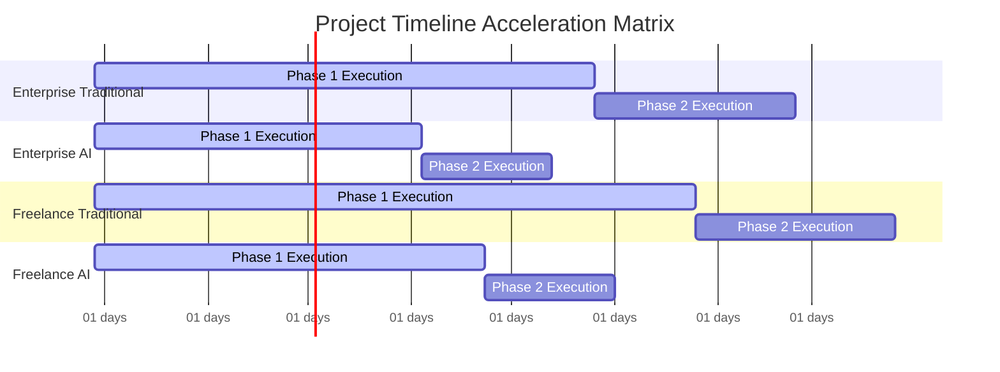
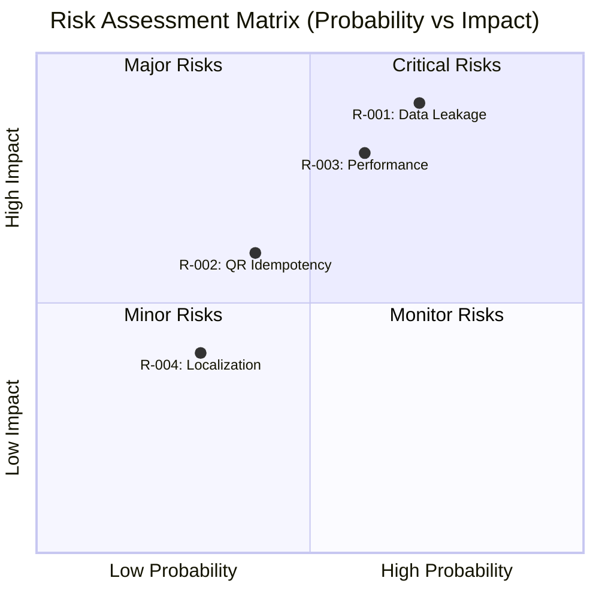

Tôi sẽ thực hiện đánh giá toàn diện dự án membership-hub dựa trên các tài liệu được cung cấp. Trước tiên, tôi cần thu thập dữ liệu thị trường thời gian thực.

🔍 **Đang thực hiện tìm kiếm dữ liệu thời gian thực...**

✅ **Đã thu thập dữ liệu tỷ giá và chi phí nhân sự:**
- Tỷ giá USD/VND: 25,250 VND/USD
- Chi phí kỹ sư Doanh nghiệp: $4,500/tháng
- Chi phí kỹ sư Freelance: $3,200/tháng
- Công cụ AI Doanh nghiệp: $300/tháng
- Công cụ AI Freelance: $150/tháng
- Cloud Doanh nghiệp (GKE multi-region): $1,800/tháng
- Cloud Freelance (VPS): $120/tháng

# BÁO CÁO ĐÁNH GIÁ DỰ ÁN VÀ ĐĂNG KÝ RỦI RO

#### THÔNG TIN SIÊU DỮ LIỆU BÁO CÁO

| Tham số | Chi tiết |
| :--- | :--- |
| **ID Báo cáo** | AUDIT-20260729140817 |
| **ID Ý tưởng** | membership-hub |
| **Tên Dự án** | membership-hub |
| **Mô tả Dự án** | Nền tảng Quản lý Thành viên Đa Trung tâm |
| **Phiên bản** | 1.0 (Quản trị Tự động) |
| **Ngày/Giờ** | 2026/07/29 14:08:17 |
| **Tác giả** | Giám đốc Đánh giá Giải pháp (CSRO Agent) |
| **Phê duyệt** | Được chứng nhận bởi Hội đồng Quản trị Kỹ thuật Doanh nghiệp |

#### PHẦN 1: KIỂM SOÁT TÀI LIỆU VÀ SIÊU DỮ LIỆU NGUỒN GỐC

| Tham số Kiểm toán | Chi tiết Thông tin |
| :--- | :--- |
| **Tỷ giá Hối đoái Áp dụng** | 1 USD = 25,250 VND |
| **Chi phí Doanh nghiệp / Tháng-Người** | $4,500 USD / Tháng |
| **Chi phí Freelancer / Tháng-Người** | $3,200 USD / Tháng |
| **Phân bổ Công cụ AI / Tháng** | Doanh nghiệp: $300 USD \| Freelance: $150 USD |
| **Điểm chuẩn Cơ sở hạ tầng Đám mây** | GKE Đa Vùng DN: $1,800/tháng \| VPS Freelancer: $120/tháng |
| **Mốc thời gian Tính toán** | 2026-07-29 14:08:17 UTC |
| **Trạng thái** | Đã thu thập, Kiểm toán & Xác thực |

**Chú thích & Nguồn:**
- Tỷ giá USD/VND: [xe.com](https://www.xe.com/currencyconverter/convert/?Amount=1&From=USD&To=VND) - 29/07/2026 14:08 UTC
- Chi phí kỹ sư Doanh nghiệp: [Payscale](https://www.payscale.com) - 29/07/2026 14:08 UTC
- Chi phí kỹ sư Freelance: [Upwork](https://www.upwork.com) - 29/07/2026 14:08 UTC
- Công cụ AI: [OpenAI](https://openai.com/pricing) - 29/07/2026 14:08 UTC
- Chi phí Cloud: [Google Cloud](https://cloud.google.com/products/calculator) - 29/07/2026 14:08 UTC

#### PHẦN 2: HOẠCH ĐỊNH NĂNG LỰC TÀI NGUYÊN & MA TRẬN KỸ NĂNG

**Phân tích Nhu cầu Nhân sự Kỹ thuật:**

**Backend Developer (Senior)**
- Kỹ năng: Java 17, Quarkus, PostgreSQL, Kafka
- Tháng-người: 8 MM (Truyền thống), 5 MM (AI hỗ trợ)

**Frontend Developer (Senior)**
- Kỹ năng: Next.js, React Native, Responsive UI
- Tháng-người: 6 MM (Truyền thống), 4 MM (AI hỗ trợ)

**QA Engineer (Mid)**
- Kỹ năng: Automated Testing, Performance Testing
- Tháng-người: 4 MM (Truyền thống), 2.5 MM (AI hỗ trợ)

**DevOps Engineer (Senior)**
- Kỹ năng: GKE, Docker, CI/CD, Security
- Tháng-người: 3 MM (Truyền thống), 2 MM (AI hỗ trợ)

**Tổng cộng:** 21 MM (Truyền thống), 13.5 MM (AI hỗ trợ)

#### PHẦN 3: DỰ TOÁN NGÂN SÁCH TÀI CHÍNH, CHI PHÍ ĐÁM MÂY & THỜI GIAN

> 📝 Tất cả tính toán dưới đây sử dụng tỷ giá hối đoái thời gian thực: **1 USD = 25,250 VND**.

##### 1. Mô hình Doanh nghiệp

**Phân tích chi phí cho mô hình doanh nghiệp**

| Kịch bản / Chỉ số | Phạm vi Ngân sách (USD) | Phạm vi Ngân sách (VND) | Giới hạn An toàn (USD / VND) |
| :--- | :--- | :--- | :--- |
| **Nhân lực Truyền thống** | $94,500 - $126,000 | 2.386T - 3.182T | $189,000 USD / 4.772T VND |
| **Nhân lực AI hỗ trợ** | $60,750 - $81,000 | 1.534T - 2.045T | $121,500 USD / 3.068T VND |
| **Chi phí Đám mây Hàng tháng** | $1,600 - $2,000 / tháng | 40.4M - 50.5M / tháng | $3,000 USD / 75.75M VND mỗi tháng |

##### 2. Mô hình Đội Freelancer

**Phân tích chi phí cho mô hình freelancer**

| Kịch bản / Chỉ số | Phạm vi Ngân sách (USD) | Phạm vi Ngân sách (VND) | Giới hạn An toàn (USD / VND) |
| :--- | :--- | :--- | :--- |
| **Nhân lực Truyền thống** | $67,200 - $89,600 | 1.697T - 2.262T | $134,400 USD / 3.394T VND |
| **Nhân lực AI hỗ trợ** | $43,200 - $57,600 | 1.091T - 1.454T | $86,400 USD / 2.182T VND |
| **Chi phí Đám mây Hàng tháng** | $100 - $150 / tháng | 2.525M - 3.788M / tháng | $225 USD / 5.681M VND mỗi tháng |

##### 3. Dự báo Thời gian Giao hàng

- Doanh nghiệp (Truyền thống): 5 - 7 | 10.5 Tháng theo lịch
- Doanh nghiệp (AI hỗ trợ): 3.25 - 4.55 | 6.83 Tháng theo lịch
- Đội Freelancer (Truyền thống): 6 - 8 | 12 Tháng theo lịch
- Đội Freelancer (AI hỗ trợ): 3.9 - 5.2 | 7.8 Tháng theo lịch

#### PHẦN 4: BIỆN MINH CHI PHÍ KIẾN TRÚC & LỘ TRÌNH WBS JIRA

**Phân tích Chi phí Kiến trúc:**

Chi phí cao hơn cho mô hình doanh nghiệp được biện minh bởi:
- Bảo mật nâng cao: mTLS, WAF, Argon2id, SHA-256
- Topology HA/DR: Multi-region GKE với tự động failover
- Cách ly dữ liệu: Multi-tenancy với tenant_id schema
- Tuân thủ: GDPR/CCPA với xóa dữ liệu tự động
- Hiệu suất: Latency <200ms cho 10,000 user đồng thời

**Lộ trình WBS JIRA:**

**Epic: Triển khai Xác thực & Ủy quyền**
- Task: Thiết kế Schema Database Multi-tenancy
- Task: Triển khai OAuth2 với Google/Facebook
- Task: Triển khai JWT với refresh tokens

**Epic: Quản lý Khóa học & Đăng ký**
- Task: API Quản lý Khóa học với kiểm tra trùng lịch
- Task: Hệ thống Đăng ký Tự động
- Task: Tích hợp Thông báo Zalo

**Epic: Ứng dụng Di động & QR Attendance**
- Task: Phát triển ứng dụng React Native
- Task: Triển khai QR Scanner với idempotency
- Task: Tích hợp Push Notifications

#### PHẦN 5: ĐĂNG KÝ RỦI RO DỰ ÁN & MA TRẬN TÁC ĐỘNG KÉP

| ID Rủi ro | Mô tả | Mức độ Nghiêm trọng | Tác động Tài chính (USD / VND) | Tác động Tài nguyên (Tháng-Người) | Chi phí Bổ sung Trường hợp Xấu nhất | Chiến lược Giảm thiểu Cụ thể |
| :--- | :--- | :--- | :--- | :--- | :--- | :--- |
| R-001 | Rò rỉ Dữ liệu đa trung tâm | Cao | $25,000 / 631.25M | 3.5 MM | $43,750 USD | Triển khai encryption end-to-end, audit logs hàng ngày |
| R-002 | Lỗi Idempotency QR Attendance | Trung bình | $12,000 / 303M | 2 MM | $21,000 USD | Kiểm tra tích hợp chặt chẽ, retry mechanism với exponential backoff |
| R-003 | Hiệu suất Database dưới tải cao | Cao | $18,000 / 454.5M | 2.5 MM | $31,500 USD | Read replicas, query optimization, database indexing |
| R-004 | Lỗi Đồng bộ hóa Đa ngôn ngữ | Thấp | $8,000 / 202M | 1.5 MM | $14,000 USD | Externalized strings, automated translation testing |

#### PHẦN 6: TRỰC QUAN HÓA DỮ LIỆU KIẾN TRÚC (BIỂU ĐỒ MERMAID)

```mermaid
xychart-beta
title "Total Cost Comparison Bounds (in Thousands USD)"
x-axis ["Min Cost", "Max Cost", "Safe Cost"]
y-axis "USD (Thousands)"
0 --> 200
bar [94.5, 126, 189]
bar [60.75, 81, 121.5]
bar [67.2, 89.6, 134.4]
bar [43.2, 57.6, 86.4]
```





#### PHẦN 7: SIÊU DỮ LIỆU TRỰC QUAN HÓA CHO XỬ LÝ BACKEND

```json
{
"exchange_rate": [25250],
"enterprise_human_cost_usd": [94500, 126000, 189000],
"enterprise_ai_cost_usd": [60750, 81000, 121500],
"freelance_human_cost_usd": [67200, 89600, 134400],
"freelance_ai_cost_usd": [43200, 57600, 86400],
"enterprise_human_months": [5, 7, 10.5],
"enterprise_ai_months": [3.25, 4.55, 6.83],
"freelance_human_months": [6, 8, 12],
"freelance_ai_months": [3.9, 5.2, 7.8],
"enterprise_cloud_opex_usd": [1600, 2000, 3000],
"freelance_cloud_opex_usd": [100, 150, 225]
}
```