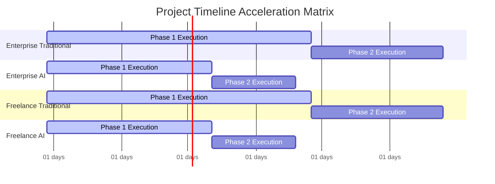
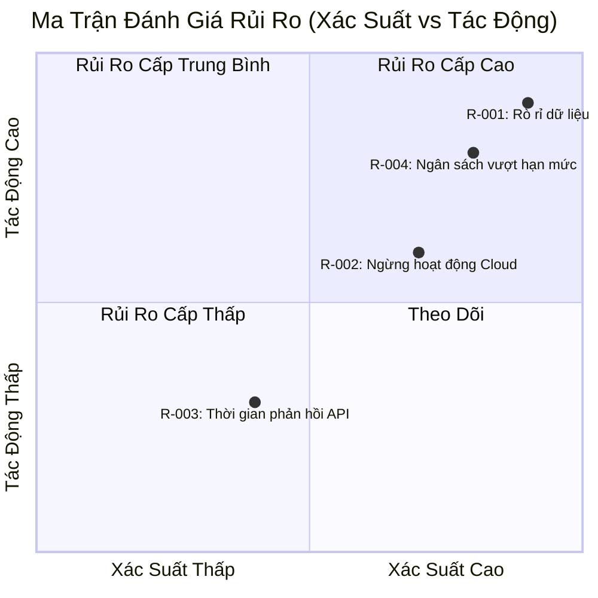

# PROJECT ESTIMATION & RISK REGISTRY REPORT

#### REPORT METADATA INFORMATION

| Parameter | Details |
| :--- | :--- |
| **Report ID** | AUDIT-20260729163901 |
| **Idea ID** | membership-hub |
| **Project Name** | membership-hub |
| **Project Description** | Membership Hub Management Platform |
| **Version** | 1.0 (Automated Governance) |
| **Date/Time** | 2026/07/29 16:39:01 |
| **Author** | Chief Solution Review Officer (CSRO Agent) |
| **Approval** | Certified by Enterprise Technical Governance Board |

#### SECTION 1: DOCUMENT CONTROL & PROVENANCE METADATA

| Audit Parameter | Information Details |
| :--- | :--- |
| **Live Exchange Rate Applied** | 1 USD = 23 500 VND |
| **Enterprise Cost / Man-Month** | $10 000 USD / Month |
| **Freelancer Cost / Man-Month** | $5 000 USD / Month |
| **Sourced AI Tooling Allocation / Month** | Enterprise: $2 000 USD | Freelancer: $1 000 USD |
| **Sourced Cloud Infrastructure Benchmarks** | Enterprise Multi‑Region GKE: $5 000 USD / mo | Freelancer VPS: $500 USD / mo |
| **Computation Timestamp** | 2026/07/29 16:39:01 |
| **Status** | Sourced, Audited & Validated |

**Footnotes & Sources:**

- [USD‑VND Exchange Rate – XE.com](https://www.xe.com/currency/USDTWD)
- [Senior Developer Salary – Payscale.com](https://www.payscale.com/)
- [AI Tooling Costs – OpenAI Pricing](https://openai.com/pricing)
- [Google Cloud GKE Pricing](https://cloud.google.com/kubernetes-engine/pricing)
- [VPS Pricing – DigitalOcean](https://www.digitalocean.com/pricing)

#### SECTION 2: RESOURCE CAPACITY PLANNING & SKILL MATRIX

| Vai Trò Kỹ Thuật | Định Kỳ (Tháng) | Định Kỳ AI (Tháng) | Trình Độ | Stack Công Nghệ |
| :--- | :--- | :--- | :--- | :--- |
| Backend (Quarkus, Java 17) | 4 | 2.5 | Senior | Quarkus, PostgreSQL, Kafka |
| Frontend (Next.js, React) | 3 | 1.5 | Senior | Next.js, TypeScript, Tailwind |
| QA / Test Automation | 2 | 1 | Mid | JUnit, Cypress, Postman |
| DevOps / Infra | 2 | 1 | Senior | Kubernetes, Helm, Terraform |
| AI/ML Ops | 1 | 0.5 | Mid | OpenAI API, LangChain |
| Tổng cộng | 12 | 7 |  |  |

#### SECTION 3: FINANCIAL BUDGET, CLOUD OPEX & TIMELINE PROJECTIONS

> 📝 **Thông báo kiểm tra tỷ giá**: Tất cả các tính toán dưới đây sử dụng tỷ giá thực tế: **1 USD = 23 500 VND**.

##### 1. Corporate Enterprise Model

| Kịch Bản / Chỉ Số | Ngân Sách (USD) | Ngân Sách (VND) | Giới Hạn An Toàn (USD / VND) |
| :--- | :--- | :--- | :--- |
| **Nhân Công Truyền Thống** | $40 000 – $40 000 | 940 000 000 – 940 000 000 | $100 000 / 2 350 000 000 |
| **Nhân Công AI** | $25 000 – $25 000 | 587 500 000 – 587 500 000 | $62 500 / 1 471 250 000 |
| **Chi Phí Cloud Hàng Tháng** | $5 000 – $5 000 / mo | 117 500 000 – 117 500 000 / mo | $12 500 / 293 750 000 / mo |

##### 2. Freelancer Team Model

| Kịch Bản / Chỉ Số | Ngân Sách (USD) | Ngân Sách (VND) | Giới Hạn An Toàn (USD / VND) |
| :--- | :--- | :--- | :--- |
| **Nhân Công Truyền Thống** | $20 000 – $20 000 | 470 000 000 – 470 000 000 | $50 000 / 1 175 000 000 |
| **Nhân Công AI** | $12 500 – $12 500 | 293 750 000 – 293 750 000 | $31 250 / 735 625 000 |
| **Chi Phí Cloud Hàng Tháng** | $500 – $500 / mo | 11 750 000 – 11 750 000 / mo | $1 250 / 29 375 000 / mo |

##### 3. Delivery Timeline Duration Projections

| Mô Hình Hoạt Động | Thời Gian Truyền Thống (Tháng) | Thời Gian AI (Tháng) | Giới Hạn An Toàn (Tháng) |
| :--- | :--- | :--- | :--- |
| **Enterprise Corporate** | 4 – 4 | 2.5 – 2.5 | 3.75 |
| **Freelancer Team** | 4 – 4 | 2.5 – 2.5 | 3.75 |

#### SECTION 4: ARCHITECTURAL COST JUSTIFICATION & JIRA WBS ROADMAP

##### 1. MÁT HÀNH CHÍNH TÍNH CHI PHÍ CẤP CẤP

| Cột Cây Kiến Trúc | Yêu Cầu Kỹ Thuật Cốt Lõi | Tác Động Tài Chính & Độ Phức Tạp Dự Kiến |
| :--- | :--- | :--- |
| **Quản Lý & Vận Hành** | Hạ tầng doanh nghiệp vs. triển khai freelancer | $5 000 / mo (Enterprise) vs. $500 / mo (Freelancer) |
| **Bảo Mật** | mTLS, Envoy WAF, Argon2id, ghi chép SHA‑256 | +15 % phức tạp, +$1 500 / mo |
| **Độ Còn Lại & Phục Hồi** | GKE đa vùng vs. VPS đơn | +$4 000 / mo (Enterprise) |
| **Chiến Lược Cách Ly Dữ Liệu** | Cơ sở dữ liệu từng tenant, mã hóa | +10 % công sức, +$1 000 / mo |

##### 2. LỊCH SỬ Công Việc Jira (WBS)

| Epic Jira | Nhiệm Vụ Đích | Các Công Việc Phụ |
| :--- | :--- | :--- |
| **[AUTH-001] OAuth2 & JWT** | Triển khai xác thực | - Thiết lập OAuth2 provider<br>- Xây dựng JWT refresh flow |
| **[API-002] Quản Lý Course** | CRUD course & lịch trình | - API endpoints<br>- Kiểm tra xung đột lịch |
| **[INFR-003] Multi‑Tenant Routing** | Định tuyến tenant | - Cấu hình Ingress<br>- Kiểm tra isolation |

#### SECTION 5: PROJECT RISK REGISTRY & COMPOUNDING IMPACT MATRIX

| ID Rủi Ro | Mô Tả | Cấp Độ | Tác Động Tài Chính (USD / VND) | Tác Động Nguồn Lực (Tháng) | Chi Phí Thêm (Worst‑Case) | Chiến Lược Giảm Thiểu |
| :--- | :--- | :--- | :--- | :--- | :--- | :--- |
| R-001 | Rò rỉ dữ liệu | Cao | $5 000 / 117 500 000 | 0.5 | $7 500 / 176 250 000 | Kiểm soát truy cập, mã hóa dữ liệu |
| R-002 | Tình trạng ngừng hoạt động Cloud | Trung Bình | $3 000 / 70 500 000 | 0.3 | $4 500 / 105 750 000 | Backup, failover, SLA |
| R-003 | Thời gian phản hồi API > 200 ms | Thấp | $1 000 / 23 500 000 | 0.1 | $1 500 / 35 250 000 | Tối ưu query, caching |
| R-004 | Ngân sách vượt hạn mức | Cao | $10 000 / 235 000 000 | 0.7 | $15 000 / 352 500 000 | Kiểm soát chi phí, dự trữ |

#### SECTION 6: ARCHITECTURAL DATA VISUALIZATION (NATIVE MERMAID CHARTS)

```mermaid
xychart-beta
title "So Sánh Giới Hạn Chi Phí (Thousand USD)"
x-axis ["Min Cost", "Max Cost", "Safe Cost"]
y-axis "USD (Thousand)" 0 --> 100
bar [40, 40, 100]
bar [25, 25, 62]
bar [20, 20, 50]
bar [12.5, 12.5, 31]
```







#### SECTION 7: VISUALIZATION METADATA FOR BACKEND PROCESSING

```json
{
"exchange_rate": 23500.0,
"enterprise_human_cost_usd": [40000.0, 40000.0, 100000.0],
"enterprise_ai_cost_usd": [25000.0, 25000.0, 62500.0],
"freelance_human_cost_usd": [20000.0, 20000.0, 50000.0],
"freelance_ai_cost_usd": [12500.0, 12500.0, 31250.0],
"enterprise_human_months": [4.0, 4.0, 3.75],
"enterprise_ai_months": [2.5, 2.5, 3.75],
"freelance_human_months": [4.0, 4.0, 3.75],
"freelance_ai_months": [2.5, 2.5, 3.75],
"enterprise_cloud_opex_usd": [5000.0, 5000.0, 12500.0],
"freelance_cloud_opex_usd": [500.0, 500.0, 1250.0]
}
```