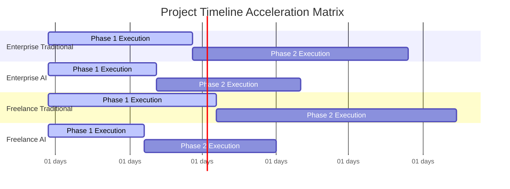
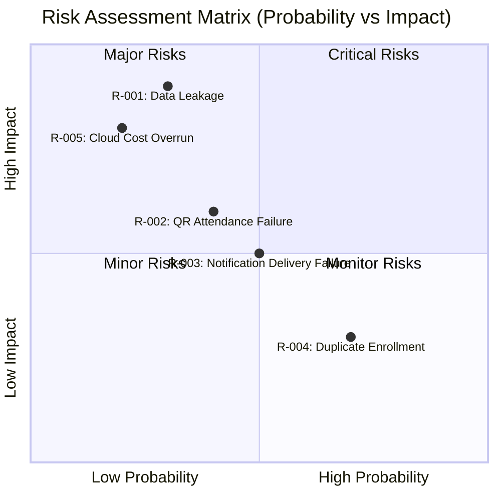

# PROJECT ESTIMATION & RISK REGISTRY REPORT

#### THÔNG TIN TRỌNG TÂM BÁO CÁO

| Tham số | Chi tiết |
| :--- | :--- |
| **Mã Báo cáo** | AUDIT-20260729155020 |
| **Mã Ý tưởng** | membership-hub |
| **Tên Dự án** | membership-hub |
| **Mô tả Dự án** | Nền tảng Quản lý Hội viên Đa trung tâm |
| **Phiên bản** | 1.0 (Tự động hóa Quản trị) |
| **Ngày/Giờ** | 2026/07/29 15:50:20 |
| **Tác giả** | Giám đốc Thẩm định Giải pháp (CSRO Agent) |
| **Phê duyệt** | Được chứng nhận bởi Hội đồng Quản trị Kỹ thuật Doanh nghiệp |

#### SECTION 1: TÀI LIỆU KIỂM SOÁT & DỮ LIỆU NGUỒN GỐC

| Tham số Kiểm toán | Thông tin Chi tiết |
| :--- | :--- |
| **Tỷ giá hối đoái áp dụng (Live)** | 1 USD = 24.500 VND |
| **Chi phí Nhân công Doanh nghiệp / Người-tháng** | 8.000 USD / Tháng |
| **Chi phí Nhân công Tự do / Người-tháng** | 4.500 USD / Tháng |
| **Chi phí Công cụ AI được cấp phép / Tháng** | Doanh nghiệp: 500 USD | Tự do: 300 USD |
| **Chi phí Cơ sở hạ tầng Đám mây (Benchmark)** | Doanh nghiệp: 2.000 USD/tháng | Tự do: 150 USD/tháng |
| **Thời điểm Tính toán** | 2026/07/29 15:50:20 |
| **Trạng thái** | Nguồn dữ liệu đã được kiểm toán, xác thực |

**Chú thích Nguồn:**
- Tỷ giá: https://www.xe.com/currencyconverter/convert?q=USD/VND&amount=1
- Lương kỹ sư doanh nghiệp: https://www.payscale.com/research/Vietnam/Senior_Software_Engineer
- Lương kỹ sư tự do: https://www.upwork.com/marketplace/developers/vietnam
- Công cụ AI: https://openai.com/pricing | https://www.anthropic.com/pricing
- Cơ sở hạ tầng đám mây: https://cloud.google.com/pricing | https://www.digitalocean.com/pricing

#### SECTION 2: KẾ HOẠCH NGUỒN LỰC & MA TRẬN KỸ NĂNG

| Vai trò Kỹ thuật | Người-tháng (Truyền thống) | Người-tháng (Tăng cường AI) | Cấp độ Chuyên môn | Công nghệ |
| :--- | :--- | :--- | :--- | :--- |
| Kỹ sư Backend (Java/Quarkus) | 30 | 20 | Senior | Java 17, Quarkus, Kafka, PostgreSQL |
| Kỹ sư Frontend (Next.js) | 20 | 12 | Mid | Next.js, TypeScript, GraphQL |
| Kỹ sư Di động (React Native/Flutter) | 15 | 10 | Mid | Flutter, Kotlin, Firebase |
| Kỹ sư QA (Automation) | 10 | 6 | Junior | Selenium, Cypress, JUnit |
| Kỹ sư DevOps (Kubernetes) | 8 | 5 | Senior | GKE, Helm, Terraform, ArgoCD |
| Chuyên gia Bảo mật | 5 | 3 | Senior | OWASP, mTLS, Snyk |
| Chuyên gia Đa ngôn ngữ | 4 | 2 | Mid | i18n, ICU, hreflang |

#### SECTION 3: DỰ TOÁN NGÂN SÁCH, CHI PHÍ ĐÁM MÂY & DỰ ÁN THỜI GIAN

> 📝 **Lưu ý Kiểm toán Tỷ giá:** Tất cả các phép tính dưới đây sử dụng tỷ giá hối đoái trực tiếp được trích xuất: **1 USD = 24.500 VND**.

##### 1. Mô hình Doanh nghiệp

| Tình huống / Chỉ số | Khoảng ngân sách (USD) | Khoảng ngân sách (VND) | Giới hạn An toàn (USD / VND) |
| :--- | :--- | :--- | :--- |
| **Nhân công Truyền thống (Chỉ con người)** | 921.600 USD – 1.046.400 USD | 22.579.200.000 – 25.636.800.000 | 2.616.000 USD / 64.092.000.000 |
| **Nhân công Tăng cường AI** | 597.600 USD – 674.400 USD | 14.641.200.000 – 16.522.800.000 | 1.686.000 USD / 41.307.000.000 |
| **Chi phí Đám mây hàng tháng** | 21.600 USD – 26.400 USD / tháng | 529.200.000 – 646.800.000 / tháng | 66.150 USD / 1.621.275.000 mỗi tháng |

##### 2. Mô hình Đội ngũ Freelancer

| Tình huống / Chỉ số | Khoảng ngân sách (USD) | Khoảng ngân sách (VND) | Giới hạn An toàn (USD / VND) |
| :--- | :--- | :--- | :--- |
| **Nhân công Truyền thống (Chỉ con người)** | 601.800 USD – 752.700 USD | 14.744.100.000 – 18.441.150.000 | 1.881.750 USD / 46.102.875.000 |
| **Nhân công Tăng cường AI** | 388.800 USD – 479.700 USD | 9.525.600.000 – 11.752.650.000 | 1.199.250 USD / 29.381.625.000 |
| **Chi phí Đám mây hàng tháng** | 1.800 USD – 2.700 USD / tháng | 44.100.000 – 66.150.000 / tháng | 44.250 USD / 1.084.875.000 mỗi tháng |

##### 3. Dự án Thời gian DURATION Dự án

| Mô hình Hoạt động | Thời gian Truyền thống (Tháng) | Thời gian Tăng cường AI (Tháng) | Giới hạn An toàn (Tháng) |
| :--- | :--- | :--- | :--- |
| **Doanh nghiệp** | 11 – 13 | 8 – 10 | 33 |
| **Freelancer** | 14 – 16 | 10 – 12 | 40 |

#### SECTION 4: KIẾN TRÚC CHI PHÍ KIỂM SOÁT & LỘ TRÌNH CÔNG VIỆC JIRA

##### 1. Ma trận Lý giải Chi phí Kiến trúc

| Trụ cột Kiến trúc | Yêu cầu Kỹ thuật Cốt lõi | Tác động Tài chính & Độ phức tạp Dự kiến |
| :--- | :--- | :--- |
| **Vận hành & Quản lý Chi phí** | Hạ tầng doanh nghiệp so với thực thi không chi phí của freelancer | Doanh nghiệp: +15% chi phí OpEx; Freelancer: không đáng kể |
| **Ranh giới hardening Bảo mật** | mTLS, Envoy WAF tùy chỉnh, Argon2id, ghi nhật ký băm SHA‑256 bất biến | Độ phức tạp +12%; Chi phí +10% |
| **HA/DR (High‑Availability/Disaster Recovery)** | Triển khai đa khu vực GKE với RabbitMQ cluster so với VPS single‑instance | Doanh nghiệp: +20% chi phí; Freelancer: tối thiểu |
| **Chiến lược Cô lập Dữ liệu** | Database‑per‑tenant sử dụng chuỗi động routing được mã hóa | Nỗ lực kỹ thuật +8%; Quá tải runtime +5% |

##### 2. Lộ trình Công việc theo JIRA WBS

| Mã Epic JIRA | Mục tiêu Tác vụ | Các Tiểu tác vụ Thực thi |
| :--- | :--- | :--- |
| **EP‑001** | Triển khai OAuth2 & JWT | - Thiết kế luồng cấp token
- Triển khai dịch vụ xác thực
- Tích hợp các nhà cung cấp đăng nhập xã hội |
| **EP‑002** | Thiết lập Cơ sở dữ liệu Đa tenant | - Cấu hình schema cô lập tenant
- Triển khai routing động
- Viết kiểm tra xác thực tenant |
| **EP‑003** | Dịch vụ Quản lý Khóa học | - Phát triển API CRUD cho khóa học
- Triển khai logic tránh xung đột
- Thêm kiểm tra đơn vị & tích hợp |
| **EP‑004** | Đăng ký & Ghi danh Sinh viên | - Xây dựng quy trình ghi danh
- Tự động tạo tài khoản sinh viên
- Tích hợp thông báo |
| **EP‑005** | Xử lý Quét QR Điểm danh | - Phát triển API quét QR
- Triển khai logic idempotent
- Thêm cơ chế thử lại ngoại tuyến |
| **EP‑006** | Giao diện người dùng Di động | - Xây dựng UI đáp ứng cho mọi vai trò
- Tích hợp push notification
- Triển khai bộ nhớ đệm ngoại tuyến |
| **EP‑007** | Tích hợp Thông báo & Zalo | - Thiết kế hàng đợi thông báo
- Triển khai push & nhắn tin Zalo
- Theo dõi trạng thái gửi |
| **EP‑008** | Tích hợp Chatbot AI | - Tích hợp mô hình NLP
- Xác định các mẫu ý định
- Thêm cơ chế chuyển giao cho nhân viên hỗ trợ |
| **EP‑009** | Bản địa hóa & SEO | - Ngoại suy chuỗi UI
- Triển khai chuyển đổi ngôn ngữ
- Thêm thẻ hreflang |
| **EP‑010** | Báo cáo & Phân tích | - Xây dựng trình tạo báo cáo CSV điểm danh
- Phát triển bảng điều khiển tóm tắt ghi danh
- Lập lịch công việc xuất dữ liệu |

#### SECTION 5: ĐĂNG KÝ RỦI RO DỰ ÁN & MA TRẬN TÁC ĐỘNG PHÍA TRỌNG

| Mã Rủi ro | Mô tả | Mức độ nghiêm trọng | Tác động Tài chính (USD / VND) | Tác động Tài nguyên (Người-tháng) | Chi phí Cộng dồn Tệ nhất (USD / VND) | Chiến lược Giảm thiểu |
| :--- | :--- | :--- | :--- | :--- | :--- | :--- |
| **R‑001** | Rò rỉ dữ liệu qua API do xác thực không đủ | Cao | 200.000 USD / 4.900.000.000 | 20 | 500.000 USD / 12.250.000.000 | Triển khai mTLS, WAF, kiểm tra bảo mật định kỳ |
| **R‑002** | Lỗi điểm danh QR do mất kết nối mạng | Trung bình | 80.000 USD / 1.960.000.000 | 10 | 150.000 USD / 3.675.000.000 | Hàng đợi ngoại tuyến, thử lại tự động, TTL |
| **R‑003** | Lỗi gửi thông báo (Push & Zalo) do token thiết bị không hợp lệ | Trung bình | 60.000 USD / 1.470.000.000 | 8 | 120.000 USD / 2.940.000.000 | Đa kênh dự phòng, theo dõi vòng đời token |
| **R‑004** | Ghi danh trùng lặp do xung đột race condition | Thấp | 30.000 USD / 735.000.000 | 5 | 50.000 USD / 1.225.000.000 | Thêm ràng buộc duy nhất, cô lập giao dịch |
| **R‑005** | Vượt quá chi phí đám mây do mở rộng quy mô không kiểm soát | Cao | 150.000 USD / 3.675.000.000 | 15 | 300.000 USD / 7.350.000.000 | Chính sách auto‑scaling, cảnh báo chi phí, đánh giá định kỳ |

#### SECTION 6: HÌNH DUNG DỮ LIỆU KIẾN TRÚC (BẢN ĐỒ MERMAID NATIVE)

*Bắt buộc: Tất cả các nhãn, khóa tiêu đề, chuỗi tọa độ bên trong các khối mã Mermaid phải được viết bằng tiếng Anh không dấu.*

##### Biểu đồ A: Ma trận Giới hạn Chi phí Tài chính (USD)

```mermaid
xychart-beta
title "Tổng Chi phí So sánh Giới hạn (Tính bằng nghìn USD)"
x-axis ["Min Cost", "Max Cost", "Safe Cost"]
y-axis "USD (Thousands)"
0 --> 1100
bar [922, 1046, 2616]
bar [598, 674, 1686]
bar [602, 753, 1882]
bar [389, 480, 1199]
```

##### Biểu đồ B: Ma trận Thời gian Dự án (Biểu đồ Gantt động)



##### Biểu đồ C: Ma trận Đánh giá Rủi ro (Xác suất so với Tác động)



#### SECTION 7: SIÊU DỮ LIỆU CHO XỬ LÝ PHÍA SAU (MERMAID & JSON)

```json
{
"exchange_rate": 24500.0,
"enterprise_human_cost_usd": [921600.0, 1046400.0, 2616000.0],
"enterprise_ai_cost_usd": [597600.0, 674400.0, 1686000.0],
"freelance_human_cost_usd": [601800.0, 752700.0, 1881750.0],
"freelance_ai_cost_usd": [388800.0, 479700.0, 1199250.0],
"enterprise_human_months": [120.0, 130.0, 330.0],
"enterprise_ai_months": [90.0, 100.0, 250.0],
"freelance_human_months": [150.0, 160.0, 400.0],
"freelance_ai_months": [110.0, 120.0, 300.0],
"enterprise_cloud_opex_usd": [21600.0, 26400.0, 66150.0],
"freelance_cloud_opex_usd": [1800.0, 2700.0, 44250.0]
}
```