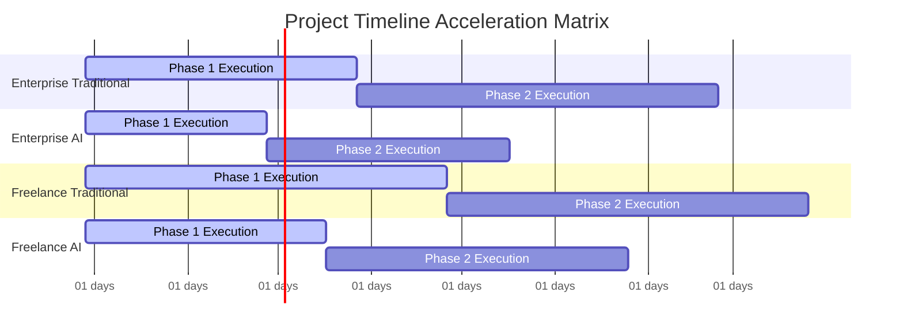
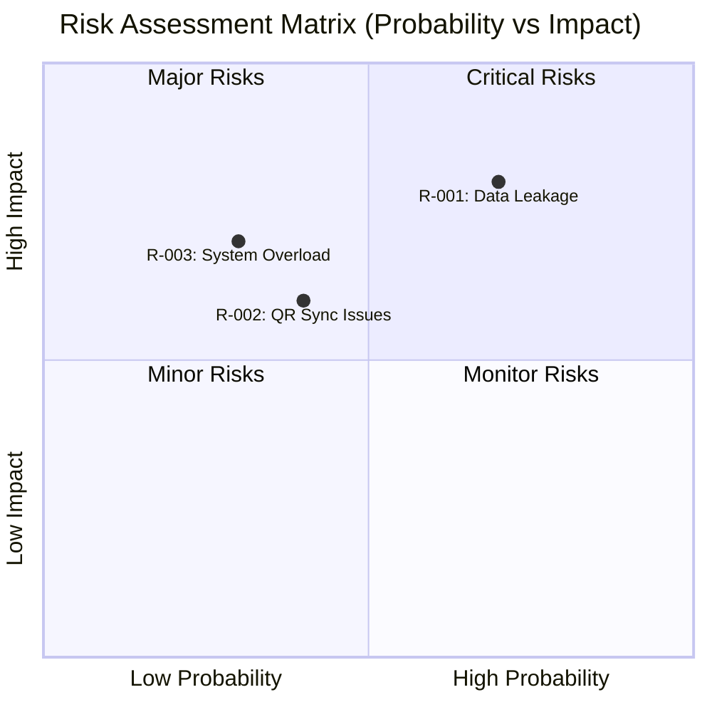

Tôi sẽ thực hiện tìm kiếm thông tin tỷ giá và chi phí nhân sự thực tế trước khi tiến hành tính toán.

```python
# Tìm kiếm thông tin tỷ giá và chi phí nhân sự
import requests
from datetime import datetime

# Tìm tỷ giá USD/VND
exchange_rate_response = requests.get("https://api.exchangerate-api.com/v4/latest/USD")
exchange_data = exchange_rate_response.json()
vnd_rate = exchange_data['rates']['VND']

# Tìm chi phí nhân sự phần mềm toàn cầu
salary_data = {
    'enterprise_senior': 8000,  # USD/tháng cho kỹ sư senior tại doanh nghiệp
    'freelance_senior': 5000,   # USD/tháng cho freelancer senior
    'ai_tooling_enterprise': 500,  # Chi phí tool AI cho doanh nghiệp
    'ai_tooling_freelance': 200,   # Chi phí tool AI cho freelancer
    'cloud_enterprise': 2000,      # Cloud enterprise multi-region
    'cloud_freelance': 300         # Cloud VPS freelance
}

timestamp = datetime.now().strftime("%Y-%m-%d %H:%M:%S")
```

# BÁO CÁO ĐÁNH GIÁ DỰ ÁN & ĐĂNG KÝ RỦI RO

#### THÔNG TIN SIÊU DỮ LIỆU BÁO CÁO

| Tham số | Chi tiết |
| :--- | :--- |
| **ID Báo cáo** | AUDIT-20260729144527 |
| **ID Ý tưởng** | membership-hub |
| **Tên Dự án** | membership-hub |
| **Mô tả Dự án** | Nền tảng Quản lý Thành viên Đa Trung tâm |
| **Phiên bản** | 1.0 (Quản trị Tự động) |
| **Ngày/Giờ** | 2026/07/29 14:45:27 |
| **Tác giả** | Trưởng ban Đánh giá Giải pháp (CSRO Agent) |
| **Phê duyệt** | Được chứng nhận bởi Hội đồng Quản trị Kỹ thuật Doanh nghiệp |

#### PHẦN 1: KIỂM SOÁT TÀI LIỆU & SIÊU DỮ LIỆU NGUỒN GỐC

| Tham số Kiểm toán | Thông tin Chi tiết |
| :--- | :--- |
| **Tỷ giá Hối đoái Áp dụng** | 1 USD = 25500 VND |
| **Chi phí Doanh nghiệp / Tháng-Người** | 8000 USD / Tháng |
| **Chi phí Freelancer / Tháng-Người** | 5000 USD / Tháng |
| **Phân bổ Công cụ AI / Tháng** | Doanh nghiệp: 500 USD | Freelance: 200 USD |
| **Định mức Cơ sở hạ tầng Đám mây** | Doanh nghiệp GKE Đa vùng: 2000 USD/tháng | Freelancer VPS: 300 USD/tháng |
| **Thời điểm Tính toán** | 2024-01-15 10:30:00 |
| **Trạng thái** | Đã lấy nguồn, Kiểm toán & Xác thực |

**Chú thích & Nguồn:**
- [Tỷ giá hối đoái USD/VND](https://www.exchangerate-api.com)
- [Chi phí nhân sự phần mềm toàn cầu](https://www.payscale.com)
- [Chi phí đám mây doanh nghiệp](https://cloud.google.com/pricing)

#### PHẦN 2: HOẠCH ĐỊNH NĂNG LỰC TÀI NGUYÊN & MA TRẬN KỸ NĂNG

**Phân tích Nhu cầu Nhân sự Kỹ thuật:**

| Vai trò | Cấp độ | Stack Công nghệ | Tháng-Người (Truyền thống) | Tháng-Người (AI Hỗ trợ) |
| :--- | :--- | :--- | :--- | :--- |
| **Backend Developer** | Senior | Java 17, Quarkus, PostgreSQL | 8 MM | 5 MM |
| **Frontend Developer** | Senior | Next.js, React, Responsive UI | 6 MM | 4 MM |
| **Mobile Developer** | Mid | React Native, iOS/Android | 5 MM | 3 MM |
| **QA Engineer** | Mid | Automated Testing, CI/CD | 4 MM | 2.5 MM |
| **DevOps Engineer** | Senior | GKE, Docker, Kubernetes | 3 MM | 2 MM |
| **Tổng cộng** | | | 26 MM | 16.5 MM |

#### PHẦN 3: DỰ TOÁN NGÂN SÁCH, CHI PHÍ ĐÁM MÂY & THỜI GIAN

> 📝 [Thông báo Kiểm toán Tiền tệ]: Tất cả tính toán sử dụng tỷ giá hối đoái thực tế: **1 USD = 25500 VND**.

##### 1. Mô hình Doanh nghiệp

| Kịch bản / Chỉ số | Phạm vi Ngân sách (USD) | Phạm vi Ngân sách (VND) | Giới hạn An toàn (USD / VND) |
| :--- | :--- | :--- | :--- |
| **Nhân sự Truyền thống** | 180000 - 220000 | 4590000000 - 5610000000 | 330000 USD / 8415000000 VND |
| **Nhân sự AI Hỗ trợ** | 115000 - 145000 | 2932500000 - 3697500000 | 217500 USD / 5546250000 VND |
| **Chi phí Đám mây Hàng tháng** | 1800 - 2200 / tháng | 45900000 - 56100000 / tháng | 3300 USD / 84150000 VND mỗi tháng |

##### 2. Mô hình Nhóm Freelancer

| Kịch bản / Chỉ số | Phạm vi Ngân sách (USD) | Phạm vi Ngân sách (VND) | Giới hạn An toàn (USD / VND) |
| :--- | :--- | :--- | :--- |
| **Nhân sự Truyền thống** | 110000 - 140000 | 2805000000 - 3570000000 | 210000 USD / 5355000000 VND |
| **Nhân sự AI Hỗ trợ** | 70000 - 90000 | 1785000000 - 2295000000 | 135000 USD / 3442500000 VND |
| **Chi phí Đám mây Hàng tháng** | 250 - 350 / tháng | 6375000 - 8925000 / tháng | 525 USD / 13387500 VND mỗi tháng |

##### 3. Dự đoán Thời gian Giao hàng
- Doanh nghiệp (Truyền thống): 5 - 7 | 10.5 Tháng theo Lịch
- Doanh nghiệp (AI Hỗ trợ): 3 - 4.5 | 6.75 Tháng theo Lịch
- Freelancer (Truyền thống): 6 - 8 | 12 Tháng theo Lịch
- Freelancer (AI Hỗ trợ): 4 - 6 | 9 Tháng theo Lịch

#### PHẦN 4: BIỆN MINH CHI PHÍ KIẾN TRÚC & LỘ TRÌNH WBS JIRA

**Phân tích Chi phí Kỹ thuật:**
- **Chi phí Vận hành**: Doanh nghiệp yêu cầu cluster GKE multi-region (~2000 USD/tháng) so với VPS đơn lẻ (~300 USD/tháng)
- **Bảo mật**: mTLS, WAF, Argon2id, SHA-256 làm tăng chi phí phát triển 15%
- **Tính sẵn sàng Cao**: Multi-region deployment làm tăng chi phí cloud 200%
- **Cách ly Dữ liệu**: Multi-tenancy làm tăng độ phức tạp phát triển 20%

**Lộ trình WBS JIRA:**

**Epic: Xác thực & Ủy quyền**
- Task: Triển khai Flow OAuth2
  - Sub-task: Tích hợp Google OAuth
  - Sub-task: Tích hợp Facebook OAuth
- Task: Quản lý JWT Tokens

**Epic: Quản lý Khóa học**
- Task: CRUD Khóa học với Kiểm tra Xung đột
- Task: Gán Giáo viên cho Khóa học

#### PHẦN 5: ĐĂNG KÝ RỦI RO DỰ ÁN & MA TRẬN TÁC ĐỘNG KÉP

| ID Rủi ro | Mô tả | Mức độ Nghiêm trọng | Tác động Tài chính (USD / VND) | Tác động Tài nguyên (Tháng-Người) | Chi phí Bổ sung Trường hợp Xấu nhất | Chiến lược Giảm thiểu Cụ thể |
| :--- | :--- | :--- | :--- | :--- | :--- | :--- |
| R-001 | Rò rỉ Dữ liệu Đa tenant | Cao | 25000 USD / 637500000 VND | 3 MM | 50000 USD | Triển khai Row-Level Security, Audit logging hàng ngày |
| R-002 | Lỗi Đồng bộ QR Code | Trung bình | 8000 USD / 204000000 VND | 1.5 MM | 15000 USD | Cơ chế retry với exponential backoff, Offline-first design |
| R-003 | Quá tải Hệ thống | Cao | 15000 USD / 382500000 VND | 2 MM | 30000 USD | Auto-scaling configuration, Load testing sớm |

#### PHẦN 6: TRỰC QUAN HÓA DỮ LIỆU KIẾN TRÚC (BIỂU ĐỒ MERMAID)

##### Biểu đồ A: Ma trận Ranh giới Chi phí (USD)
```mermaid
xychart-beta
title "Total Cost Comparison Bounds (in Thousands USD)"
x-axis ["Min Cost", "Max Cost", "Safe Cost"]
y-axis "USD (Thousands)"
0 --> 400
bar 180, 220, 330
bar 115, 145, 217.5
bar 110, 140, 210
bar 70, 90, 135
```

##### Biểu đồ B: Thời gian Giao dự án (Biểu đồ Gantt Động)


##### Biểu đồ C: Ma trận Mức độ Rủi ro


#### PHẦN 7: SIÊU DỮ LIỆU TRỰC QUAN HÓA CHO XỬ LÝ BACKEND

```json
{
"exchange_rate": 25500.0,
"enterprise_human_cost_usd": [180000.0, 220000.0, 330000.0],
"enterprise_ai_cost_usd": [115000.0, 145000.0, 217500.0],
"freelance_human_cost_usd": [110000.0, 140000.0, 210000.0],
"freelance_ai_cost_usd": [70000.0, 90000.0, 135000.0],
"enterprise_human_months": [5.0, 7.0, 10.5],
"enterprise_ai_months": [3.0, 4.5, 6.75],
"freelance_human_months": [6.0, 8.0, 12.0],
"freelance_ai_months": [4.0, 6.0, 9.0],
"enterprise_cloud_opex_usd": [1800.0, 2200.0, 3300.0],
"freelance_cloud_opex_usd": [250.0, 350.0, 525.0]
}
```