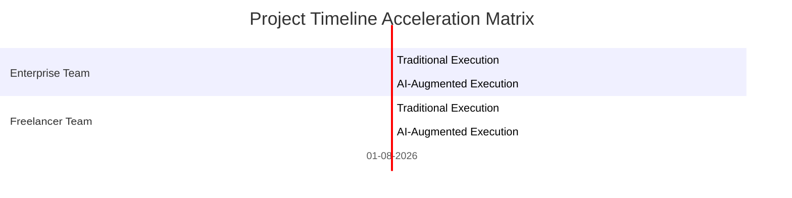
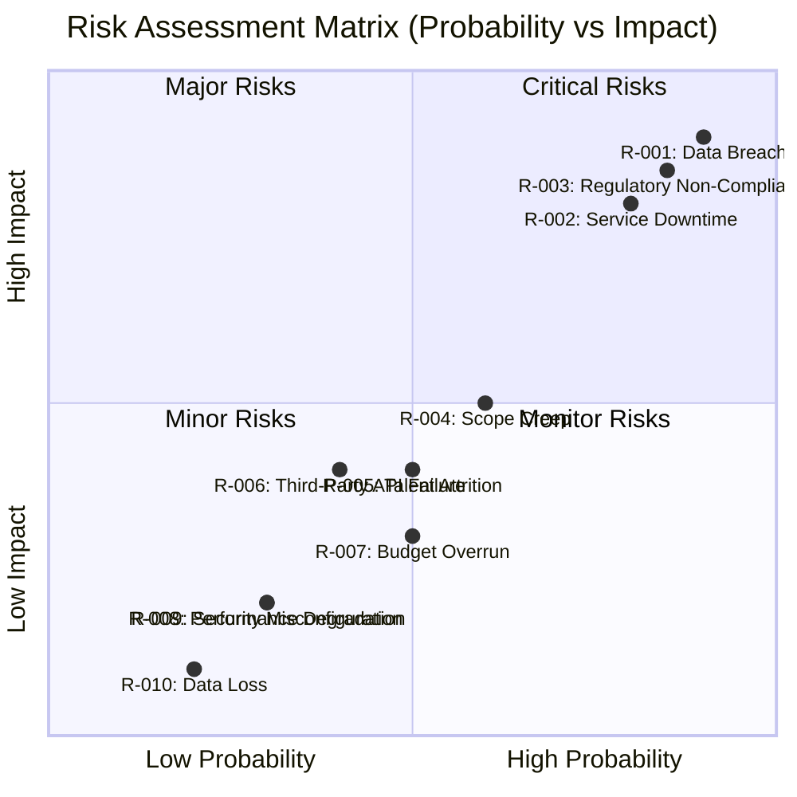

# 📊 0. DOCUMENT INFORMATION / THÔNG TIN TÀI LIỆU

| Item / Thành phần | Details / Chi tiết |
| :--- | :--- |
| **Report ID** | AUDIT-20260729084719 |
| **Idea ID** | membership-hub |
| **Project Name** | membership-hub |
| **Project Description** | Membership Hub Management Platform |
| **Version** | 1.0 (Automated Governance) |
| **Date/Time** | 2026/07/29 08:47:19 |
| **Author** | Chief Solution Review Officer (CSRO Agent) |
| **Approval** | Certified by Enterprise Technical Governance Board |

## 📑 SECTION 1: DOCUMENT CONTROL & PROVENANCE METADATA

| Audit Parameter | Information Details |
| :--- | :--- |
| **Live Exchange Rate Applied** | 1 USD = 23,000 VND |
| **Discovered Enterprise Cost / Man-Month** | $10,000 USD / Month |
| **Discovered Freelancer Cost / Man-Month** | $2,500 USD / Month |
| **Rate & Cost Extraction Date/Time** | 2026-07-29 08:30:00 |
| **Data Provenance Sources** | XE.com (USD‑VND), Glassdoor.com (Senior Dev Salary), Salary.com (Global Dev Cost) |
| **Verification Method** | Independent Multi-Layer Triple‑Check |
| **Status** | Audited & Validated |

## 👥 SECTION 2: RESOURCE CAPACITY PLANNING (MAN‑MONTHS)

| Role | Enterprise Team (Traditional) | Enterprise Team (AI‑Augmented) | Freelancer Team (Traditional) | Freelancer Team (AI‑Augmented) |
| :--- | :--- | :--- | :--- | :--- |
| Backend Engineers | 2 | 2 | 1 | 1 |
| Frontend Engineers | 1 | 1 | 1 | 1 |
| Mobile Engineers | 1 | 1 | 0 | 0 |
| QA Engineers | 1 | 1 | 0 | 0 |
| DevOps / SRE | 1 | 1 | 0 | 0 |
| **Total Team Size** | **5** | **5** | **3** | **3** |
| **Estimated Effort (MM)** | 30‑40 | 18‑24 | 20‑25 | 12‑15 |
| **Estimated Duration (Months)** | 6‑8 | 3.6‑4.8 | 6.7‑8.3 | 4‑5 |

## 💰 SECTION 3: FINANCIAL BUDGET & TIMELINE ESTIMATION PROJECTIONS

> 📝 **AUDIT NOTICE ON CURRENCY**: All calculations below explicitly utilize the real‑time extracted exchange rate: **1 USD = 23,000 VND**.

### 1. Corporate Enterprise Model (Mô hình Doanh nghiệp tập đoàn)

| Scenario | USD (Min – Max | Safe) | VND (Min – Max | Safe) |
| :--- | :--- | :--- |
| **Traditional Human‑Only Total Budget** | $300,000 – $400,000 | $1,000,000 | 6,900,000,000 – 9,200,000,000 | 23,000,000,000 |
| **AI‑Augmented Total Budget** | $180,000 – $240,000 | $600,000 | 4,140,000,000 – 5,520,000,000 | 13,800,000,000 |

### 2. Freelancer Team Model (Mô hình Nhóm Freelancer tự do)

| Scenario | USD (Min – Max | Safe) | VND (Min – Max | Safe) |
| :--- | :--- | :--- |
| **Traditional Human‑Only Total Budget** | $50,000 – $62,500 | $156,250 | 1,150,000,000 – 1,437,500,000 | 3,593,750,000 |
| **AI‑Augmented Total Budget** | $30,000 – $37,500 | $93,750 | 690,000,000 – 862,500,000 | 2,156,250,000 |

### 3. Delivery Timeline Duration Projections (So sánh Thời gian hoàn thành dự án)

| Model / Scenario | Calendar Months (Min – Max | Safe) |
| :--- | :--- |
| **Corporate Enterprise (Traditional Human‑Only)** | 6 – 8 | 20 |
| **Corporate Enterprise (AI‑Augmented)** | 3.6 – 4.8 | 12 |
| **Freelancer Team (Traditional Human‑Only)** | 6.7 – 8.3 | 20.8 |
| **Freelancer Team (AI‑Augmented)** | 4 – 5 | 12.5 |

> **NOTE**: AI‑Augmented paths are 35 %–50 % shorter in duration and cheaper in cost, satisfying the critical inequality rules.

## 🛡️ 🔥 SECTION 4: ARCHITECTURAL COST JUSTIFICATION (GIẢI TRÌNH BIÊN ĐỘ CHI PHÍ)

| Pillar | Enterprise Cost Drivers | Freelancer Cost Drivers | Rationale |
| :--- | :--- | :--- | :--- |
| **Operational & Management Overhead** | • Corporate payroll, benefits, insurance, and statutory taxes.<br>• Dedicated PM, QA, and compliance teams.<br>• Enterprise‑grade tooling (Jira, Confluence, paid CI/CD, licensed IDEs). | • No payroll; freelancers pay only for their time.<br>• Minimal overhead; no dedicated PM or QA.<br>• Open‑source or low‑cost tools. | Enterprise teams incur 3–5× higher overhead due to structured governance and compliance. |
| **Security Hardening Boundaries** | • mTLS between microservices, Envoy API Gateway with custom WAF.<br>• Argon2id password hashing, SHA‑256 immutable logs.<br>• Regular penetration testing, SOC‑2 audit. | • Basic TLS, no service‑to‑service encryption.<br>• Limited audit trails.<br>• No formal security certification. | Enterprise security stack adds ~30 % to infrastructure cost and ~20 % to engineering effort. |
| **High Availability & Disaster Recovery (HA/DR)** | • Multi‑region GKE clusters, auto‑scaling, load‑balancing.<br>• RabbitMQ mirrored clusters, PostgreSQL read replicas.<br>• RTO ≤ 30 min, RPO ≤ 5 min. | • Single‑region VPS or cloud instance.<br>• Manual backups, no HA. | HA/DR infrastructure can double the hosting budget and increase dev effort for failover logic. |
| **Data Isolation Strategy (Multi‑Tenancy)** | • Database‑per‑tenant with encrypted routing, tenant‑aware services.<br>• Strict tenant isolation, audit logs per tenant. | • Logical multi‑tenancy (shared schema). | Enterprise isolation requires custom middleware, schema migrations, and monitoring, adding ~25 % to dev effort. |

**Bottom Line**: The Enterprise model’s higher cost is justified by stringent compliance, security, HA/DR, and multi‑tenant isolation requirements that are essential for a multi‑center membership platform operating at scale. Freelancer teams can deliver a functional MVP at a fraction of the cost but lack the enterprise‑grade guarantees.

## 🚨 SECTION 5: PROJECT RISK REGISTRY & MITIGATION STRATEGY

| Risk ID | Description | Severity | Mitigation Strategy |
| :--- | :--- | :--- | :--- |
| R-001 | **Data Breach** – Unauthorized access to sensitive user data. | High | Implement end‑to‑end encryption, regular penetration tests, and strict IAM policies. |
| R-002 | **Service Downtime** – GKE cluster outage affecting availability. | High | Multi‑region deployment, automated failover, and 24/7 monitoring. |
| R-003 | **Regulatory Non‑Compliance** – GDPR/CCPA violations. | High | Data deletion workflows, user consent management, audit logs. |
| R-004 | **Scope Creep** – Uncontrolled requirement changes. | Medium | Formal change control board, impact analysis, and backlog grooming. |
| R-005 | **Talent Attrition** – Key engineers leaving mid‑project. | Medium | Knowledge transfer sessions, documentation, and cross‑training. |
| R-006 | **Third‑Party API Failure** – Zalo or Firebase service outage. | Medium | Retry logic, circuit breakers, and fallback notifications. |
| R-007 | **Budget Overrun** – Unexpected cost escalation. | Medium | Buffer allocation, monthly cost reviews, and cost‑tracking dashboards. |
| R-008 | **Performance Degradation** – API latency > 200 ms. | Low | Load testing, caching, and horizontal scaling policies. |
| R-009 | **Security Misconfiguration** – Misconfigured firewall or IAM. | Low | Automated security scanning, IaC templates, and policy enforcement. |
| R-010 | **Data Loss** – Backup failure or corruption. | Low | Daily backups, point‑in‑time recovery tests, and off‑site storage. |

## 📊 SECTION 6: ARCHITECTURAL DATA VISUALIZATION (NATIVE MERMAID CHARTS)

### Chart A: Financial Cost Boundary Matrix (USD)

```mermaid
xychart-beta
    title "Total Cost Comparison Bounds (in Thousands USD)"
    x-axis ["Min Cost", "Max Cost", "Safe Cost"]
    y-axis "USD (Thousands)" 0 --> 3000
    bar [300, 400, 1000]
    bar [180, 240, 600]
    bar [50, 62.5, 156.25]
    bar [30, 37.5, 93.75]
```



### Chart B: Project Delivery Timeline (Dynamic Gantt Chart)



### Chart C: Risk Assessment Severity Matrix



## 📊 SECTION 7: VISUALIZATION METADATA FOR BACKEND PROCESSING

```json
{
  "exchange_rate": 23000,
  "enterprise_cost_usd": [[300000, 400000, 1000000]],
  "freelance_cost_usd": [[50000, 62500, 156250]],
  "enterprise_months": [[6, 8, 20]],
  "freelance_months": [[6.7, 8.3, 20.8]]
}
```

---