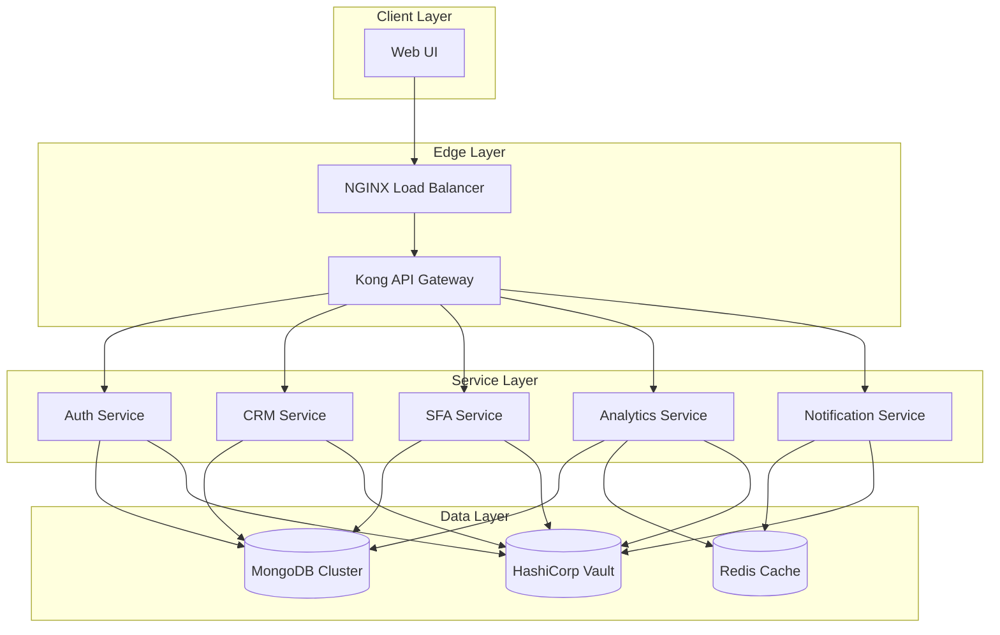

# GLOBAL PROJECT CONTEXT: autosellhub-automation

## Overview
The **autosellhub-automation** project is a comprehensive automation platform designed to streamline and optimize sales operations for businesses. It integrates multiple services, including lead management, customer relationship management (CRM), sales force automation, and analytics, all within a unified, cloud‑native architecture.

## Key Objectives
- **Unify disparate sales tools** into a single, cohesive platform.
- **Automate repetitive sales processes** to reduce manual effort and errors.
- **Provide real‑time insights** through advanced analytics and reporting.
- **Scale efficiently** to support growing user bases and increasing data volumes.
- **Ensure high availability** and disaster recovery capabilities.

## Technology Stack
| Layer | Technology | Rationale |
|-------|------------|-----------|
| **Frontend** | React 18 + TypeScript | Modern, component‑based UI with strong typing. |
| **Backend** | Node.js 20 + Express.js | Scalable, performant server framework. |
| **Database** | MongoDB 7.0 (sharded) | Flexible schema, horizontal scaling. |
| **Message Queue** | RabbitMQ (fanout/headers) | Reliable async communication, decoupling. |
| **Containerization** | Docker + Docker Compose | Consistent environments, easy deployment. |
| **Orchestration** | Kubernetes (EKS) | Production‑grade scaling and management. |
| **CI/CD** | GitHub Actions | Integrated pipelines for testing, building, and deploying. |
| **Monitoring** | Prometheus + Grafana | Real‑time metrics and alerting. |
| **Logging** | ELK Stack (Elasticsearch, Logstash, Kibana) | Centralized log aggregation and analysis. |
| **Security** | OAuth 2.0 + JWT | Secure authentication and authorization. |
| **API Gateway** | Kong | Centralized routing, throttling, and security. |
| **Load Balancing** | NGINX | High‑availability and SSL termination. |
| **Secrets Management** | HashiCorp Vault | Secure storage and retrieval of credentials. |

## Architecture Diagram

## Service Descriptions

### Auth Service
- **Purpose**: Handles authentication (OAuth 2.0, JWT issuance/refresh) and token validation.
- **Endpoints**:
  - `POST /auth/login` – Authenticate user and return tokens.
  - `POST /auth/refresh` – Refresh access token using a valid refresh token.
  - `POST /auth/logout` – Invalidate tokens.
- **Dependencies**: MongoDB (users collection), Vault (JWT secret, OAuth client credentials).

### CRM Service
- **Purpose**: Manages customer data, contact information, and interaction history.
- **Endpoints**:
  - `GET /customers` – List customers (paginated).
  - `GET /customers/{id}` – Retrieve a specific customer.
  - `POST /customers` – Create a new customer.
  - `PUT /customers/{id}` – Update customer details.
  - `DELETE /customers/{id}` – Remove a customer.
- **Dependencies**: MongoDB (customers collection), Auth Service (JWT validation).

### SFA (Sales Force Automation) Service
- **Purpose**: Automates sales processes, including lead assignment, activity tracking, and pipeline management.
- **Endpoints**:
  - `GET /leads` – List leads.
  - `POST /leads` – Create a lead.
  - `PATCH /leads/{id}/assign` – Assign a lead to a sales rep.
  - `GET /activities` – List sales activities.
  - `POST /activities` – Log a new activity.
- **Dependencies**: MongoDB (leads, activities collections), Auth Service.

### Analytics Service
- **Purpose**: Provides real‑time and historical analytics, dashboards, and reporting.
- **Endpoints**:
  - `GET /reports/sales` – Retrieve sales performance report.
  - `GET /metrics/leads` – Retrieve lead conversion metrics.
  - `GET /dashboards/overview` – Overview dashboard data.
- **Dependencies**: MongoDB (aggregated data), Redis (caching), Auth Service.

### Notification Service
- **Purpose**: Sends notifications (email, SMS, in‑app) to users based on events.
- **Endpoints**:
  - `POST /notifications` – Trigger a notification.
  - `GET /notifications/status/{id}` – Check notification delivery status.
- **Dependencies**: Redis (message queue), external email/SMS providers, Auth Service.

## Data Flow
1. **Client Request**: User interacts with the UI, generating an API request.
2. **API Gateway**: Kong routes the request to the appropriate service after validating the JWT.
3. **Service Processing**: The target service performs business logic, accessing MongoDB and/or Redis as needed.
4. **Asynchronous Processing**: Services emit events (e.g., new lead, activity) to RabbitMQ.
5. **Event Consumers**: Other services (e.g., Analytics, Notification) consume these events for real‑time updates and notifications.
6. **Response**: Processed data is returned to the client via the API Gateway.
7. **Logging & Monitoring**: All requests, responses, and errors are logged to ELK Stack; metrics are exported to Prometheus.

## Security Considerations
- **Authentication**: OAuth 2.0 with JWT access tokens (short‑lived) and refresh tokens.
- **Authorization**: Role‑based access control (RBAC) enforced by the Auth Service; scopes define permitted operations.
- **Transport Security**: All communications use HTTPS with TLS 1.3.
- **Secrets Management**: All secrets (database credentials, JWT signing keys, third‑party API keys) are stored in HashiCorp Vault and injected into containers at runtime.
- **Input Validation**: Joi schemas validate all request payloads.
- **Output Encoding**: Automatic escaping in the frontend to mitigate XSS.
- **Audit Logging**: All critical actions (e.g., customer deletion, lead assignment) are logged with user context.

## Deployment & Scaling
- **Containerization**: Each service is packaged as a Docker image.
- **Orchestration**: Services are deployed to a Kubernetes cluster (EKS) using Helm charts.
- **Auto‑Scaling**: Horizontal Pod Autoscalers adjust replica counts based on CPU/memory utilization and custom metrics (e.g., request latency).
- **Database Scaling**: MongoDB is sharded; read/write concerns are configured per service.
- **CI/CD**: GitHub Actions pipelines handle linting, unit/integration testing, security scanning, and deployment to staging and production environments.

## Monitoring & Alerting
- **Metrics**: Prometheus collects metrics from all services (e.g., request latency, error rates, database connections). Grafana dashboards provide visual insights.
- **Logs**: ELK Stack aggregates logs; Kibana dashboards enable real‑time log analysis.
- **Alerts**: Prometheus alerts trigger PagerDuty incidents for critical conditions (e.g., high error rate, database downtime).

## Disaster Recovery & Backup
- **Backup Strategy**: Automated daily MongoDB dumps stored in an encrypted S3 bucket.
- **Recovery Procedures**: documented runbooks for restoring data and bringing services back online.
- **High Availability**: Multi‑zone deployment across AWS regions; failover mechanisms for database and message queue.

## Compliance & Governance
- **Data Privacy**: GDPR and CCPA compliance built into data handling processes.
- **Audit Trails**: Immutable logs for all data modifications.
- **Change Management**: All code changes require peer review, automated testing, and approval before merging to main.

## Future Enhancements
- **Machine Learning Integration**: Predictive lead scoring and sales forecasting.
- **Mobile App**: Native iOS/Android client for field sales teams.
- **Integration with Third‑Party Tools**: Connectors for popular CRM and marketing automation platforms.

---

*This blueprint outlines the current architecture of the autosellhub-automation platform. It will be iteratively refined as new features are added and as the system scales.*# GLOBAL PROJECT CONTEXT: autosellhub-automation

## Overview
The **autosellhub-automation** project is a comprehensive automation platform designed to streamline and optimize sales operations for businesses. It integrates multiple services, including lead management, customer relationship management (CRM), sales force automation, and analytics, all within a unified, cloud‑native architecture.

## Key Objectives
- **Unify disparate sales tools** into a single, cohesive platform.
- **Automate repetitive sales processes** to reduce manual effort and errors.
- **Provide real‑time insights** through advanced analytics and reporting.
- **Scale efficiently** to support growing user bases and increasing data volumes.
- **Ensure high availability** and disaster recovery capabilities.

## Technology Stack
| Layer | Technology | Rationale |
|-------|------------|-----------|
| **Frontend** | React 18 + TypeScript | Modern, component‑based UI with strong typing. |
| **Backend** | Node.js 20 + Express.js | Scalable, performant server framework. |
| **Database** | MongoDB 7.0 (sharded) | Flexible schema, horizontal scaling. |
| **Message Queue** | RabbitMQ (fanout/headers) | Reliable async communication, decoupling. |
| **Containerization** | Docker + Docker Compose | Consistent environments, easy deployment. |
| **Orchestration** | Kubernetes (EKS) | Production‑grade scaling and management. |
| **CI/CD** | GitHub Actions | Integrated pipelines for testing, building, and deploying. |
| **Monitoring** | Prometheus + Grafana | Real‑time metrics and alerting. |
| **Logging** | ELK Stack (Elasticsearch, Logstash, Kibana) | Centralized log aggregation and analysis. |
| **Security** | OAuth 2.0 + JWT | Secure authentication and authorization. |
| **API Gateway** | Kong | Centralized routing, throttling, and security. |
| **Load Balancing** | NGINX | High‑availability and SSL termination. |
| **Secrets Management** | HashiCorp Vault | Secure storage and retrieval of credentials. |

## Architecture Diagram

## Service Descriptions

### Auth Service
- **Purpose**: Handles authentication (OAuth 2.0, JWT issuance/refresh) and token validation.
- **Endpoints**:
  - `POST /auth/login` – Authenticate user and return tokens.
  - `POST /auth/refresh` – Refresh access token using a valid refresh token.
  - `POST /auth/logout` – Invalidate tokens.
- **Dependencies**: MongoDB (users collection), Vault (JWT secret, OAuth client credentials).

### CRM Service
- **Purpose**: Manages customer data, contact information, and interaction history.
- **Endpoints**:
  - `GET /customers` – List customers (paginated).
  - `GET /customers/{id}` – Retrieve a specific customer.
  - `POST /customers` – Create a new customer.
  - `PUT /customers/{id}` – Update customer details.
  - `DELETE /customers/{id}` – Remove a customer.
- **Dependencies**: MongoDB (customers collection), Auth Service (JWT validation).

### SFA (Sales Force Automation) Service
- **Purpose**: Automates sales processes, including lead assignment, activity tracking, and pipeline management.
- **Endpoints**:
  - `GET /leads` – List leads.
  - `POST /leads` – Create a lead.
  - `PATCH /leads/{id}/assign` – Assign a lead to a sales rep.
  - `GET /activities` – List sales activities.
  - `POST /activities` – Log a new activity.
- **Dependencies**: MongoDB (leads, activities collections), Auth Service.

### Analytics Service
- **Purpose**: Provides real‑time and historical analytics, dashboards, and reporting.
- **Endpoints**:
  - `GET /reports/sales` – Retrieve sales performance report.
  - `GET /metrics/leads` – Retrieve lead conversion metrics.
  - `GET /dashboards/overview` – Overview dashboard data.
- **Dependencies**: MongoDB (aggregated data), Redis (caching), Auth Service.

### Notification Service
- **Purpose**: Sends notifications (email, SMS, in‑app) to users based on events.
- **Endpoints**:
  - `POST /notifications` – Trigger a notification.
  - `GET /notifications/status/{id}` – Check notification delivery status.
- **Dependencies**: Redis (message queue), external email/SMS providers, Auth Service.

## Data Flow
1. **Client Request**: User interacts with the UI, generating an API request.
2. **API Gateway**: Kong routes the request to the appropriate service after validating the JWT.
3. **Service Processing**: The target service performs business logic, accessing MongoDB and/or Redis as needed.
4. **Asynchronous Processing**: Services emit events (e.g., new lead, activity) to RabbitMQ.
5. **Event Consumers**: Other services (e.g., Analytics, Notification) consume these events for real‑time updates and notifications.
6. **Response**: Processed data is returned to the client via the API Gateway.
7. **Logging & Monitoring**: All requests, responses, and errors are logged to ELK Stack; metrics are exported to Prometheus.

## Security Considerations
- **Authentication**: OAuth 2.0 with JWT access tokens (short‑lived) and refresh tokens.
- **Authorization**: Role‑based access control (RBAC) enforced by the Auth Service; scopes define permitted operations.
- **Transport Security**: All communications use HTTPS with TLS 1.3.
- **Secrets Management**: All secrets (database credentials, JWT signing keys, third‑party API keys) are stored in HashiCorp Vault and injected into containers at runtime.
- **Input Validation**: Joi schemas validate all request payloads.
- **Output Encoding**: Automatic escaping in the frontend to mitigate XSS.
- **Audit Logging**: All critical actions (e.g., customer deletion, lead assignment) are logged with user context.

## Deployment & Scaling
- **Containerization**: Each service is packaged as a Docker image.
- **Orchestration**: Services are deployed to a Kubernetes cluster (EKS) using Helm charts.
- **Auto‑Scaling**: Horizontal Pod Autoscalers adjust replica counts based on CPU/memory utilization and custom metrics (e.g., request latency).
- **Database Scaling**: MongoDB is sharded; read/write concerns are configured per service.
- **CI/CD**: GitHub Actions pipelines handle linting, unit/integration testing, security scanning, and deployment to staging and production environments.

## Monitoring & Alerting
- **Metrics**: Prometheus collects metrics from all services (e.g., request latency, error rates, database connections). Grafana dashboards provide visual insights.
- **Logs**: ELK Stack aggregates logs; Kibana dashboards enable real‑time log analysis.
- **Alerts**: Prometheus alerts trigger PagerDuty incidents for critical conditions (e.g., high error rate, database downtime).

## Disaster Recovery & Backup
- **Backup Strategy**: Automated daily MongoDB dumps stored in an encrypted S3 bucket.
- **Recovery Procedures**: documented runbooks for restoring data and bringing services back online.
- **High Availability**: Multi‑zone deployment across AWS regions; failover mechanisms for database and message queue.

## Compliance & Governance
- **Data Privacy**: GDPR and CCPA compliance built into data handling processes.
- **Audit Trails**: Immutable logs for all data modifications.
- **Change Management**: All code changes require peer review, automated testing, and approval before merging to main.

## Future Enhancements
- **Machine Learning Integration**: Predictive lead scoring and sales forecasting.
- **Mobile App**: Native iOS/Android client for field sales teams.
- **Integration with Third‑Party Tools**: Connectors for popular CRM and marketing automation platforms.

---

*This blueprint outlines the current architecture of the autosellhub-automation platform. It will be iteratively refined as new features are added and as the system scales.*