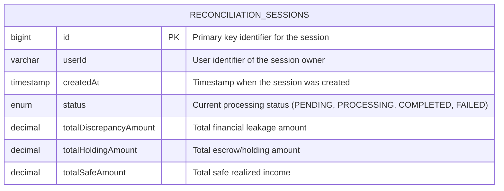
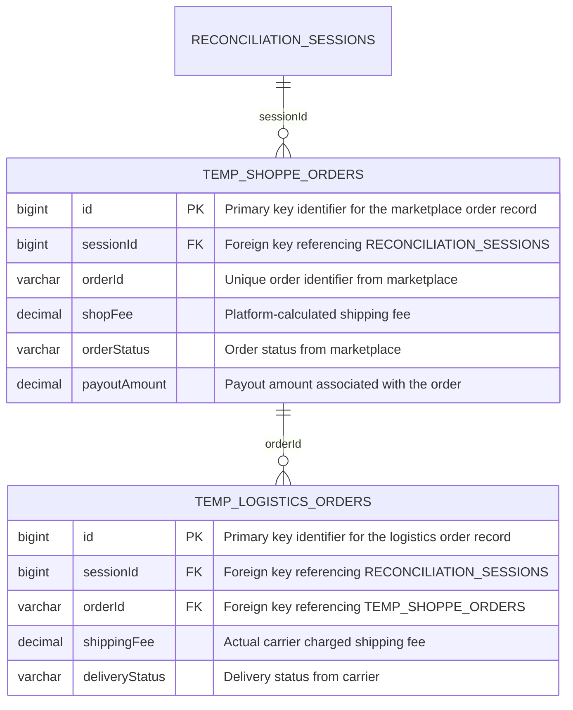
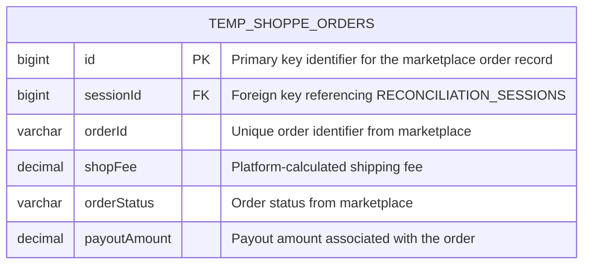
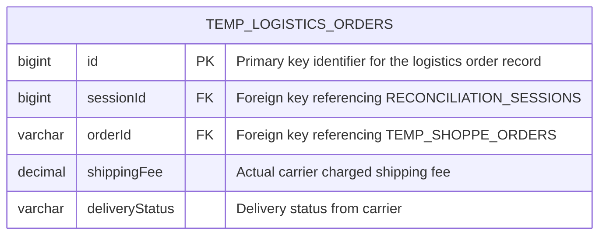

# SOFTWARE REQUIREMENTS SPECIFICATION: financial-reconciliation

## 1. PROJECT OVERVIEW & GLOBAL ARCHITECTURE

### Product Objectives & Core Values
- Automated financial reconciliation to eliminate revenue leakage.
- Real‑time visibility into capital allocation (leaked, escrow, safe).
- Scalable micro‑SaaS delivering high‑throughput processing on cost‑effective infrastructure.

### Target User Personas
- C‑level Executives (CEO, CFO) – high‑level dashboard views.
- Finance Managers – ledger uploads, session management, report exports.
- Operations Managers – session status monitoring, discrepancy audit.
- System Administrators – user/role management, system configuration.

### Global Role‑Based Access Control (RBAC) Matrix
- [ARC-001] SuperAdmin: full CRUD on all modules, user management, role assignments, system configuration.
- [ARC-002] FinanceAnalyst: upload ledger files, create/reconcile sessions, view dashboard metrics, export reports.
- [ARC-003] OperationsManager: monitor session status, trigger reconciliation, audit logs, generate compliance reports.
- [ARC-004] Auditor: read‑only access to all reports, session history, and exported data for audit purposes.

### Global Tech Stack Constraints & Infrastructure Blueprint [ARC-005]
- Monolithic architecture using Spring Boot 3.x.
- Java 17 / 21 LTS runtime.
- EasyExcel (SAX) for line‑by‑line Excel parsing; Spring Batch & `@Async` for background processing.
- PostgreSQL or MySQL with native SQL computations; session‑based table partitioning.
- HTML5, Thymeleaf, Tailwind CSS for responsive admin UI.
- JWT‑based authentication, role‑based authorization, audit logging, TLS 1.3 encryption.

## 2. ENHANCED EPIC MODULES

### 2.1 Asynchronous File Ingestion Module

**Core Functional Requirements**
- [REQ-001] As a FinanceAnalyst, I want to upload both Marketplace Ledger (Excel) and Logistics Ledger (Excel) via drag‑and‑drop, so that a new ReconciliationSession is created and processing can begin.

**Acceptance Criteria & Interactions**
- Given I am logged in as a FinanceAnalyst,
- When I drag‑and‑drop the Marketplace Ledger Excel file,
- Then the system accepts the file, normalizes data types, and stores rows into `temp_shopee_orders` staging table with a new `sessionId`.
- Given I have uploaded both ledger files,
- When I click “Start Reconciliation”,
- Then a `ReconciliationSession` record is inserted with status `PENDING` and a unique `sessionId` is returned to the UI.
- Given the upload API receives a file with unsupported format,
- When the request is processed,
- Then the system returns HTTP 400 with error code `ERR_ING_001` and a message “Invalid file format; only .xlsx/.xls allowed”.
- Given the upload API receives an empty file,
- When the request is processed,
- Then the system returns HTTP 400 with error code `ERR_ING_002` and a message “File is empty; at least one data row required”.

**Module Exception Flows**
- [EXC-001] Invalid file format (non‑Excel) – reject with ERR_ING_001.
- [EXC-002] Empty file – reject with ERR_ING_002.
- [EXC-003] Duplicate `orderId` within the same session – log warning and skip duplicate rows.
- [EXC-004] Database constraint violation during session insertion – abort transaction and rollback.

**Module Localized Data Dictionary**
- [DAT-001] Table: `reconciliation_sessions`
  - `bigint id PK "Primary key identifier for the session"`
  - `varchar userId "User identifier of the session owner"`
  - `timestamp createdAt "Timestamp when the session was created"`
  - `enum status "Current processing status (PENDING, PROCESSING, COMPLETED, FAILED)"`
  - `decimal totalDiscrepancyAmount "Total financial leakage amount"`
  - `decimal totalHoldingAmount "Total escrow/holding amount"`
  - `decimal totalSafeAmount "Total safe realized income"`

### 2.2 Core Reconciliation Logic Engine Module

**Core Functional Requirements**
- [REQ-002] As a FinanceAnalyst, I want the system to automatically compute variances between platform‑calculated shipping fees and actual carrier charges, flag discrepancies, and update session totals, so that I can review leakage.

**Acceptance Criteria & Interactions**
- Given a session with uploaded ledgers,
- When the reconciliation engine runs the native SQL query,
- Then the system returns rows with `orderId`, `platformCalculatedFee`, `carrierActualFee`, `varianceAmount` where variance != 0,
- And updates `reconciliation_sessions` totals (`totalDiscrepancyAmount`, `totalHoldingAmount`, `totalSafeAmount`) accordingly.
- Given the variance calculation query encounters a missing matching `orderId`,
- When the process executes,
- Then the system logs a warning `EXC_005` and treats the missing pair as a discrepancy.
- Given the session status is not `PROCESSING`,
- When the engine attempts to compute,
- Then the system aborts, sets session status to `FAILED`, and returns error `ERR_REC_001`.

**Module Exception Flows**
- [EXC-005] Missing matching `orderId` between marketplace and logistics tables – log warning and treat as discrepancy.
- [EXC-006] Negative variance due to data corruption – clamp to zero and raise alert.
- [EXC-007] Session not in `PROCESSING` status – abort reconciliation and set status to `FAILED`.

**Module Localized Data Dictionary**
- [DAT-002] Tables: `temp_shopee_orders` and `temp_logistics_orders`
  - `temp_shopee_orders`:
    - `bigint id PK "Primary key identifier for the marketplace order record"`
    - `bigint sessionId FK "Foreign key referencing RECONCILIATION_SESSIONS"`
    - `varchar orderId "Unique order identifier from marketplace"`
    - `decimal shopFee "Platform-calculated shipping fee"`
    - `varchar orderStatus "Order status from marketplace"`
    - `decimal payoutAmount "Payout amount associated with the order"`
  - `temp_logistics_orders`:
    - `bigint id PK "Primary key identifier for the logistics order record"`
    - `bigint sessionId FK "Foreign key referencing RECONCILIATION_SESSIONS"`
    - `varchar orderId FK "Foreign key referencing TEMP_SHOPPE_ORDERS"`
    - `decimal shippingFee "Actual carrier charged shipping fee"`
    - `varchar deliveryStatus "Delivery status from carrier"`

### 2.3 Executive Financial Dashboard Module

**Core Functional Requirements**
- [REQ-003] As a C‑level executive, I want a real‑time dashboard that aggregates session metrics (leaked capital, escrow capital, safe capital) and presents them in a summarized view, so that I can monitor financial health.

**Acceptance Criteria & Interactions**
- Given a completed session,
- When the dashboard loads,
- Then it displays three metric cards: `totalDiscrepancyAmount` (Leaked Capital), `totalHoldingAmount` (Escrow Capital), `totalSafeAmount` (Safe Capital).
- Given the user selects a session and clicks “Export to CSV”,
- When the export process runs,
- Then the system generates a CSV containing `orderId` and `discrepancyMargin` for all leaked capital entries and prompts download.

**Module Exception Flows**
- [EXC-008] Session not completed – dashboard shows placeholder “No data available”.
- [EXC-009] CSV generation failure – returns HTTP 500 with error code `ERR_DASH_001`.

**Module Localized Data Dictionary**
- [DAT-003] [NOT APPLICABLE] – No dedicated database tables required for the dashboard module; all metrics are derived from existing `reconciliation_sessions` and staging tables.

### 2.4 Core Database Schema Module

**Core Functional Requirements**
- [REQ-004] As a system architect, I want the entity definitions (`ReconciliationSession`, `TempShopeeOrder`, `TempLogisticsOrder`) to be persisted with proper constraints, indexes, and relationships, so that the application can enforce data integrity and support high‑performance joins.

**Acceptance Criteria & Interactions**
- Given the schema design,
- When the tables are created,
- Then each entity contains the columns defined in the data dictionary, primary keys enforce uniqueness, foreign keys maintain referential integrity, and indexes exist on `session_id` and `order_id` for fast lookups.
- Given a new session is created,
- When the ingestion module inserts a record,
- Then the `reconciliation_sessions` entry is referenced by foreign keys in staging tables.

**Module Exception Flows**
- [EXC-010] Schema migration conflict – abort deployment and raise `ERR_SCH_001`.
- [EXC-011] Missing nullable constraint on required column – validation fails and rolls back transaction.

**Module Localized Data Dictionary**
- [DAT-004] Table: `reconciliation_sessions`
  - `bigint id PK "Primary key identifier for the session"`
  - `varchar userId "User identifier of the session owner"`
  - `timestamp createdAt "Timestamp when the session was created"`
  - `enum status "Current processing status (PENDING, PROCESSING, COMPLETED, FAILED)"`
  - `decimal totalDiscrepancyAmount "Total financial leakage amount"`
  - `decimal totalHoldingAmount "Total escrow/holding amount"`
  - `decimal totalSafeAmount "Total safe realized income"`

- [DAT-005] Table: `temp_shopee_orders`
  - `bigint id PK "Primary key identifier for the marketplace order record"`
  - `bigint sessionId FK "Foreign key referencing RECONCILIATION_SESSIONS"`
  - `varchar orderId "Unique order identifier from marketplace"`
  - `decimal shopFee "Platform-calculated shipping fee"`
  - `varchar orderStatus "Order status from marketplace"`
  - `decimal payoutAmount "Payout amount associated with the order"`

- [DAT-006] Table: `temp_logistics_orders`
  - `bigint id PK "Primary key identifier for the logistics order record"`
  - `bigint sessionId FK "Foreign key referencing RECONCILIATION_SESSIONS"`
  - `varchar orderId FK "Foreign key referencing TEMP_SHOPPE_ORDERS"`
  - `decimal shippingFee "Actual carrier charged shipping fee"`
  - `varchar deliveryStatus "Delivery status from carrier"`

## 3. GLOBAL NON-FUNCTIONAL REQUIREMENTS

- [NFR-001] Performance Metrics
  - File upload acknowledgment latency < 200 ms.
  - Background batch processing completion per session < 5 seconds.
  - Dashboard refresh and metric rendering < 10 seconds.
- [NFR-002] Security
  - JWT‑based authentication with role‑based access control; token expiration ≤ 30 minutes.
  - Enforce OWASP Top 10 mitigations: prepared statements, input validation, output encoding.
  - TLS 1.3 for all inbound/outbound communications; encryption at rest (AES‑256).
  - Comprehensive audit logging for all session and data modifications.
- [NFR-003] Scalability, High Availability & Multi‑tenant Isolation
  - Stateless services enable horizontal scaling; load balancer distributes requests.
  - Database sharding per tenant using `sessionId` partitioning; no cross‑tenant data leakage.
  - Target 99.9 % uptime; automated failover and health‑check endpoints.