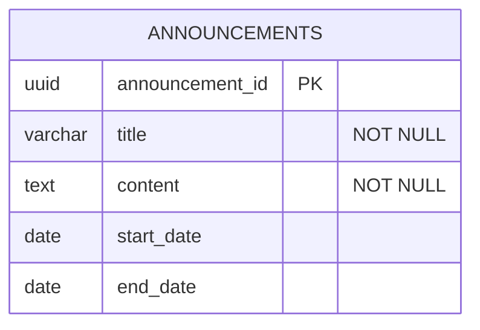

# SOFTWARE REQUIREMENTS SPECIFICATION: membership-hub

## 1. PROJECT OVERVIEW & GLOBAL ARCHITECTURE

### Mục tiêu sản phẩm & Giá trị cốt lõi
- Cung cấp nền tảng thống nhất quản lý hội viên đa trung tâm.
- Cho phép theo dõi điểm danh thời gian thực qua quét QR.
- Cung cấp thẻ hội viên kỹ thuật số với tính năng đếm ngày hiệu lực.
- Hỗ trợ truyền thông đa kênh (web, mobile, nhóm Zalo).
- Giá trị cốt lõi: độ tin cậy, khả năng mở rộng, bảo mật, tính thân thiện với người dùng, hỗ trợ đa ngôn ngữ.

### Nhóm người dùng mục tiêu
- Quản trị viên hệ thống (toàn quyền)
- Quản trị viên trung tâm (quyền hạn ở cấp trung tâm)
- Quản lý (phụ trách, quyền hạn giới hạn)
- Giáo viên (chỉ đọc lịch giảng dạy)
- Học viên (duyệt khóa học, ghi danh, xem thẻ hội viên)
- Người dùng ứng dụng di động (cùng vai trò với phiên bản web)

### Ma trận kiểm soát truy cập dựa trên vai trò toàn cục
- [ARC-001] Quản trị viên hệ thống: toàn quyền trên tất cả các trung tâm.
- [ARC-002] Quản trị viên trung tâm: toàn quyền trong trung tâm của mình, không thể tác động đến trung tâm khác.
- [ARC-003] Quản lý: có thể tạo thông báo, quản lý học viên, chỉ định học viên vào khóa học hiện có, xem danh sách khóa học, không thể chỉnh sửa khóa học hoặc chỉ định giáo viên.
- [ARC-004] Giáo viên: xem khóa học của mình, danh sách học viên, lịch giảng dạy; chỉ đọc.
- [ARC-005] Học viên: duyệt khóa học, ghi danh vào khóa học mới, xem thẻ hội viên (ngày hiệu lực còn lại), gia hạn thẻ.

### Constraints và Blueprint hạ tầng kỹ thuật toàn cục [ARC-010]
- Stack kỹ thuật: React (web), Flutter (mobile), Node.js/Quarkus (backend), PostgreSQL (DB), Redis (cache), Firebase (xác thực & push), Docker/Kubernetes (GKE), Grafana + Prometheus (theo dõi).
- Mô hình đa租: mỗi trung tâm là một schema độc lập trong PostgreSQL; cô lập dữ liệu giữa các trung tâm theo định nghĩa RBAC.
- Vùng chứa bảo mật: Kubernetes Pod Security Policies, network policies, service mesh (Istio) để segmentation.
- Quản lý API: API Gateway (Kong/Apigee) với JWT validation, rate limiting, caching (Redis).
- CI/CD: GitOps với ArgoCD, pipeline tự động kiểm tra, xây dựng hình ảnh Docker (<500MB), triển khai canary.

## 2. MODULES CHỨC NĂNG NÂNG CAO

### 2.1 Quản lý người dùng

#### Yêu cầu chức năng cốt lõi
- **[REQ-001]** Đăng ký người dùng: As a prospective user, I want to register using email and password (or social providers) so that I can obtain an account in the system.
- **[REQ-002]** Xác thực xã hội: As a user, I want to sign‑in/up using Firebase, Google, or Facebook OAuth so that I can leverage existing credentials.
- **[REQ-003]** Phân quyền người dùng: As an administrator, I want to assign or change a user’s role (System Admin, Center Admin, Manager, Teacher, Student) so that permissions are correctly enforced.

#### Tiêu chí chấp nhận & tương tác
- **[REQ-001]** Given a user provides a unique email, a strong password, and agrees to terms, When they submit the registration form, Then the system validates the input, creates a new user record with role ‘Student’ (or ‘Teacher’ if invited), and returns a success response with a JWT token.
- **[REQ-002]** Given a user selects a social provider, When they authenticate through the provider’s popup, Then the system receives an OAuth2 code, exchanges it for user info, creates or updates the local user record, and issues a JWT token.
- **[REQ-003]** Given an admin selects a user and a new role, When the assignment is confirmed, Then the user’s role column is updated, and appropriate permissions are applied immediately.

#### Lỗi và luồng ngoại lệ của mô-đun
- **[EXC-004]** Xác thực đầu vào không hợp lệ (ví dụ: email không đúng định dạng, thiếu trường bắt buộc): If validation fails on form submission, When the error is returned to the user, Then a clear message lists each invalid field and prompts correction.

#### Từ điển dữ liệu cục bộ của mô-đun
- **[DAT-001]** Bảng Users
  - user_id: uuid PK
  - email: varchar NOT_NULL, UNIQUE
  - password_hash: char NOT_NULL
  - full_name: varchar NOT_NULL
  - role_id: smallint FK → Roles.role_id
  - provider: varchar NOT_NULL (local/firebase/google/facebook)
  - created_at: timestamp NOT_NULL
  - updated_at: timestamp NOT_NULL

``` 
erDiagram
    USERS {
        uuid user_id PK
        varchar email NOT_NULL
        char password_hash NOT_NULL
        varchar full_name NOT_NULL
        smallint role_id FK
        varchar provider NOT_NULL
        timestamp created_at NOT_NULL
        timestamp updated_at NOT_NULL
    }
```

- **[DAT-008]** Bảng Roles
  - role_id: smallint PK
  - name: varchar NOT_NULL, UNIQUE
  - description: varchar

``` 
erDiagram
    ROLES {
        smallint role_id PK
        varchar name NOT_NULL
        varchar description
    }
```

### 2.2 Quản lý trung tâm

#### Yêu cầu chức năng cốt lõi
- **[REQ-004]** Xem danh sách trung tâm: As any authenticated user, I want to see a list of all centers with address, tax ID, and admin contact so that I can identify relevant centers.
- **[REQ-005]** Tạo/cập nhật/xóa trung tâm: As a System Admin, I want to add, edit, or remove a center record so that center information stays current.
- **[REQ-006]** Chỉ định quản trị viên trung tâm: As a System Admin, I want to assign or unassign a user as a Center Admin for a specific center so that administrative control is delegated.

#### Tiêu chí chấp nhận & tương tác
- **[REQ-004]** Given a user navigates to the Centers page, When the request completes, Then a table of centers (Name, Address, TaxID, AdminContact) is displayed.
- **[REQ-005]** Given a System Admin provides center name, address, tax ID, primary contact phone and email, When the save action is executed, Then the center is persisted and appears in the list; if duplicate tax ID exists, the operation fails with a conflict error.
- **[REQ-006]** Given a System Admin selects a user and a center, When the assign action is confirmed, Then the user’s role is set to ‘Center Admin’ and the center ID is recorded; unassign reverses the operation.

#### Lỗi và luồng ngoại lệ của mô-đun
- *[No module-specific exceptions beyond global]*

#### Từ điển dữ liệu cục bộ của mô-đun
- **[DAT-002]** Bảng Centers
  - center_id: uuid PK
  - name: varchar NOT_NULL
  - address: varchar NOT_NULL
  - tax_id: varchar NOT_NULL, UNIQUE
  - contact_phone: varchar
  - contact_email: varchar

``` 
erDiagram
    CENTERS {
        uuid center_id PK
        varchar name NOT_NULL
        varchar address NOT_NULL
        varchar tax_id NOT_NULL
        varchar contact_phone
        varchar contact_email
    }
```

### 2.3 Quản lý khóa học

#### Yêu cầu chức năng cốt lõi
- **[REQ-007]** Xem danh sách khóa học: As any authenticated user, I want to see all courses with schedule and assigned teacher so that I can browse offerings.
- **[REQ-008]** Tạo/cập nhật/xóa khóa học (tránh xung đột): As a System Admin or Center Admin, I want to manage courses (add, edit, remove) while ensuring no overlapping schedules for the same teacher or venue.
- **[REQ-009]** Chỉ định giáo viên vào khóa học: As a System Admin, I want to assign or unassign teachers to courses so that teaching responsibilities are updated.

#### Tiêu chí chấp nhận & tương tác
- **[REQ-007]** Given a user visits the Courses page, When the request completes, Then a grid displays CourseID, Title, StartDate, EndDate, TeacherName.
- **[REQ-008]** Given an admin provides CourseTitle, StartDate, EndDate, TeacherID, When the save action is triggered, Then the system validates that the teacher is not already scheduled for another course intersecting these dates; if conflict, an error is returned; otherwise the course is persisted.
- **[REQ-009]** Given an admin selects a course and a teacher, When the assign action is executed, Then the course‑teacher mapping is created and a notification is queued for the teacher’s mobile app; unassign removes the mapping.

#### Lỗi và luồng ngoại lệ của mô-đun
- *[No module-specific exceptions beyond global]*

#### Từ điển dữ liệu cục bộ của mô-đun
- **[DAT-003]** Bảng Courses
  - course_id: uuid PK
  - title: varchar NOT_NULL
  - description: text
  - start_date: date NOT_NULL
  - end_date: date NOT_NULL
  - teacher_id: uuid FK
  - max_students: int DEFAULT 30

``` 
erDiagram
    COURSES {
        uuid course_id PK
        varchar title NOT_NULL
        text description
        date start_date NOT_NULL
        date end_date NOT_NULL
        uuid teacher_id FK
        int max_students
    }
```

### 2.4 Ghi danh và Đăng ký của Học viên

#### Yêu cầu chức năng cốt lõi
- **[REQ-010]** Duyệt khóa học: As a Student, I want to browse available courses (excluding those already enrolled) so that I can select courses to join.
- **[REQ-011]** Ghi danh khóa học: As a Student, I want to register for a course (existing or new), which auto‑creates a Student account if missing, and assigns the student to the course.

#### Tiêu chí chấp nhận & tương tác
- **[REQ-010]** Given a Student logs in and navigates to the Browse Courses page, When the request completes, Then a list of courses with capacity and schedule is shown, excluding courses where the student already has an enrollment record.
- **[REQ-011]** Given a Student selects a course and submits the registration, When the backend processes the request, Then a new enrollment record is created; if the student does not have a local account, one is created with role ‘Student’; a notification is queued to the student’s mobile app and the center’s Zalo group.

#### Lỗi và luồng ngoại lệ của mô-đun
- *[No module-specific exceptions beyond global]*

#### Từ điển dữ liệu cục bộ của mô-đun
- **[DAT-004]** Bảng Enrollments
  - enrollment_id: uuid PK
  - student_id: uuid FK
  - course_id: uuid FK
  - enrollment_date: timestamp NOT_NULL

``` 
erDiagram
    ENROLLMENTS {
        uuid enrollment_id PK
        uuid student_id FK
        uuid course_id FK
        timestamp enrollment_date NOT_NULL
    }
```

### 2.5 Điểm danh và Quét QR

#### Yêu cầu chức năng cốt lõi
- **[REQ-012]** Ghi nhận điểm danh qua QR: As a Student (via mobile app), I want to scan a QR code at class start so that my attendance is recorded for the current day.
- **[REQ-013]** Đảm bảo tính idempotent của điểm danh: The attendance service must guarantee that multiple scans from the same student for the same course on the same day produce a single attendance record.

#### Tiêu chí chấp nhận & tương tác
- **[REQ-012]** Given a Student opens the scanner, scans a valid course QR, and confirms attendance, When the API receives the payload, Then the system validates the student‑course relationship, creates an Attendance record with timestamp, and returns a success response; duplicate scans on the same day are ignored.
- **[REQ-013]** Given a student scans a QR twice within a minute, When the service processes both requests, Then only one attendance row is created; subsequent requests return a success with a ‘duplicate’ flag.

#### Lỗi và luồng ngoại lệ của mô-đun
- **[EXC-001]** Network & Connectivity Drops During QR Scan: If a student scans a QR but the network is unavailable, When the app retries the request after reconnection, Then the attendance is recorded once the service is reachable.
- **[EXC-002]** Duplicate Attendance Submission: If the same student scans the same course QR multiple times within the same day, When the system detects a duplicate, Then it returns a success response indicating ‘already recorded’ and does not create extra rows.

#### Từ điển dữ liệu cục bộ của mô-đun
- **[DAT-005]** Bảng Attendance
  - attendance_id: uuid PK
  - student_id: uuid FK
  - course_id: uuid FK
  - attendance_date: date NOT_NULL
  - timestamp: timestamp NOT_NULL

``` 
erDiagram
    ATTENDANCE {
        uuid attendance_id PK
        uuid student_id FK
        uuid course_id FK
        date attendance_date NOT_NULL
        timestamp timestamp NOT_NULL
    }
```

### 2.6 Quản lý thẻ hội viên

#### Yêu cầu chức năng cốt lõi
- **[REQ-014]** Hiển thị hiệu lực thẻ: As a Student, I want to view my membership card showing remaining validity days so that I know when renewal is needed.
- **[REQ-015]** Gia hạn thẻ: As a Student, I want to extend my membership card validity by paying a fee, which updates the end date.

#### Tiêu chí chấp nhận & tương tác
- **[REQ-014]** Given a Student opens the Card page, When the request loads, Then the UI shows total validity days, days used, and days remaining; data is derived from the StudentCard entity.
- **[REQ-015]** Given a Student selects a renewal period (e.g., 30 days), confirms payment, When the payment service confirms success, Then the StudentCard’s EndDate is extended by the selected days and a confirmation notification is sent.

#### Lỗi và luồng ngoại lệ của mô-đun
- *[No module-specific exceptions beyond global]*

#### Từ điển dữ liệu cục bộ của mô-đun
- **[DAT-006]** Bảng StudentCards
  - card_id: uuid PK
  - student_id: uuid FK
  - issue_date: date NOT_NULL
  - validity_days: int NOT_NULL
  - remaining_days: int NOT_NULL

``` 
erDiagram
    STUDENTCARDS {
        uuid card_id PK
        uuid student_id FK
        date issue_date NOT_NULL
        int validity_days NOT_NULL
        int remaining_days NOT_NULL
    }
```

### 2.7 Thông báo & Truyền thông

#### Yêu cầu chức năng cốt lõi
- **[REQ-016]** Kích hoạt thông báo: When an admin creates an announcement, assigns a teacher to a course, or registers a student, the system must generate a notification to the student’s mobile app and post a message to the designated Zalo group.

#### Tiêu chí chấp nhận & tương tác
- **[REQ-016]** Given an admin performs an action that requires notification, When the action is saved, Then a Notification record is created, a push notification payload is queued for the mobile app, and a text message is sent to the Zalo group chat.

#### Lỗi và luồng ngoại lệ của mô-đun
- **[EXC-003]** Failed Notification Delivery: When a push notification cannot be delivered (e.g., device token invalid), Then the system logs the failure and schedules a retry up to three times before marking as failed.

#### Từ điển dữ liệu cục bộ của mô-đun
- **[DAT-007]** Bảng Notifications
  - notification_id: uuid PK
  - user_id: uuid FK (optional)
  - group_zalo: varchar
  - message: text NOT_NULL
  - sent_at: timestamp NOT_NULL
  - delivered: boolean NOT_NULL

``` 
erDiagram
    NOTIFICATIONS {
        uuid notification_id PK
        uuid user_id FK
        varchar group_zalo
        text message NOT_NULL
        timestamp sent_at NOT_NULL
        boolean delivered NOT_NULL
    }
```

### 2.8 Quản lý Khuyến mãi & Thông báo

#### Yêu cầu chức năng cốt lõi
- **[REQ-017]** Quản lý khuyến mãi: As a Center Admin or Manager, I want to create, edit, or delete promotions (discounts, offers) with start/end dates so that students can see applicable deals.
- **[REQ-018]** Quản lý thông báo: As a Center Admin or Manager, I want to create, edit, or delete announcements with optional expiry dates for broadcast to all users.

#### Tiêu chí chấp nhận & tương tác
- **[REQ-017]** Given an admin provides PromotionName, description, conditions, startDate, endDate, When saved, Then the promotion appears in the student‑visible list; if endDate is omitted, the promotion is considered perpetual.
- **[REQ-018]** Given an admin inputs AnnouncementTitle, content, optional expiry, When saved, Then the announcement is displayed site‑wide; if expiry is set, it auto‑disappears after the date.

#### Lỗi và luồng ngoại lệ của mô-đun
- *[No module-specific exceptions beyond global]*

#### Từ điển dữ liệu cục bộ của mô-đun
- **[DAT-009]** Bảng Promotions
  - promo_id: uuid PK
  - code: varchar
  - discount_percent: smallint NOT_NULL
  - start_date: date
  - end_date: date
  - description: text

``` 
erDiagram
    PROMOTIONS {
        uuid promo_id PK
        varchar code
        smallint discount_percent NOT_NULL
        date start_date
        date end_date
        text description
    }
```

- **[DAT-010]** Bảng Announcements
  - announcement_id: uuid PK
  - title: varchar NOT_NULL
  - content: text NOT_NULL
  - start_date: date
  - end_date: date



### 2.9 Chatbot Dịch vụ Khách hàng AI

#### Yêu cầu chức năng cốt lõi
- **[REQ-019]** Tích hợp chatbot AI: As any user, I want to interact with an AI chatbot that can answer common queries about courses, teachers, centers, and account status.

#### Tiêu chí chấp nhận & tương tác
- **[REQ-019]** Given a user opens the chat widget, When they ask a question, Then the AI returns a relevant answer or escalates to human support if confidence is low.

#### Lỗi và luồng ngoại lệ của mô-đun
- *[No module-specific exceptions beyond global]*

### 2.10 Các Tính năng Cốt lõi của Ứng dụng Di động

#### Yêu cầu chức năng cốt lõi
- **[REQ-020]** Giao diện người dùng theo vai trò trên thiết bị di động: As a mobile user, I want a responsive UI that mirrors web functionality for my assigned role (Student, Teacher, Admin, etc.).
- **[REQ-021]** Thông báo đẩy trên thiết bị di động: As a registered user, I want to receive push notifications on my mobile device for attendance confirmations, new announcements, and reminder messages.

#### Tiêu chí chấp nhận & tương tác
- **[REQ-020]** Given a user logs in on Android or iOS, When the app loads, Then the appropriate navigation menu and screens are displayed based on the user’s role.
- **[REQ-021]** Given a backend event triggers a push, When the device token is registered, Then the notification is delivered via Firebase Cloud Messaging (FCM) or APNs.

#### Lỗi và luồng ngoại lệ của mô-đun
- *[No module-specific exceptions beyond global]*

### 2.11 Bản địa hóa & SEO

#### Yêu cầu chức năng cốt lõi
- **[REQ-022]** Phát hiện ngôn ngữ mặc định: As a visitor, I want the system to use my previously selected language preference, falling back to browser settings, for a personalized experience.
- **[REQ-023]** SEO đa ngôn ngữ: The platform must support SEO for at least English, Vietnamese, and Spanish; each page must include language‑specific meta tags and hreflang attributes.

#### Tiêu chí chấp nhận & tương tác
- **[REQ-022]** Given a user accesses the site, When the system evaluates locale, Then it selects the stored language if present; otherwise it uses the Accept‑Language header; the UI updates accordingly.
- **[REQ-023]** Given a page is requested with a specific locale, When the page is rendered, Then the HTML includes a <html lang='en'> tag and hreflang links pointing to alternate language versions.

#### Lỗi và luồng ngoại lệ của mô-đun
- *[No module-specific exceptions beyond global]*

### 2.12 Báo cáo & Phân tích

#### Yêu cầu chức năng cốt lõi
- **[REQ-024]** Tạo báo cáo điểm danh: As an admin, I want to generate a daily attendance report for a center (CSV) showing each student’s presence status.
- **[REQ-025]** Bảng điều khiển tóm tắt ghi danh: As a Center Admin, I want a real‑time dashboard summarizing total students, active courses, and upcoming sessions.

#### Tiêu chí chấp nhận & tương tác
- **[REQ-024]** Given an admin selects a center and date range, When the report is requested, Then a CSV file is produced with columns: StudentName, CourseName, AttendanceDate, Status.
- **[REQ-025]** Given an admin opens the dashboard, When the data refreshes, Then cards display totalStudents, activeCourses, upcomingSessions (next 7 days).

#### Lỗi và luồng ngoại lệ của mô-đun
- *[No module-specific exceptions beyond global]*

## 3. LUỒNG NGOẠI LỆ & TRƯỜNG HỢP ĐẶC BIỆT

- **[EXC-001]** Network & Connectivity Drops During QR Scan: If a student scans a QR but the network is unavailable, When the app retries the request after reconnection, Then the attendance is recorded once the service is reachable.
- **[EXC-002]** Duplicate Attendance Submission: If the same student scans the same course QR multiple times within the same day, When the system detects a duplicate, Then it returns a success response indicating ‘already recorded’ and does not create extra rows.
- **[EXC-003]** Failed Notification Delivery: When a push notification cannot be delivered (e.g., device token invalid), Then the system logs the failure and schedules a retry up to three times before marking as failed.
- **[EXC-004]** Xác thực đầu vào không hợp lệ (ví dụ: email không đúng định dạng, thiếu trường bắt buộc): If validation fails on form submission, When the error is returned to the user, Then a clear message lists each invalid field and prompts correction.
- **[EXC-005]** System Recovery After Outage: If the service becomes unavailable, When it restores, Then any pending attendance scans are processed in FIFO order, and users receive a notification of recovered events.

## 4. YÊU CẦU PHI CHỨC NĂNG TOÀN CẦU

- **[NFR-001]** Metrics Hiệu suất:
  - Thời gian phản hồi của API cốt lõi (xác thực, điểm danh, danh sách khóa học) phải dưới 200 ms trung bình.
  - Các truy vấn cơ sở dữ liệu phải được lập chỉ mục để hỗ trợ thời gian đọc dưới 1 giây với tối đa 10 000 người dùng đồng thời.
- **[NFR-002]** Khả năng sẵn sàng:
  - Mục tiêu đạt 99,9 % thời gian hoạt động hàng năm; bao gồm SLA với khả năng thất bại tự động trên các cụm GKE.
- **[NFR-003]** Bảo mật:
  - Tất cả dữ liệu truyền qua phải sử dụng TLS 1.3; mã hóa dữ liệu ở trạng thái nghỉ bằng AES‑256.
  - JWT access token có hạn sử dụng 15 phút; refresh token có hạn sử dụng 7 ngày.
  - Thực hiện các biện pháp kiểm soát OWASP Top 10 (SQL injection, XSS, CSRF).
- **[NFR-004]** Khả năng mở rộng & tính sẵn sàng cao:
  - Mở rộng theo chiều ngang các dịch vụ Quarkus qua Kubernetes HPA dựa trên CPU > 70 % hoặc độ trễ yêu cầu > 300 ms.
  - Sử dụng bản sao đọc của PostgreSQL cho khối lượng công việc báo cáo.
- **[NFR-005]** Kích thước hình ảnh Docker:
  - Hình ảnh cơ sở < 200 MB; hình ảnh cuối cùng < 500 MB.
- **[NFR-006]** Logging & Kiểm toán:
  - Tất cả các hành động của người dùng (thay đổi vai trò, bản ghi điểm danh, thông báo) phải được ghi lại với dấu thời gian, ID người dùng và chi tiết hành động; nhật ký được lưu giữ trong 1 năm.
- **[NFR-007]** Hỗ trợ đa ngôn ngữ:
  - Các chuỗi giao diện người dùng phải được ngoại lai hóa; hỗ trợ tiếng Anh, tiếng Việt, tiếng Tây Ban Nha; chuyển đổi ngôn ngữ mà không cần tải lại trang khi có thể.
- **[NFR-008]** Tuân thủ GDPR/CCPA:
  - Xóa dữ liệu cá nhân theo yêu cầu của người dùng; cho phép xuất dữ liệu dưới dạng JSON; quản lý sự đồng ý cho truyền thông tiếp thị.
- **[NFR-009]** Sao lưu & Phục hồi sau thảm họa:
  - Sao lưu toàn bộ PostgreSQL hàng ngày; khả năng phục hồi tại một thời điểm cụ thể lên đến 24 giờ; sao lưu cụm GKE sang vùng riêng biệt.