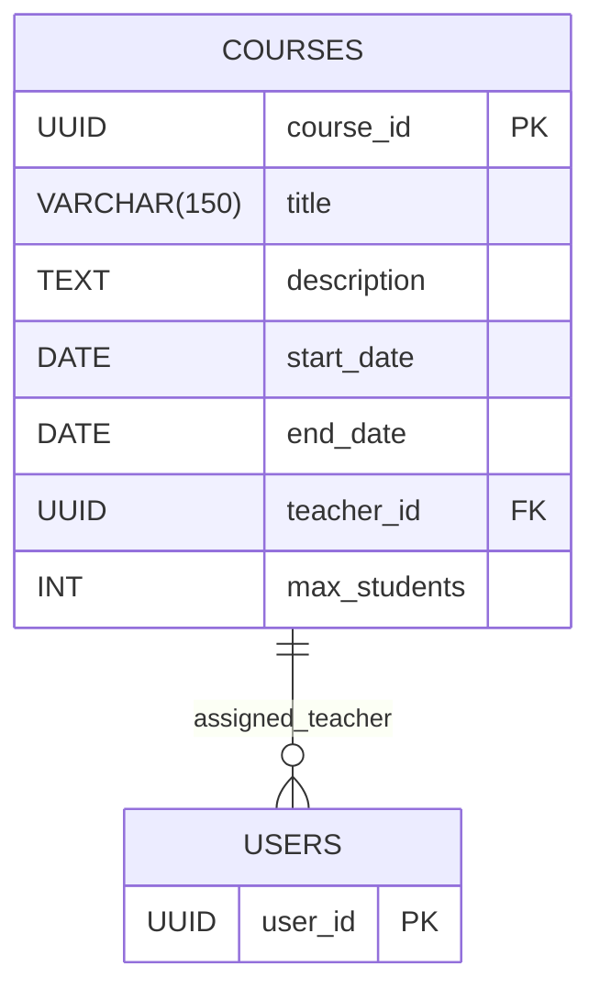
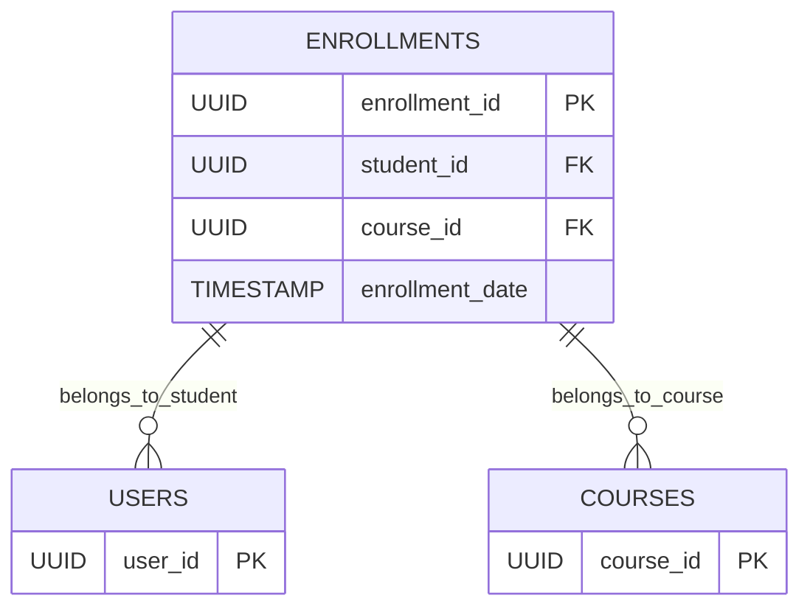
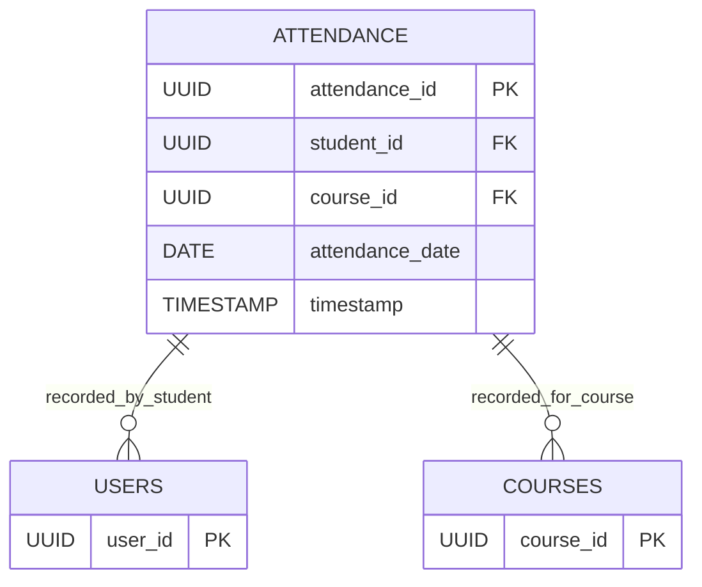
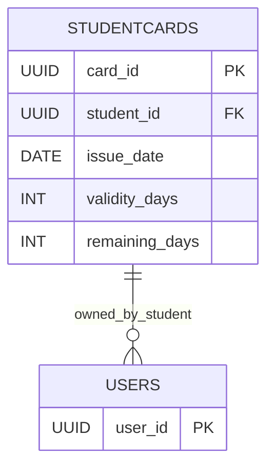
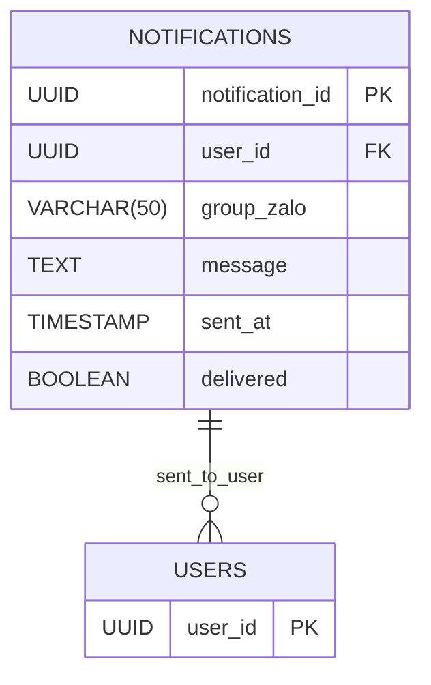
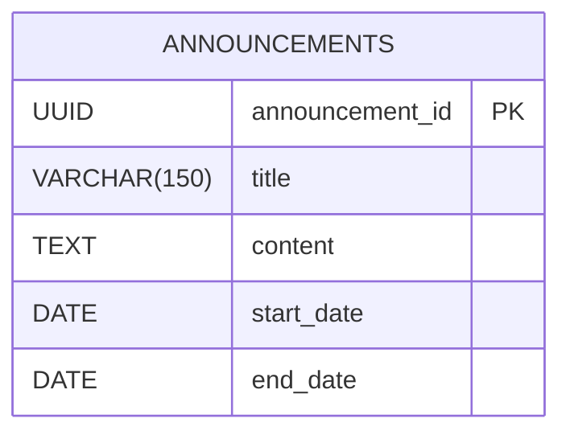
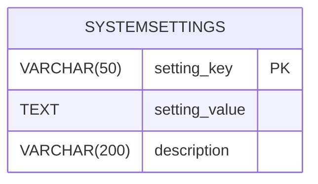

# SOFTWARE REQUIREMENTS SPECIFICATION: membership-hub

## 1. PROJECT OVERVIEW & GLOBAL ARCHITECTURE

### Mục tiêu sản phẩm & giá trị cốt lõi
- Cung cấp nền tảng thống nhất quản lý hội viên đa trung tâm.
- Cho phép theo dõi điểm danh thời gian thực qua quét QR.
- Cung cấp thẻ hội viên kỹ thuật số với tính ngày hiệu lực.
- Hỗ trợ liên lạc đa kênh (web, di động, nhóm Zalo).
- Giá trị cốt lõi: độ tin cậy, khả năng mở rộng, bảo mật, dễ sử dụng, hỗ trợ đa ngôn ngữ.

### Đối tượng người dùng mục tiêu
- Quản trị viên hệ thống (toàn quyền)
- Quản trị viên trung tâm (quyền toàn bộ trung tâm của mình)
- Quản lý (phụ trách, quyền hạn giới hạn)
- Giáo viên (chỉ xem lịch và danh sách học viên)
- Học viên (duyệt khóa học, ghi danh, xem thẻ hội viên)
- Người dùng ứng dụng di động (cùng các vai trò trên, giao diện đáp ứng)

### Ma trận kiểm soát truy cập dựa trên vai trò (RBAC)
- [ARC-001] Quản trị viên hệ thống: toàn bộ quyền trên mọi trung tâm.
- [ARC-002] Quản trị viên trung tâm: toàn quyền trong trung tâm của mình, không ảnh hưởng các trung tâm khác.
- [ARC-003] Quản lý: có thể tạo thông báo, quản lý học viên, gán học viên vào khóa học hiện có, xem danh sách khóa học, không được phép chỉnh sửa khóa học hay gán giáo viên.
- [ARC-004] Giáo viên: xem các khóa học của mình, danh sách học viên, lịch dạy; chỉ đọc.
- [ARC-005] Học viên: duyệt khóa học, đăng ký khóa học mới, xem thẻ hội viên (ngày hiệu lực còn lại), gia hạn thẻ.

### Kiến trúc & luồng dữ liệu (key flows)
- [ARC-006] Luồng xác thực: hỗ trợ email/mật khẩu, Firebase, Google, Facebook qua OAuth2; cấp JWT có hạn dùng 15 phút và refresh token.
- [ARC-007] Luồng xử lý QR điểm danh: ứng dụng di động quét QR, gửi studentID và timestamp; dịch vụ xác thực và ghi nhận điểm danh một cách duy nhất.
- [ARC-008] Luồng gửi thông báo: hệ thống kích hoạt push notification đến ứng dụng di động và đăng lên nhóm Zalo được chỉ định cho thông báo, phân công khóa học, cảnh báo điểm danh.
- [ARC-009] Luồng tích hợp backend ứng dụng di động: frontend Next.js tiêu thụ REST APIs; xác thực qua bearer token; hỗ trợ caching offline cho trường hợp mất kết nối mạng.

## 2. USER MANAGEMENT

### Yêu cầu chức năng cốt lõi
- **[REQ-001]** Đăng ký người dùng: Là một người dùng tiềm năng, tôi muốn đăng ký bằng email và mật khẩu (hoặc nhà cung cấp xã hội) để có thể tạo tài khoản trong hệ thống.
  - **Tiêu chí chấp nhận**:
    - Giả sử người dùng cung cấp email duy nhất, mật khẩu mạnh và đồng ý điều khoản, khi họ gửi biểu mẫu đăng ký, sau đó hệ thống xác thực đầu vào, tạo bản ghi người dùng mới với vai trò ‘Học viên’ (hoặc ‘Giáo viên’ nếu được mời) và trả về phản hồi thành công kèm JWT token. *[REQ-001]*
  - **Dữ liệu đầu vào & quy tắc xác thực**:
    - Email: bắt buộc, tối đa 255 ký tự, phải chứa đúng một ký tự ‘@’ và phần tên miền hợp lệ (vd: user@example.com). Phải là duy nhất.
    - Mật khẩu: bắt buộc, tối thiểu 8 ký tự, ít nhất một chữ hoa, một chữ thường, một chữ số, một ký tự đặc biệt.
    - Điều khoản: bắt buộc chọn ô xác nhận.

- **[REQ-002]** Xác thực xã hội: Là một người dùng, tôi muốn đăng nhập/đăng ký bằng Firebase, Google hoặc Facebook OAuth để có thể sử dụng thông tin xác thực hiện có.
  - **Tiêu chí chấp nhận**:
    - Giả sử người dùng chọn một nhà cung cấp, khi họ xác thực qua cửa sổ popup của nhà cung cấp, sau đó hệ thống nhận mã OAuth2, trao đổi mã lấy thông tin người dùng, tạo hoặc cập nhật bản ghi người dùng cục bộ, và cấp JWT token. *[REQ-002]*
  - **Dữ liệu đầu vào & quy tắc xác thực**: mã thông báo nhà cung cấp, tùy chọn hình ảnh hồ sơ.

- **[REQ-003]** Gán vai trò người dùng: Là một quản trị viên, tôi muốn chỉ định hoặc thay đổi vai trò của một người dùng (Quản trị viên hệ thống, Quản trị viên trung tâm, Quản lý, Giáo viên, Học viên) để đảm bảo thực thi quyền chính xác.
  - **Tiêu chí chấp nhận**:
    - Giả sử một quản trị viên chọn một người dùng và vai trò mới, khi hành động được xác nhận, sau đó vai trò của người dùng được cập nhật và các quyền tương ứng được áp dụng ngay lập tức. *[REQ-003]*
  - **Dữ liệu đầu vào & quy tắc xác thực**: Chọn vai trò trong dropdown, bắt buộc ghi lại nhật ký kiểm toán.

### Luồng ngoại lệ mô-đun
- **[EXC-004]** Xác thực đầu vào không hợp lệ (ví dụ: email sai định dạng, thiếu trường bắt buộc):
  - Nếu xác thực thất bại khi gửi biểu mẫu, khi lỗi được trả về cho người dùng, sau đó một thông báo rõ ràng liệt kê từng trường không hợp lệ và yêu cầu chỉnh sửa. *[EXC-004]*

## 3. CENTER MANAGEMENT

### Yêu cầu chức năng cốt lõi
- **[REQ-004]** Xem danh sách trung tâm: Là bất kỳ người dùng đã xác thực nào, tôi muốn xem danh sách tất cả các trung tâm kèm địa chỉ, mã số thuế và liên hệ quản trị để có thể xác định trung tâm phù hợp.
  - **Tiêu chí chấp nhận**:
    - Giả sử người dùng điều hướng đến trang Trung tâm, khi yêu cầu hoàn tất, sau đó một bảng hiển thị các trung tâm (Tên, Địa chỉ, Mã số thuế, Liên hệ quản trị) được hiển thị. *[REQ-004]*
  - **Dữ liệu đầu vào & quy tắc xác thực**: Không có (chỉ đọc).

- **[REQ-005]** Tạo/Cập nhật/Xóa trung tâm: Là Quản trị viên hệ thống, tôi muốn thêm, chỉnh sửa hoặc xóa một bản ghi trung tâm để duy trì tính cập nhật của thông tin trung tâm.
  - **Tiêu chí chấp nhận**:
    - Giả sử Quản trị viên hệ thống cung cấp tên trung tâm, địa chỉ, mã số thuế, số điện thoại liên hệ và email, khi hành động lưu được thực hiện, sau đó trung tâm được lưu persist và xuất hiện trong danh sách; nếu mã số thuế bị trùng lặp, thao tác thất bại với lỗi xung đột. *[REQ-005]*
  - **Dữ liệu đầu vào & quy tắc xác thực**:
    - Tên: bắt buộc, tối đa 100 ký tự.
    - Địa chỉ: bắt buộc, tối đa 255 ký tự.
    - Mã số thuế: bắt buộc, dạng số, 10‑13 chữ số, duy nhất.
    - Số điện thoại liên hệ: tùy chọn, có thể chứa +, chữ số, dấu cách, dấu gạch ngang, dấu ngoặc.
    - Email liên hệ: tùy chọn, phải là định dạng email hợp lệ.

- **[REQ-006]** Chỉ định quản trị viên trung tâm: Là Quản trị viên hệ thống, tôi muốn chỉ định hoặc hủy chỉ định một người dùng làm Quản trị viên trung tâm cho một trung tâm cụ thể để phân quyền quản trị.
  - **Tiêu chí chấp nhận**:
    - Giả sử Quản trị viên hệ thống chọn một người dùng và một trung tâm, khi hành động chỉ định được xác nhận, sau đó vai trò của người dùng được đặt thành ‘Quản trị viên trung tâm’ và ID trung tâm được ghi lại; thao tác hủy chỉ định đảo ngược hoạt động. *[REQ-006]*
  - **Dữ liệu đầu vào & quy tắc xác thực**: ID người dùng, ID trung tâm.

### Luồng ngoại lệ mô-đun
- **[EXC-004]** Xác thực đầu vào không hợp lệ áp dụng cho các trường tạo/cập nhật trung tâm.

## 4. COURSE MANAGEMENT

### Yêu cầu chức năng cốt lõi
- **[REQ-007]** Xem danh sách khóa học: Là bất kỳ người dùng đã xác thực nào, tôi muốn xem tất cả các khóa học kèm lịch dạy và giáo viên được chỉ định để có thể duyệt các khóa học có sẵn.
  - **Tiêu chí chấp nhận**:
    - Giả sử người dùng truy cập trang Khóa học, khi yêu cầu hoàn tất, sau đó một lưới hiển thị CourseID, Tiêu đề, Ngày bắt đầu, Ngày kết thúc, Tên giáo viên. *[REQ-007]*
  - **Dữ liệu đầu vào & quy tắc xác thực**: Không có.

- **[REQ-008]** Tạo/Cập nhật/Xóa khóa học (tránh xung đột): Là Quản trị viên hệ thống hoặc Quản trị viên trung tâm, tôi muốn quản lý khóa học (thêm, chỉnh sửa, xóa) trong khi đảm bảo không có lịch dạy trùng lặp cho cùng một giáo viên hoặc địa điểm.
  - **Tiêu chí chấp nhận**:
    - Giả sử quản trị viên cung cấp CourseTitle, StartDate, EndDate, TeacherID, khi hành động lưu được kích hoạt, sau đó hệ thống xác thực rằng giáo viên không bị lên lịch cho khóa học khác chồng lấn với các ngày này; nếu có xung đột, lỗi được trả về; nếu không, khóa học được lưu. *[REQ-008]*
  - **Dữ liệu đầu vào & quy tắc xác thực**:
    - Tiêu đề: bắt buộc, tối đa 150 ký tự.
    - Ngày bắt đầu/Ngày kết thúc: bắt buộc, Ngày kết thúc >= Ngày bắt đầu.
    - TeacherID: bắt buộc, khóa ngoại.
    - Logic kiểm tra chồng lấn được thực thi ở mức DB/trigger.

- **[REQ-009]** Chỉ định giáo viên vào khóa học: Là Quản trị viên hệ thống, tôi muốn chỉ định hoặc hủy chỉ định giáo viên vào khóa học để cập nhật trách nhiệm giảng dạy.
  - **Tiêu chí chấp nhận**:
    - Giả sử quản trị viên chọn một khóa học và một giáo viên, khi hành động chỉ định được thực hiện, sau đó ánh xạ khóa học-giáo viên được tạo và một thông báo được xếp hàng cho ứng dụng di động của giáo viên; thao tác hủy chỉ định xóa ánh xạ. *[REQ-009]*
  - **Dữ liệu đầu vào & quy tắc xác thực**: CourseID, TeacherID (phải tồn tại).

### Luồng ngoại lệ mô-đun
- **[EXC-004]** Xác thực đầu vào không hợp lệ áp dụng cho các trường tạo/cập nhật khóa học.

## 5. STUDENT ENROLLMENT & REGISTRATION

### Yêu cầu chức năng cốt lõi
- **[REQ-010]** Duyệt khóa học: Là Học viên, tôi muốn duyệt các khóa học có sẵn (trừ những khóa học tôi đã ghi danh) để có thể chọn các khóa học để tham gia.
  - **Tiêu chí chấp nhận**:
    - Giả sử Học viên đăng nhập và truy cập trang Duyệt khóa học, khi yêu cầu hoàn tất, sau đó một danh sách các khóa học kèm thông tin dung lượng và lịch dạy được hiển thị, loại trừ các khóa học mà học viên đã có bản ghi ghi danh. *[REQ-010]*
  - **Dữ liệu đầu vào & quy tắc xác thực**: Không có.

- **[REQ-011]** Ghi danh khóa học: Là Học viên, tôi muốn ghi danh vào một khóa học (có sẵn hoặc mới), điều này tự động tạo tài khoản học viên nếu thiếu và gán học viên vào khóa học.
  - **Tiêu chí chấp nhận**:
    - Giả sử Học viên chọn một khóa học và gửi yêu cầu ghi danh, khi backend xử lý yêu cầu, sau đó một bản ghi ghi danh mới được tạo; nếu học viên chưa có tài khoản cục bộ, một tài khoản được tạo với vai trò ‘Học viên’; một thông báo được xếp hàng cho ứng dụng di động của học viên và nhóm Zalo của trung tâm. *[REQ-011]*
  - **Dữ liệu đầu vào & quy tắc xác thực**:
    - CourseID: bắt buộc, phải là khóa học đang hoạt động.
    - StudentID: được suy ra từ token xác thực (hoặc tạo trên-the-fly).

### Luồng ngoại lệ mô-đun
- **[EXC-004]** Xác thực đầu vào không hợp lệ áp dụng cho các trường tạo/cập nhật ghi danh.

## 6. ATTENDANCE & QR SCANNING

### Yêu cầu chức năng cốt lõi
- **[REQ-012]** Ghi nhận điểm danh qua QR: Là Học viên (qua ứng dụng di động), tôi muốn quét mã QR khi bắt đầu tiết học để ghi nhận điểm danh cho ngày hiện tại.
  - **Tiêu chí chấp nhận**:
    - Giả sử Học viên mở máy quét, quét QR hợp lệ của khóa học và xác nhận điểm danh, khi API nhận payload, sau đó hệ thống xác thực mối quan hệ học viên-khóa học, tạo bản ghi Điểm danh với timestamp, và trả về phản hồi thành công; các lần quét trùng lặp trong cùng ngày bị bỏ qua. *[REQ-012]*
  - **Dữ liệu đầu vào & quy tắc xác thực**:
    - Payload QR: chuỗi base64 mã hóa studentID và courseID.
    - Xác thực: học viên phải ghi danh vào khóa học cho ngày đó.

- **[REQ-013]** Tính duy nhất điểm danh: Dịch vụ điểm danh phải đảm bảo rằng nhiều lần quét từ cùng một học viên cho cùng một khóa học trong cùng một ngày tạo ra một bản ghi điểm danh duy nhất.
  - **Tiêu chí chấp nhận**:
    - Giả sử học viên quét QR hai lần trong vòng một phút, khi dịch vụ xử lý cả hai yêu cầu, sau đó chỉ một hàng điểm danh được tạo; các yêu cầu tiếp theo trả về thành công với cờ ‘đã ghi nhận’. *[REQ-013]*
  - **Dữ liệu đầu vào & quy tắc xác thực**: Khóa duy nhất (StudentID, CourseID, Date).

### Luồng ngoại lệ mô-đun
- **[EXC-001]** Mất mạng & ngắt kết nối trong khi quét QR:
  - Nếu học viên quét QR nhưng mạng không khả dụng, khi ứng dụng thử lại sau khi tái kết nối, sau đó điểm danh được ghi nhận khi dịch vụ sẵn sàng.
- **[EXC-002]** Gửi điểm danh trùng lặp:
  - Nếu cùng một học viên quét QR cùng một khóa học nhiều lần trong ngày, khi hệ thống phát hiện trùng lặp, sau đó nó trả về phản hồi thành công báo hiệu ‘đã ghi nhận’ và không tạo hàng bổ sung. *[EXC-002]*

## 7. STUDENT CARD MANAGEMENT

### Yêu cầu chức năng cốt lõi
- **[REQ-014]** Hiển thị tính ngày hiệu lực thẻ: Là Học viên, tôi muốn xem thẻ hội viên của mình hiển thị ngày hiệu lực còn lại để biết khi nào cần gia hạn.
  - **Tiêu chí chấp nhận**:
    - Giả sử Học viên mở trang Thẻ, khi yêu cầu tải, sau đó giao diện hiển thị tổng số ngày hiệu lực, ngày đã sử dụng và ngày còn lại; dữ liệu được suy ra từ thực thể StudentCard. *[REQ-014]*
  - **Dữ liệu đầu vào & quy tắc xác thực**: Không có (chỉ đọc).

- **[REQ-015]** Gia hạn thẻ: Là Học viên, tôi muốn gia hạn thẻ hội viên của mình bằng cách trả phí, điều này cập nhật ngày kết thúc.
  - **Tiêu chí chấp nhận**:
    - Giả sử Học viên chọn một khoảng thời gian gia hạn (ví dụ: 30 ngày), xác nhận thanh toán, khi dịch vụ thanh toán xác nhận thành công, sau đó EndDate của StudentCard được gia hạn thêm số ngày đã chọn và một thông báo xác nhận được gửi. *[REQ-015]*
  - **Dữ liệu đầu vào & quy tắc xác thực**:
    - RenewalDays: số nguyên, từ 1 đến 365.
    - Tích hợp cổng thanh toán (ngoài phạm vi).

### Luồng ngoại lệ mô-đun
- **[EXC-004]** Xác thực đầu vào không hợp lệ áp dụng cho các trường gia hạn.

## 8. NOTIFICATIONS & COMMUNICATIONS

### Yêu cầu chức năng cốt lõi
- **[REQ-016]** Kích hoạt thông báo: Khi quản trị viên tạo thông báo, chỉ định giáo viên vào khóa học, hoặc ghi danh học viên, hệ thống phải tạo thông báo gửi đến ứng dụng di động của học viên và đăng lên nhóm Zalo được chỉ định cho thông báo, phân công khóa học, cảnh báo điểm danh.
  - **Tiêu chí chấp nhận**:
    - Giả sử quản trị viên thực hiện hành động yêu cầu thông báo, khi hành động được lưu, sau đó một bản ghi Thông báo được tạo, payload push notification được xếp hàng cho ứng dụng di động, và một tin nhắn được gửi đến nhóm chat Zalo. *[REQ-016]*
  - **Dữ liệu đầu vào & quy tắc xác thực**: Đối tượng mục tiêu (học viên, giáo viên, nhóm), nội dung thông báo, tùy chọn media.

### Luồng ngoại lệ mô-đun
- **[EXC-003]** Gửi thông báo thất bại:
  - Khi push notification không thể gửi (ví dụ: token thiết bị không hợp lệ), khi thất bại được ghi lại, sau đó hệ thống lên lịch thử lại tối đa ba lần trước khi đánh dấu là thất bại.

## 9. PROMOTIONS & ANNOUNCEMENTS MANAGEMENT

### Yêu cầu chức năng cốt lõi
- **[REQ-017]** Quản lý khuyến mãi: Là Quản trị viên trung tâm hoặc Quản lý, tôi muốn tạo, chỉnh sửa hoặc xóa các chương trình khuyến mãi (giảm giá, ưu đãi) với ngày bắt đầu/kết thúc để học viên có thể xem các ưu đãi áp dụng.
  - **Tiêu chí chấp nhận**:
    - Giả sử quản trị viên cung cấp PromotionName, mô tả, điều kiện, startDate, endDate, khi lưu, sau đó chương trình khuyến mãi xuất hiện trong danh sách hiển thị cho học viên; nếu endDate bị bỏ qua, chương trình khuyến mãi được coi là vĩnh viễn. *[REQ-017]*
  - **Dữ liệu đầu vào & quy tắc xác thực**:
    - Tên: bắt buộc, tối đa 100 ký tự.
    - Ngày bắt đầu/Ngày kết thúc: tùy chọn, định dạng YYYY‑MM‑DD.
    - Mô tả: tối đa 500 ký tự.

- **[REQ-018]** Quản lý thông báo: Là Quản trị viên trung tâm hoặc Quản lý, tôi muốn tạo, chỉnh sửa hoặc xóa các thông báo có ngày hết hạn tùy chọn để phát sóng cho tất cả người dùng.
  - **Tiêu chí chấp nhận**:
    - Giả sử quản trị viên nhập AnnouncementTitle, nội dung, hết hạn tùy chọn, khi lưu, sau đó thông báo được hiển thị trên toàn trang web; nếu hết hạn được thiết lập, nó tự động biến mất sau ngày đó. *[REQ-018]*
  - **Dữ liệu đầu vào & quy tắc xác thực**:
    - Tiêu đề: bắt buộc, tối đa 150 ký tự.
    - Nội dung: bắt buộc, tối đa 2000 ký tự.

### Luồng ngoại lệ mô-đun
- **[EXC-004]** Xác thực đầu vào không hợp lệ áp dụng cho các trường tạo/cập nhật khuyến mãi và thông báo.

## 10. AI CUSTOMER SERVICE CHATBOT

### Yêu cầu chức năng cốt lõi
- **[REQ-019]** Tích hợp chatbot AI: Là bất kỳ người dùng nào, tôi muốn tương tác với một chatbot AI có thể trả lời các truy vấn phổ biến về khóa học, giáo viên, trung tâm và trạng thái tài khoản.
  - **Tiêu chí chấp nhận**:
    - Giả sử người dùng mở cửa sổ chat, khi họ đặt câu hỏi, sau đó AI trả về câu trả lời liên quan hoặc chuyển sang hỗ trợ con người nếu độ tin cậy thấp. *[REQ-019]*
  - **Dữ liệu đầu vào & quy tắc xác thực**: Văn bản đầu vào, timeout phiên (ví dụ: 5 phút).

## 11. MOBILE APP CORE FEATURES

### Yêu cầu chức năng cốt lõi
- **[REQ-020]** Giao diện người dùng cụ thể cho từng vai trò trên di động: Là người dùng di động, tôi muốn một giao diện đáp ứng phản ánh chức năng web cho vai trò được chỉ định của tôi (Học viên, Giáo viên, Quản trị, v.v.).
  - **Tiêu chí chấp nhận**:
    - Giả sử người dùng đăng nhập trên Android hoặc iOS, khi ứng dụng tải, sau đó menu điều hướng thích hợp và các màn hình được hiển thị dựa trên vai trò của người dùng. *[REQ-020]*
  - **Dữ liệu đầu vào & quy tắc xác thực**: Không có.

- **[REQ-021]** Push notification trên di động: Là người dùng đã đăng ký, tôi muốn nhận push notification trên thiết bị di động cho xác nhận điểm danh, thông báo mới và tin nhắn nhắc nhở.
  - **Tiêu chí chấp nhận**:
    - Giả sử backend kích hoạt push, khi token thiết bị được đăng ký, sau đó notification được phân phối qua Firebase Cloud Messaging (FCM) hoặc APNs. *[REQ-021]*
  - **Dữ liệu đầu vào & quy tắc xác thực**: DeviceToken, Platform (iOS/Android).

## 12. LOCALIZATION & SEO

### Yêu cầu chức năng cốt lõi
- **[REQ-022]** Phát hiện ngôn ngữ mặc định: Là khách truy cập, tôi muốn hệ thống sử dụng tùy chọn ngôn ngữ đã lưu trước đó, nếu không có, sử dụng cài đặt ngôn ngữ trình duyệt, để có trải nghiệm cá nhân hóa.
  - **Tiêu chí chấp nhận**:
    - Giả sử người dùng truy cập trang web, khi hệ thống đánh giá ngôn ngữ, sau đó nó chọn ngôn ngữ được lưu nếu có; nếu không, sử dụng Accept‑Language header; giao diện cập nhật theo ngôn ngữ đó. *[REQ-022]*
  - **Dữ liệu đầu vào & quy tắc xác thực**: Không có.

- **[REQ-023]** SEO đa ngôn ngữ: Nền tảng phải hỗ trợ SEO cho ít nhất ba ngôn ngữ: Tiếng Anh, Tiếng Việt, Tiếng Tây Ban Nha; mỗi trang phải bao gồm meta tags ngôn ngữ-specific và các liên kết hreflang.
  - **Tiêu chí chấp nhận**:
    - Giả sử một trang được yêu cầu với một ngôn ngữ cụ thể, khi trang được render, sau đó HTML bao gồm một thẻ `<html lang='en'>` và các liên kết hreflang trỏ đến các phiên bản ngôn ngữ thay thế. *[REQ-023]*
  - **Dữ liệu đầu vào & quy tắc xác thực**: Mã ngôn ngữ (en, vi, es).

## 13. REPORTING & ANALYTICS

### Yêu cầu chức năng cốt lõi
- **[REQ-024]** Tạo báo cáo điểm danh: Là quản trị viên, tôi muốn tạo một báo cáo điểm danh hàng ngày cho một trung tâm (CSV) hiển thị trạng thái hiện diện của từng học viên.
  - **Tiêu chí chấp nhận**:
    - Giả sử quản trị viên chọn một trung tâm và khoảng thời gian, khi báo cáo được yêu cầu, sau đó một file CSV được tạo với các cột: Tên học viên, Tên khóa học, Ngày điểm danh, Trạng thái. *[REQ-024]*
  - **Dữ liệu đầu vào & quy tắc xác thực**:
    - Khoảng thời gian: start ≤ end, tối đa 30 ngày.

- **[REQ-025]** Bảng điều khiển tóm tắt ghi danh: Là Quản trị viên trung tâm, tôi muốn một bảng điều khiển thời gian thực tóm tắt tổng số học viên, khóa học đang hoạt động và các buổi học sắp tới.
  - **Tiêu chí chấp nhận**:
    - Giả sử quản trị viên mở bảng điều khiển, khi dữ liệu được làm mới, sau đó các thẻ hiển thị totalStudents, activeCourses, upcomingSessions (7 ngày tới). *[REQ-025]*
  - **Dữ liệu đầu vào & quy tắc xác thực**: Khoảng thời gian làm mới (mặc định 15 phút).

## 14. EXCEPTION FLOWS & EDGE CASES

- **[EXC-001]** Mất mạng & ngắt kết nối trong khi quét QR: được định nghĩa ở trên.
- **[EXC-002]** Gửi điểm danh trùng lặp: được định nghĩa ở trên.
- **[EXC-003]** Gửi thông báo thất bại: được định nghĩa ở trên.
- **[EXC-004]** Xác thực đầu vào không hợp lệ: được định nghĩa ở trên.
- **[EXC-005]** Khôi phục hệ thống sau sự cố:
  - Nếu dịch vụ trở nên không khả dụng, khi khôi phục, sau đó bất kỳ quét QR đang chờ xử lý được xử lý theo thứ tự FIFO, và người dùng nhận được thông báo về các sự kiện đã khôi phục.

## 15. NON-FUNCTIONAL REQUIREMENTS

- **[NFR-001]** Chỉ số hiệu năng:
  - Các API cốt lõi (xác thực, ghi nhận điểm danh, danh sách khóa học) phải hoàn tất trong vòng 200 ms trung bình.
  - Các truy vấn cơ sở dữ liệu phải được tối ưu hóa để hỗ trợ đọc trong vòng dưới một giây cho tối đa 10 000 người dùng đồng thời.

- **[NFR-002]** Khả năng sẵn sàng:
  - Mục tiêu 99.9 % thời gian hoạt động hàng năm; SLA bao gồm khả năng phục hồi tự động trên các cụm GKE.

- **[NFR-003]** Bảo mật:
  - Tất cả dữ liệu truyền tải phải sử dụng TLS 1.3; mã hóa AES‑256 khi lưu trữ.
  - JWT access token có hạn dùng 15 phút; refresh token có hạn dùng 7 ngày.
  - Triển khai các biện pháp kiểm soát OWASP Top 10 (SQL injection, XSS, CSRF).

- **[NFR-004]** Khả năng mở rộng & tính sẵn sàng:
  - Cấu hình mở rộng ngang của dịch vụ Quarkus qua Kubernetes HPA dựa trên CPU > 70 % hoặc độ trễ yêu cầu > 300 ms.
  - Tạo bản sao PostgreSQL để đọc cho workloads báo cáo.

- **[NFR-005]** Kích thước hình ảnh Docker:
  - Hình ảnh cơ sở < 200 MB; hình ảnh cuối cùng < 500 MB.

- **[NFR-006]** Ghi nhật ký & kiểm toán:
  - Tất cả hành động người dùng (thay đổi vai trò, bản ghi điểm danh, thông báo) phải được ghi nhật ký với timestamp, ID người dùng và chi tiết hành động; nhật ký được lưu giữ trong 1 năm.

- **[NFR-007]** Hỗ trợ đa ngôn ngữ:
  - Các chuỗi giao diện người dùng phải được ngoại phạm vi; hỗ trợ tiếng Anh, tiếng Việt, tiếng Tây Ban Nha; chuyển đổi ngôn ngữ mà không tải lại trang khi có thể.

- **[NFR-008]** Tuân thủ GDPR/CCPA:
  - Xóa dữ liệu cá nhân theo yêu cầu của người dùng; xuất dữ liệu ở định dạng JSON; quản lý sự đồng ý cho thông tin tiếp thị.

- **[NFR-009]** Sao lưu & phục hồi sau thảm họa:
  - Sao lưu PostgreSQL hàng ngày đầy đủ; phục hồi tức thời lên đến 24 giờ; sao lưu cụm GKE sang khu vực riêng biệt.

## 16. DATA DICTIONARY (ENTITY-SPECIFIC)

### 16.1 Users [DAT-001]
| Field | Data Type | Constraints | Description |
|-------|-----------|-------------|-------------|
| user_id | UUID | PK, NOT NULL | Unique identifier |
| email | VARCHAR(255) | NOT NULL, UNIQUE | Primary login identifier |
| password_hash | CHAR(60) | NOT NULL | bcrypt hash |
| full_name | VARCHAR(100) | NOT NULL | Real name |
| role_id | SMALLINT | FK → Roles.role_id | Assigned role |
| provider | ENUM('local','firebase','google','facebook') | default 'local' | Auth provider |
| created_at | TIMESTAMP | NOT NULL, default now() | Account creation |
| updated_at | TIMESTAMP | NOT NULL, default now() | Last update |

**Mermaid erDiagram**
```mermaid
erDiagram
    USERS {
        UUID user_id PK
        VARCHAR(255) email UNIQ
        CHAR(60) password_hash
        VARCHAR(100) full_name
        SMALLINT role_id FK
        ENUM('local','firebase','google','facebook') provider
        TIMESTAMP created_at
        TIMESTAMP updated_at
    }
    ROLES {
        SMALLINT role_id PK
        VARCHAR(30) name UNIQ
        VARCHAR(200) description
    }
    USERS ||--o{ ROLES : has_role
```

### 16.2 Centers [DAT-002]
| Field | Data Type | Constraints | Description |
|-------|-----------|-------------|-------------|
| center_id | UUID | PK, NOT NULL | Unique identifier |
| name | VARCHAR(100) | NOT NULL | Center name |
| address | VARCHAR(255) | NOT NULL | Physical address |
| tax_id | VARCHAR(20) | UNIQUE, NOT NULL | Tax identification number |
| contact_phone | VARCHAR(20) | OPTIONAL | Contact telephone |
| contact_email | VARCHAR(100) | OPTIONAL | Contact email |

**Mermaid erDiagram**
```mermaid
erDiagram
    CENTERS {
        UUID center_id PK
        VARCHAR(100) name
        VARCHAR(255) address
        VARCHAR(20) tax_id UNIQ
        VARCHAR(20) contact_phone
        VARCHAR(100) contact_email
    }
```

### 16.3 Courses [DAT-003]
| Field | Data Type | Constraints | Description |
|-------|-----------|-------------|-------------|
| course_id | UUID | PK, NOT NULL | Unique identifier |
| title | VARCHAR(150) | NOT NULL | Course name |
| description | TEXT | OPTIONAL | Detailed description |
| start_date | DATE | NOT NULL | Course start |
| end_date | DATE | NOT NULL | Course end |
| teacher_id | UUID | FK → Users.user_id | Assigned teacher |
| max_students | INT | default 30 | Capacity |

**Mermaid erDiagram**


### 16.4 Enrollments [DAT-004]
| Field | Data Type | Constraints | Description |
|-------|-----------|-------------|-------------|
| enrollment_id | UUID | PK, NOT NULL | Unique identifier |
| student_id | UUID | FK → Users.user_id | Enrolled student |
| course_id | UUID | FK → Courses.course_id | Course |
| enrollment_date | TIMESTAMP | default now() | When enrolled |

**Mermaid erDiagram**


### 16.5 Attendance [DAT-005]
| Field | Data Type | Constraints | Description |
|-------|-----------|-------------|-------------|
| attendance_id | UUID | PK, NOT NULL | Unique identifier |
| student_id | UUID | FK → Users.user_id | Student present |
| course_id | UUID | FK → Courses.course_id | Course attended |
| attendance_date | DATE | NOT NULL | Date of attendance |
| timestamp | TIMESTAMP | default now() | Exact time recorded |

**Mermaid erDiagram**


### 16.6 StudentCards [DAT-006]
| Field | Data Type | Constraints | Description |
|-------|-----------|-------------|-------------|
| card_id | UUID | PK, NOT NULL | Unique identifier |
| student_id | UUID | FK → Users.user_id | Owner |
| issue_date | DATE | NOT NULL | Card issue date |
| validity_days | INT | NOT NULL | Total validity days |
| remaining_days | INT | computed | Days left until expiry |

**Mermaid erDiagram**


### 16.7 Notifications [DAT-007]
| Field | Data Type | Constraints | Description |
|-------|-----------|-------------|-------------|
| notification_id | UUID | PK, NOT NULL | Unique identifier |
| user_id | UUID | FK → Users.user_id (optional) | Target user |
| group_zalo | VARCHAR(50) | OPTIONAL | Target Zalo group |
| message | TEXT | NOT NULL | Notification content |
| sent_at | TIMESTAMP | default now() | When sent |
| delivered | BOOLEAN | default false | Delivery status |

**Mermaid erDiagram**


### 16.8 Roles [DAT-008]
| Field | Data Type | Constraints | Description |
|-------|-----------|-------------|-------------|
| role_id | SMALLINT | PK | Role identifier |
| name | VARCHAR(30) | UNIQUE, NOT NULL | Role name |
| description | VARCHAR(200) | OPTIONAL | Role description |

**Mermaid erDiagram**
```mermaid
erDiagram
    ROLES {
        SMALLINT role_id PK
        VARCHAR(30) name UNIQ
        VARCHAR(200) description
    }
```

### 16.9 Promotions [DAT-009]
| Field | Data Type | Constraints | Description |
|-------|-----------|-------------|-------------|
| promo_id | UUID | PK, NOT NULL | Unique identifier |
| code | VARCHAR(30) | UNIQUE | Discount code |
| discount_percent | SMALLINT | NOT NULL | Discount percentage |
| start_date | DATE | OPTIONAL | Promotion start |
| end_date | DATE | OPTIONAL | Promotion end |
| description | TEXT | OPTIONAL | Promo details |

**Mermaid erDiagram**
```mermaid
erDiagram
    PROMOTIONS {
        UUID promo_id PK
        VARCHAR(30) code UNIQ
        SMALLINT discount_percent
        DATE start_date
        DATE end_date
        TEXT description
    }
```

### 16.10 Announcements [DAT-010]
| Field | Data Type | Constraints | Description |
|-------|-----------|-------------|-------------|
| announcement_id | UUID | PK, NOT NULL | Unique identifier |
| title | VARCHAR(150) | NOT NULL | Title |
| content | TEXT | NOT NULL | Content |
| start_date | DATE | OPTIONAL | Effective start |
| end_date | DATE | OPTIONAL | Effective end |

**Mermaid erDiagram**


### 16.11 SystemSettings [DAT-011]
| Field | Data Type | Constraints | Description |
|-------|-----------|-------------|-------------|
| setting_key | VARCHAR(50) | PK | Configuration key |
| setting_value | TEXT | NOT NULL | Configuration value |
| description | VARCHAR(200) | OPTIONAL | Meaning of setting |

**Mermaid erDiagram**


---