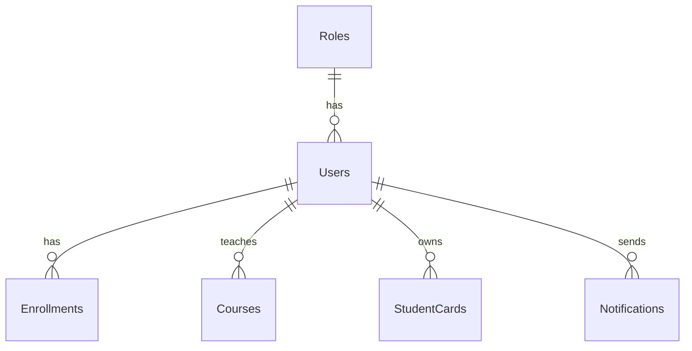
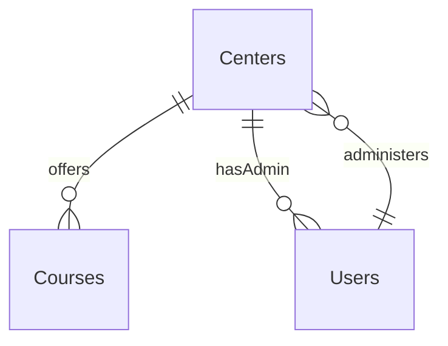
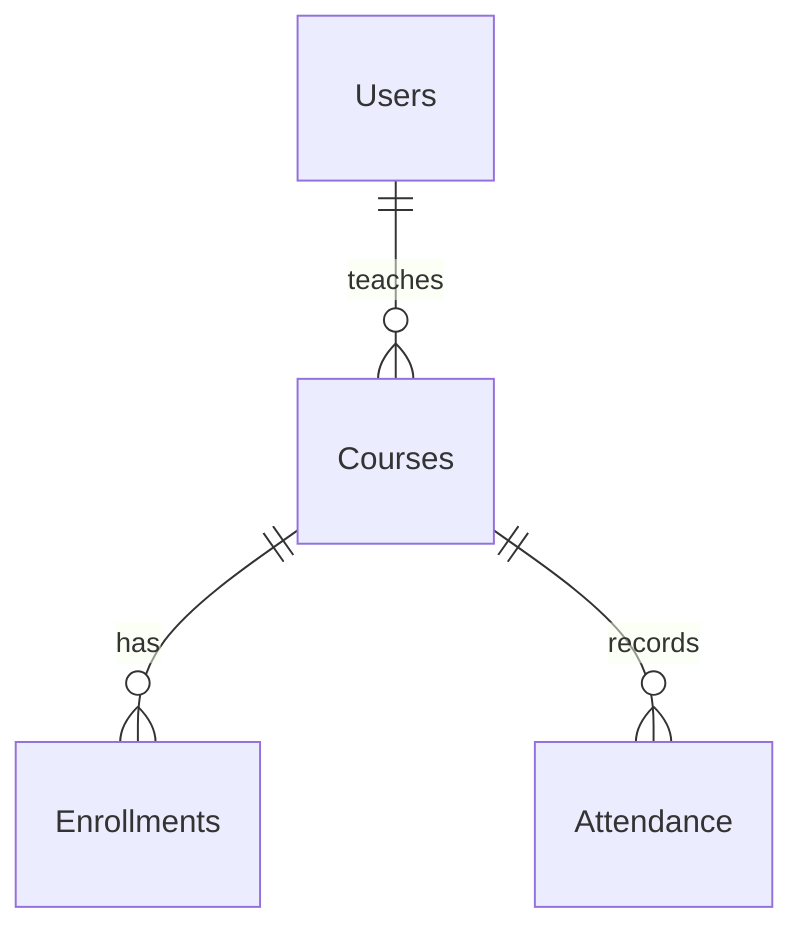
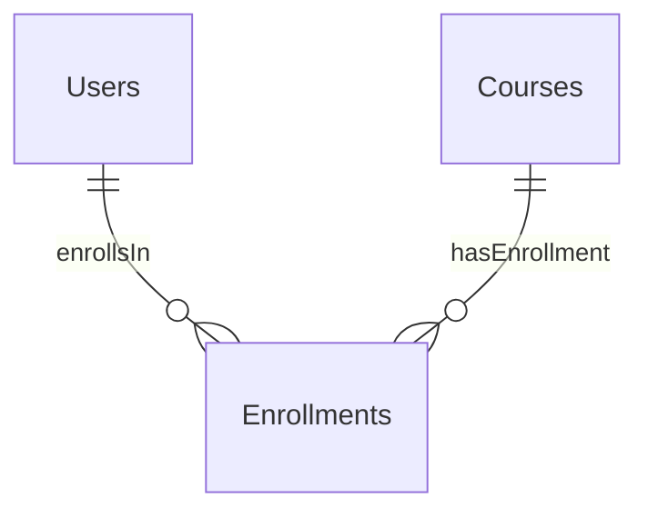
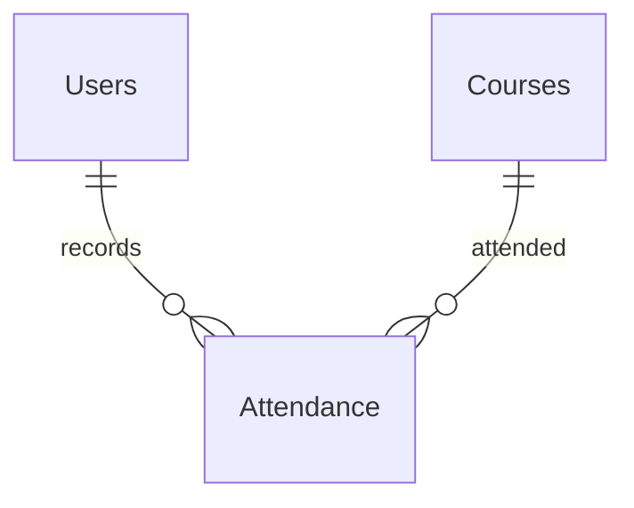
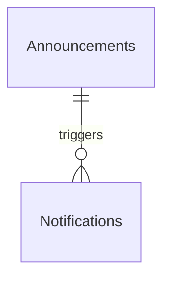

# 1. TỔNG QUAN DỰ ÁN & KIẾN TRÚC TOÀN CẦU

## Mục tiêu sản phẩm & Giá trị cốt lõi
- Cung cấp nền tảng thống nhất quản lý hội viên đa trung tâm.
- Cho phép theo dõi điểm danh thời gian thực qua quét QR.
- Cung cấp thẻ hội viên số với tính năng đếm ngày hiệu lực.
- Hỗ trợ truyền thông đa kênh (web, di động, nhóm Zalo).
- Giá trị cốt lõi: độ tin cậy, khả năng mở rộng, bảo mật, tính thân thiện với người dùng, hỗ trợ đa ngôn ngữ.

## Nhóm người dùng mục tiêu
- Quản trị viên hệ thống (siêu người dùng toàn cầu)
- Quản trị viên trung tâm (người quản lý cấp trung tâm)
- Quản lý (phó quản trị viên, quyền hạn giới hạn)
- Giáo viên (chỉ đọc lịch giảng dạy)
- Học viên (duyệt khóa học, ghi danh, xem thẻ hội viên)
- Người dùng ứng dụng di động (cùng vai trò, giao diện đáp ứng)

## Ma trận kiểm soát truy cập dựa trên vai trò (RBAC)
- [ARC-001] Quản trị viên hệ thống: toàn quyền trên tất cả các trung tâm.
- [ARC-002] Quản trị viên trung tâm: toàn quyền trong trung tâm của mình, không ảnh hưởng đến trung tâm khác.
- [ARC-003] Quản lý: có thể tạo thông báo, quản lý học viên, phân công học viên vào khóa học, xem danh sách khóa học, không thể chỉnh sửa khóa học hoặc phân công giáo viên.
- [ARC-004] Giáo viên: xem khóa học của mình, danh sách học viên, lịch giảng dạy; chỉ đọc.
- [ARC-005] Học viên: duyệt khóa học, đăng ký khóa học mới, xem thẻ hội viên (ngày còn lại), gia hạn thẻ.

## Kiến trúc hệ thống & luồng dữ liệu toàn cục
- [ARC-006] Xác thực: hỗ trợ email/mật khẩu, Firebase, Google, Facebook qua OAuth2; cấp JWT token với thời hạn 15 phút và token làm mới.
- [ARC-007] Điểm danh QR: ứng dụng di động quét QR, gửi studentID và timestamp đến backend; dịch vụ xác thực và ghi nhận điểm danh một cách duy nhất.
- [ARC-008] Thông báo: hệ thống kích hoạt push notification đến ứng dụng di động và đăng lên nhóm Zalo được chỉ định cho thông báo, phân công khóa học, cảnh báo điểm danh.
- [ARC-009] Tích hợp di động: frontend Next.js tiêu thụ REST API; xác thực qua bearer token; hỗ trợ lưu trữ ngoại tuyến cho kết nối hạn chế.

# 2. CÁC MODULE CHỨC NĂNG EPIC

## 2.1 Quản lý người dùng
- **Yêu cầu chức năng**: [REQ-001] Đăng ký người dùng: Là người dùng tiềm năng, tôi muốn đăng ký bằng email và mật khẩu (hoặc nhà cung cấp xã hội) để có tài khoản trong hệ thống.
  - **Tiêu chí chấp nhận**:
    - Giả sử người dùng cung cấp email duy nhất, mật khẩu mạnh và đồng ý với điều khoản, khi họ gửi biểu mẫu đăng ký, sau đó hệ thống xác thực đầu vào, tạo bản ghi người dùng mới với vai trò 'Học viên' (hoặc 'Giáo viên' nếu được mời) và trả về phản hồi thành công với JWT token. *[REQ-001]*
  - **Dữ liệu đầu vào & quy tắc xác thực**:
    - Email: bắt buộc, tối đa 255 ký tự, phải chứa một '@' và phần tên miền (ví dụ: user@example.com). Phải là duy nhất.
    - Mật khẩu: bắt buộc, tối thiểu 8 ký tự, ít nhất một ký tự hoa, một ký tự thường, một chữ số, một ký tự đặc biệt.
    - Điều khoản: ô kiểm bắt buộc.
- **Yêu cầu chức năng**: [REQ-002] Xác thực xã hội: Là người dùng, tôi muốn đăng nhập/đăng ký bằng Firebase, Google, hoặc Facebook OAuth để tận dụng thông tin đăng nhập hiện có.
  - **Tiêu chí chấp nhận**:
    - Giả sử người dùng chọn một nhà cung cấp xã hội, khi họ xác thực qua cửa sổ pop-up của nhà cung cấp, sau đó hệ thống nhận mã OAuth2, trao đổi mã để lấy thông tin người dùng, tạo hoặc cập nhật bản ghi người dùng cục bộ, và cấp JWT token. *[REQ-002]*
  - **Dữ liệu đầu vào & quy tắc xác thực**: mã thông báo nhà cung cấp, tùy chọn ảnh hồ sơ.
- **Yêu cầu chức năng**: [REQ-003] Phân công vai trò người dùng: Là quản trị viên, tôi muốn chỉ định hoặc thay đổi vai trò của người dùng (Quản trị viên hệ thống, Quản trị viên trung tâm, Quản lý, Giáo viên, Học viên) để thực thi quyền permissions chính xác.
  - **Tiêu chí chấp nhận**:
    - Giả sử quản trị viên chọn một người dùng và vai trò mới, khi hành động được xác nhận, sau đó vai trò của người dùng được cập nhật và quyền permissions tương ứng được áp dụng ngay lập tức. *[REQ-003]*
  - **Dữ liệu đầu vào & quy tắc xác thực**: danh sách thả xuống vai trò, bản ghi nhật ký kiểm toán bắt buộc.

### Ngoại lệ module (2.1)
- **[EXC-004]** Xác thực đầu vào không hợp lệ:
  - Nếu xác thực thất bại khi gửi biểu mẫu, khi lỗi được trả về cho người dùng, sau đó một thông báo rõ ràng liệt kê từng trường không hợp lệ và yêu cầu chỉnh sửa.
- **[EXC-001]** Mất kết nối mạng & khả năng khôi phục:
  - Nếu học viên quét QR nhưng không có mạng, khi ứng dụng thử lại sau khi kết nối lại, sau đó điểm danh được ghi nhận khi dịch vụ sẵn sàng.

### Từ điển dữ liệu module (2.1) – Bảng Users
- **[DAT-001]** Bảng Users:
  - **user_id**: UUID, Khóa chính, không null
  - **email**: VARCHAR(255), không null, duy nhất
  - **password_hash**: CHAR(60), không null
  - **full_name**: VARCHAR(100), không null
  - **role_id**: SMALLINT, khóa ngoại → Roles.role_id
  - **provider**: ENUM('local','firebase','google','facebook'), default 'local'
  - **created_at**: TIMESTAMP, không null, default now()
  - **updated_at**: TIMESTAMP, không null, default now()
  - **Mô tả**: Lưu trữ thông tin đăng nhập và hồ sơ người dùng.

## 2.2 Quản lý trung tâm
- **Yêu cầu chức năng**: [REQ-004] Xem danh sách trung tâm: Là bất kỳ người dùng đã xác thực, tôi muốn xem danh sách tất cả các trung tâm cùng địa chỉ, mã số thuế, và liên hệ quản trị viên để xác định trung tâm liên quan.
  - **Tiêu chí chấp nhận**:
    - Giả sử người dùng truy cập trang Trung tâm, khi yêu cầu hoàn tất, sau đó một bảng hiển thị các trung tâm (Tên, Địa chỉ, TaxID, Liên hệ quản trị viên) được hiển thị. *[REQ-004]*
  - **Dữ liệu đầu vào & quy tắc xác thực**: Không có (chỉ đọc).
- **Yêu cầu chức năng**: [REQ-005] Tạo/Cập nhật/Xóa trung tâm: Là Quản trị viên hệ thống, tôi muốn thêm, chỉnh sửa, hoặc xóa bản ghi trung tâm để giữ thông tin trung tâm cập nhật.
  - **Tiêu chí chấp nhận**:
    - Giả sử Quản trị viên hệ thống cung cấp tên trung tâm, địa chỉ, mã số thuế, điện thoại liên hệ và email, khi hành động lưu được thực thi, sau đó trung tâm được lưu và xuất hiện trong danh sách; nếu mã số thuế trùng lặp, thao tác thất bại với lỗi xung đột. *[REQ-005]*
  - **Dữ liệu đầu vào & quy tắc xác thực**:
    - Tên: bắt buộc, tối đa 100 ký tự.
    - Địa chỉ: bắt buộc, tối đa 255 ký tự.
    - TaxID: bắt buộc, số, 10-13 chữ số, duy nhất.
    - Điện thoại liên hệ: tùy chọn, có thể bao gồm +, chữ số, dấu cách, dấu gạch ngang, ngoặc đơn.
    - Email liên hệ: tùy chọn, phải là email hợp lệ.
- **Yêu cầu chức năng**: [REQ-006] Phân công quản trị viên trung tâm: Là Quản trị viên hệ thống, tôi muốn chỉ định hoặc hủy chỉ định một người dùng làm Quản trị viên trung tâm cho một trung tâm cụ thể để phân quyền kiểm soát.
  - **Tiêu chí chấp nhận**:
    - Giả sử Quản trị viên hệ thống chọn một người dùng và một trung tâm, khi hành động chỉ định được xác nhận, sau đó vai trò của người dùng được đặt thành 'Quản trị viên trung tâm' và ID trung tâm được ghi lại; thao tác hủy chỉ định đảo ngược hoạt động. *[REQ-006]*
  - **Dữ liệu đầu vào & quy tắc xác thực**: ID người dùng, ID trung tâm.

### Ngoại lệ module (2.2)
- **[EXC-005]** Khôi phục hệ thống sau sự cố:
  - Nếu dịch vụ không khả dụng, khi nó khôi phục, sau đó bất kỳ điểm danh đang chờ xử lý nào được xử lý theo thứ tự FIFO, và người dùng nhận được thông báo về các sự kiện đã khôi phục.
- **[EXC-004]** Xác thực đầu vào không hợp lệ:
  - Nếu xác thực thất bại khi gửi biểu mẫu, khi lỗi được trả về cho người dùng, sau đó một thông báo rõ ràng liệt kê từng trường không hợp lệ và yêu cầu chỉnh sửa.

### Từ điển dữ liệu module (2.2) – Bảng Centers
- **[DAT-002]** Bảng Centers:
  - **center_id**: UUID, Khóa chính, không null
  - **name**: VARCHAR(100), không null
  - **address**: VARCHAR(255), không null
  - **tax_id**: VARCHAR(20), duy nhất, không null
  - **contact_phone**: VARCHAR(20), tùy chọn
  - **contact_email**: VARCHAR(100), tùy chọn
  - **Mô tả**: Lưu trữ thông tin đăng ký và liên hệ của trung tâm.

## 2.3 Quản lý khóa học
- **Yêu cầu chức năng**: [REQ-007] Xem danh sách khóa học: Là bất kỳ người dùng đã xác thực, tôi muốn xem tất cả các khóa học cùng lịch học và giáo viên được chỉ định để có thể duyệt các khóa học được cung cấp.
  - **Tiêu chí chấp nhận**:
    - Giả sử người dùng truy cập trang Khóa học, khi yêu cầu hoàn tất, sau đó một lưới hiển thị CourseID, Tiêu đề, StartDate, EndDate, TeacherName. *[REQ-007]*
  - **Dữ liệu đầu vào & quy tắc xác thực**: Không có.
- **Yêu cầu chức năng**: [REQ-008] Tạo/Cập nhật/Xóa khóa học (tránh xung đột): Là Quản trị viên hệ thống hoặc Quản trị viên trung tâm, tôi muốn quản lý khóa học (thêm, chỉnh sửa, xóa) trong khi đảm bảo không có lịch học chồng chéo cho cùng một giáo viên hoặc địa điểm.
  - **Tiêu chí chấp nhận**:
    - Giả sử quản trị viên cung cấp CourseTitle, StartDate, EndDate, TeacherID, khi hành động lưu được kích hoạt, sau đó hệ thống xác thực rằng giáo viên không có lịch học khác chồng chéo trong các ngày này; nếu xung đột, lỗi được trả về; nếu không, khóa học được lưu. *[REQ-008]*
  - **Dữ liệu đầu vào & quy tắc xác thực**:
    - Tiêu đề: bắt buộc, tối đa 150 ký tự.
    - StartDate/EndDate: bắt buộc, EndDate >= StartDate.
    - TeacherID: bắt buộc, khóa ngoại.
    - Logic kiểm tra chồng chéo được thực thi ở mức DB/trigger.
- **Yêu cầu chức năng**: [REQ-009] Phân công giáo viên cho khóa học: Là Quản trị viên hệ thống, tôi muốn chỉ định hoặc hủy chỉ định giáo viên cho khóa học để cập nhật trách nhiệm giảng dạy.
  - **Tiêu chí chấp nhận**:
    - Giả sử quản trị viên chọn một khóa học và một giáo viên, khi hành động phân công được thực thi, sau đó bản đồ khóa học-giáo viên được tạo và một thông báo được xếp hàng cho ứng dụng di động của giáo viên; thao tác hủy chỉ định xóa bản đồ. *[REQ-009]*
  - **Dữ liệu đầu vào & quy tắc xác thực**: CourseID, TeacherID (phải tồn tại).

### Ngoại lệ module (2.3)
- **[EXC-002]** Điểm danh trùng lặp:
  - Nếu cùng một học viên quét QR cùng một khóa học nhiều lần trong cùng một ngày, khi hệ thống phát hiện trùng lặp, sau đó nó trả về phản hồi thành công với cờ 'đã ghi nhận' và không tạo thêm hàng.
- **[EXC-001]** Mất kết nối mạng & khả năng khôi phục:
  - Nếu học viên quét QR nhưng không có mạng, khi ứng dụng thử lại sau khi kết nối lại, sau đó điểm danh được ghi nhận khi dịch vụ sẵn sàng.

### Từ điển dữ liệu module (2.3) – Bảng Courses
- **[DAT-003]** Bảng Courses:
  - **course_id**: UUID, Khóa chính, không null
  - **title**: VARCHAR(150), không null
  - **description**: TEXT, tùy chọn
  - **start_date**: DATE, không null
  - **end_date**: DATE, không null
  - **teacher_id**: UUID, khóa ngoại → Users.user_id
  - **max_students**: INT, default 30
  - **Mô tả**: Lưu trữ thông tin chi tiết về khóa học.

## 2.4 Ghi danh & đăng ký học viên
- **Yêu cầu chức năng**: [REQ-010] Duyệt khóa học: Là Học viên, tôi muốn duyệt các khóa học có sẵn (trừ những khóa học đã ghi danh) để có thể chọn các khóa học tham gia.
  - **Tiêu chí chấp nhận**:
    - Giả sử Học viên đăng nhập và truy cập trang Duyệt khóa học, khi yêu cầu hoàn tất, sau đó một danh sách các khóa học cùng thông tin về sức chứa và lịch học được hiển thị, trừ các khóa học mà học viên đã có bản ghi ghi danh. *[REQ-010]*
  - **Dữ liệu đầu vào & quy tắc xác thực**: Không có.
- **Yêu cầu chức năng**: [REQ-011] Đăng ký khóa học học viên: Là Học viên, tôi muốn đăng ký một khóa học (tồn tại hoặc mới), điều này tự động tạo tài khoản học viên nếu thiếu, và phân công học viên vào khóa học.
  - **Tiêu chí chấp nhận**:
    - Giả sử Học viên chọn một khóa học và gửi đăng ký, khi backend xử lý yêu cầu, sau đó một bản ghi ghi danh mới được tạo; nếu học viên không có tài khoản cục bộ, một tài khoản được tạo với vai trò 'Học viên'; một thông báo được xếp hàng cho ứng dụng di động của học viên và nhóm Zalo của trung tâm. *[REQ-011]*
  - **Dữ liệu đầu vào & quy tắc xác thực**:
    - CourseID: bắt buộc, phải là khóa học đang hoạt động.
    - StudentID: được suy ra từ token xác thực (hoặc tạo trên-the-fly).

### Ngoại lệ module (2.4)
- **[EXC-004]** Xác thực đầu vào không hợp lệ:
  - Nếu xác thực thất bại khi gửi biểu mẫu, khi lỗi được trả về cho người dùng, sau đó một thông báo rõ ràng liệt kê từng trường không hợp lệ và yêu cầu chỉnh sửa.

### Từ điển dữ liệu module (2.4) – Bảng Enrollments
- **[DAT-004]** Bảng Enrollments:
  - **enrollment_id**: UUID, Khóa chính, không null
  - **student_id**: UUID, khóa ngoại → Users.user_id
  - **course_id**: UUID, khóa ngoại → Courses.course_id
  - **enrollment_date**: TIMESTAMP, default now()
  - **Mô tả**: Lưu trữ bản ghi ghi danh của học viên vào khóa học.

## 2.5 Điểm danh & quét QR
- **Yêu cầu chức năng**: [REQ-012] Ghi nhận điểm danh qua QR: Là Học viên (qua ứng dụng di động), tôi muốn quét mã QR khi bắt đầu lớp học để ghi nhận điểm danh của tôi trong ngày.
  - **Tiêu chí chấp nhận**:
    - Giả sử Học viên mở máy quét, quét QR hợp lệ của khóa học và xác nhận điểm danh, khi API nhận payload, sau đó hệ thống xác thực mối quan hệ học viên-khóa học, tạo bản ghi Điểm danh với timestamp, và trả về phản hồi thành công; các lần quét trùng lặp trong cùng ngày bị bỏ qua. *[REQ-012]*
  - **Dữ liệu đầu vào & quy tắc xác thực**:
    - Payload QR: chuỗi base64 chứa studentID và courseID.
    - Xác thực: học viên phải ghi danh vào khóa học trong ngày.
- **Yêu cầu chức năng**: [REQ-013] Tính idempotent điểm danh: Dịch vụ điểm danh phải đảm bảo rằng nhiều lần quét từ cùng một học viên cho cùng một khóa học trong cùng một ngày tạo ra một bản ghi điểm danh duy nhất.
  - **Tiêu chí chấp nhận**:
    - Giả sử học viên quét QR hai lần trong vòng một phút, khi dịch vụ xử lý cả hai yêu cầu, sau đó chỉ một hàng điểm danh được tạo; các yêu cầu tiếp theo trả về phản hồi thành công với cờ 'trùng lặp'. *[REQ-013]*
  - **Dữ liệu đầu vào & quy tắc xác thực**: Khóa chính tổng hợp (StudentID, CourseID, Date).

### Ngoại lệ module (2.5)
- **[EXC-001]** Mất kết nối mạng & khả năng khôi phục:
  - Nếu học viên quét QR nhưng không có mạng, khi ứng dụng thử lại sau khi kết nối lại, sau đó điểm danh được ghi nhận khi dịch vụ sẵn sàng.
- **[EXC-002]** Điểm danh trùng lặp:
  - Nếu cùng một học viên quét QR cùng một khóa học nhiều lần trong cùng một ngày, khi hệ thống phát hiện trùng lặp, sau đó nó trả về phản hồi thành công với cờ 'đã ghi nhận' và không tạo thêm hàng.

### Từ điển dữ liệu module (2.5) – Bảng Attendance
- **[DAT-005]** Bảng Attendance:
  - **attendance_id**: UUID, Khóa chính, không null
  - **student_id**: UUID, khóa ngoại → Users.user_id
  - **course_id**: UUID, khóa ngoại → Courses.course_id
  - **attendance_date**: DATE, không null
  - **timestamp**: TIMESTAMP, default now()
  - **Mô tả**: Lưu trữ hồ sơ điểm danh cho từng học viên trong từng khóa học.

## 2.6 Quản lý thẻ hội viên học viên
- **Yêu cầu chức năng**: [REQ-014] Hiển thị tính hợp lệ thẻ: Là Học viên, tôi muốn xem thẻ hội viên của mình hiển thị ngày hiệu lực còn lại để biết khi nào cần gia hạn.
  - **Tiêu chí chấp nhận**:
    - Giả sử Học viên mở trang Thẻ, khi yêu cầu tải, sau đó giao diện hiển thị tổng số ngày hiệu lực, ngày đã sử dụng, và ngày còn lại; dữ liệu được suy ra từ thực thể StudentCard. *[REQ-014]*
  - **Dữ liệu đầu vào & quy tắc xác thực**: Không có (chỉ đọc).
- **Yêu cầu chức năng**: [REQ-015] Gia hạn thẻ hội viên: Là Học viên, tôi muốn gia hạn thẻ hội viên của mình bằng cách thanh toán một khoản phí, điều này cập nhật ngày kết thúc.
  - **Tiêu chí chấp nhận**:
    - Giả sử Học viên chọn một khoảng thời gian gia hạn (ví dụ: 30 ngày), xác nhận thanh toán, khi dịch vụ thanh toán xác nhận thành công, sau đó StudentCard's EndDate được mở rộng thêm số ngày đã chọn và một thông báo xác nhận được gửi. *[REQ-015]*
  - **Dữ liệu đầu vào & quy tắc xác thực**:
    - RenewalDays: số nguyên, 1‑365.
    - Tích hợp cổng thanh toán (ngoài phạm vi).

### Ngoại lệ module (2.6)
- **[EXC-001]** Mất kết nối mạng & khả năng khôi phục:
  - Nếu học viên quét QR nhưng không có mạng, khi ứng dụng thử lại sau khi kết nối lại, sau đó điểm danh được ghi nhận khi dịch vụ sẵn sàng.

### Từ điển dữ liệu module (2.6) – Bảng StudentCards
- **[DAT-006]** Bảng StudentCards:
  - **card_id**: UUID, Khóa chính, không null
  - **student_id**: UUID, khóa ngoại → Users.user_id
  - **issue_date**: DATE, không null
  - **validity_days**: INT, không null
  - **remaining_days**: INT, tính toán
  - **Mô tả**: Lưu trữ thẻ hội viên của học viên và tính toán ngày hiệu lực còn lại.

## 2.7 Thông báo & truyền thông
- **Yêu cầu chức năng**: [REQ-016] Kích hoạt thông báo: Khi quản trị viên tạo thông báo, phân công giáo viên vào khóa học, hoặc ghi danh học viên, hệ thống phải tạo thông báo gửi đến ứng dụng di động của học viên và đăng lên nhóm Zalo được chỉ định.
  - **Tiêu chí chấp nhận**:
    - Giả sử quản trị viên thực hiện hành động yêu cầu thông báo, khi hành động được lưu, sau đó một bản ghi Thông báo được tạo, payload thông báo push được xếp hàng cho ứng dụng di động, và một tin nhắn văn bản được gửi đến nhóm chat Zalo. *[REQ-016]*
  - **Dữ liệu đầu vào & quy tắc xác thực**: Đối tượng mục tiêu (học viên, giáo viên, nhóm), nội dung tin nhắn, tùy chọn media.

### Ngoại lệ module (2.7)
- **[EXC-003]** Giao hàng thông báo thất bại:
  - Khi một thông báo push không thể được gửi (ví dụ: token thiết bị không hợp lệ), khi hệ thống phát hiện thất bại, sau đó nó ghi lại lỗi và lên lịch thử lại tối đa ba lần trước khi đánh dấu là thất bại.

### Từ điển dữ liệu module (2.7) – Bảng Notifications
- **[DAT-007]** Bảng Notifications:
  - **notification_id**: UUID, Khóa chính, không null
  - **user_id**: UUID, khóa ngoại → Users.user_id (tùy chọn)
  - **group_zalo**: VARCHAR(50), tùy chọn
  - **message**: TEXT, không null
  - **sent_at**: TIMESTAMP, default now()
  - **delivered**: BOOLEAN, default false
  - **Mô tả**: Lưu trữ hồ sơ thông báo được gửi cho người dùng hoặc nhóm Zalo.

## 2.8 Quản lý khuyến mãi & thông báo
- **Yêu cầu chức năng**: [REQ-017] Quản lý khuyến mãi: Là Quản trị viên trung tâm hoặc Quản lý, tôi muốn tạo, chỉnh sửa, hoặc xóa các khuyến mãi (giảm giá, ưu đãi) với ngày bắt đầu/kết thúc để học viên có thể xem các ưu đãi áp dụng.
  - **Tiêu chí chấp nhận**:
    - Giả sử quản trị viên cung cấp PromotionName, mô tả, điều kiện, startDate, endDate, khi lưu, sau đó khuyến mãi xuất hiện trong danh sách hiển thị cho học viên; nếu endDate bị bỏ qua, khuyến mãi được coi là vĩnh viễn. *[REQ-017]*
  - **Dữ liệu đầu vào & quy tắc xác thực**:
    - Tên: bắt buộc, tối đa 100 ký tự.
    - StartDate/EndDate: tùy chọn, định dạng YYYY-MM-DD.
    - Mô tả: tối đa 500 ký tự.
- **Yêu cầu chức năng**: [REQ-018] Quản lý thông báo: Là Quản trị viên trung tâm hoặc Quản lý, tôi muốn tạo, chỉnh sửa, hoặc xóa các thông báo với ngày hết hạn tùy chọn để phát sóng cho tất cả người dùng.
  - **Tiêu chí chấp nhận**:
    - Giả sử quản trị viên nhập AnnouncementTitle, nội dung, tùy chọn hết hạn, khi lưu, sau đó thông báo được hiển thị trên toàn trang web; nếu hết hạn được đặt, nó tự động biến mất sau ngày đó. *[REQ-018]*
  - **Dữ liệu đầu vào & quy tắc xác thực**:
    - Tiêu đề: bắt buộc, tối đa 150 ký tự.
    - Nội dung: bắt buộc, tối đa 2000 ký tự.

### Ngoại lệ module (2.8)
- **[EXC-004]** Xác thực đầu vào không hợp lệ:
  - Nếu xác thực thất bại khi gửi biểu mẫu, khi lỗi được trả về cho người dùng, sau đó một thông báo rõ ràng liệt kê từng trường không hợp lệ và yêu cầu chỉnh sửa.

### Từ điển dữ liệu module (2.8) – Bảng Promotions & Announcements
- **[DAT-009]** Bảng Promotions:
  - **promo_id**: UUID, Khóa chính, không null
  - **code**: VARCHAR(30), duy nhất
  - **discount_percent**: SMALLINT, không null
  - **start_date**: DATE, tùy chọn
  - **end_date**: DATE, tùy chọn
  - **description**: TEXT, tùy chọn
  - **Mô tả**: Lưu trữ thông tin khuyến mãi.

- **[DAT-010]** Bảng Announcements:
  - **announcement_id**: UUID, Khóa chính, không null
  - **title**: VARCHAR(150), không null
  - **content**: TEXT, không null
  - **start_date**: DATE, tùy chọn
  - **end_date**: DATE, tùy chọn
  - **Mô tả**: Lưu trữ nội dung thông báo.

## 2.9 Chatbot dịch vụ khách hàng AI
- **Yêu cầu chức năng**: [REQ-019] Tích hợp chatbot AI: Là bất kỳ người dùng, tôi muốn tương tác với một chatbot AI có thể trả lời các câu hỏi phổ biến về khóa học, giáo viên, trung tâm, và trạng thái tài khoản.
  - **Tiêu chí chấp nhận**:
    - Giả sử người dùng mở widget chat, khi họ hỏi một câu hỏi, sau đó AI trả về một câu trả lời liên quan hoặc chuyển đến hỗ trợ con người nếu độ tin cậy thấp. *[REQ-019]*
  - **Dữ liệu đầu vào & quy tắc xác thực**: Văn bản đầu vào, timeout phiên.

### Ngoại lệ module (2.9)
- **[EXC-004]** Xác thực đầu vào không hợp lệ:
  - Nếu xác thực thất bại khi gửi biểu mẫu, khi lỗi được trả về cho người dùng, sau đó một thông báo rõ ràng liệt kê từng trường không hợp lệ và yêu cầu chỉnh sửa.

## 2.10 Các tính năng chính của ứng dụng di động
- **Yêu cầu chức năng**: [REQ-020] Giao diện người dùng di động theo vai trò: Là người dùng di động, tôi muốn một giao diện đáp ứng phản ánh chức năng web cho vai trò được chỉ định (Học viên, Giáo viên, Quản trị viên, v.v.).
  - **Tiêu chí chấp nhận**:
    - Giả sử người dùng đăng nhập trên Android hoặc iOS, khi ứng dụng tải, sau đó menu điều hướng và màn hình thích hợp được hiển thị dựa trên vai trò của người dùng. *[REQ-020]*
  - **Dữ liệu đầu vào & quy tắc xác thực**: Không có.
- **Yêu cầu chức năng**: [REQ-021] Thông báo đẩy trên di động: Là người dùng đã đăng ký, tôi muốn nhận thông báo đẩy trên thiết bị di động cho xác nhận điểm danh, thông báo mới, và tin nhắn nhắc nhở.
  - **Tiêu chí chấp nhận**:
    - Giả sử backend kích hoạt một thông báo đẩy, khi token thiết bị được đăng ký, sau đó thông báo được gửi qua Firebase Cloud Messaging (FCM) hoặc APNs. *[REQ-021]*
  - **Dữ liệu đầu vào & quy tắc xác thực**: DeviceToken, Platform (iOS/Android).

### Ngoại lệ module (2.10)
- **[EXC-003]** Giao hàng thông báo thất bại:
  - Khi một thông báo push không thể được gửi (ví dụ: token thiết bị không hợp lệ), khi hệ thống phát hiện thất bại, sau đó nó ghi lại lỗi và lên lịch thử lại tối đa ba lần trước khi đánh dấu là thất bại.

## 2.11 Bản địa hóa & SEO
- **Yêu cầu chức năng**: [REQ-022] Phát hiện ngôn ngữ mặc định: Là khách truy cập, tôi muốn hệ thống sử dụng ngôn ngữ ưa thích đã lưu trước đó, sau đó là cài đặt ngôn ngữ trình duyệt, để có trải nghiệm cá nhân hóa.
  - **Tiêu chí chấp nhận**:
    - Giả sử người dùng truy cập trang web, khi hệ thống đánh giá ngôn ngữ, sau đó nó chọn ngôn ngữ được lưu nếu có; nếu không, nó sử dụng Accept-Language header; giao diện được cập nhật tương ứng. *[REQ-022]*
  - **Dữ liệu đầu vào & quy tắc xác thực**: Không có.
- **Yêu cầu chức năng**: [REQ-023] SEO đa ngôn ngữ: Hệ thống phải hỗ trợ SEO cho ít nhất tiếng Anh, tiếng Việt, và tiếng Tây Ban Nha; mỗi trang phải bao gồm các thẻ meta cụ thể theo ngôn ngữ và các liên kết hreflang.
  - **Tiêu chí chấp nhận**:
    - Giả sử một trang được yêu cầu với một ngôn ngữ cụ thể, khi trang được render, sau đó HTML bao gồm thẻ <html lang='en'> và các liên kết hreflang trỏ đến các phiên bản ngôn ngữ thay thế. *[REQ-023]*
  - **Dữ liệu đầu vào & quy tắc xác thực**: Mã ngôn ngữ (en, vi, es).

### Ngoại lệ module (2.11)
- **[EXC-004]** Xác thực đầu vào không hợp lệ:
  - Nếu xác thực thất bại khi gửi biểu mẫu, khi lỗi được trả về cho người dùng, sau đó một thông báo rõ ràng liệt kê từng trường không hợp lệ và yêu cầu chỉnh sửa.

## 2.12 Báo cáo & phân tích
- **Yêu cầu chức năng**: [REQ-024] Tạo báo cáo điểm danh: Là quản trị viên, tôi muốn tạo báo cáo điểm danh hàng ngày cho một trung tâm (CSV) hiển thị trạng thái hiện diện của từng học viên.
  - **Tiêu chí chấp nhận**:
    - Giả sử quản trị viên chọn một trung tâm và khoảng thời gian, khi yêu cầu báo cáo được thực hiện, sau đó một tệp CSV được tạo với các cột: StudentName, CourseName, AttendanceDate, Status. *[REQ-024]*
  - **Dữ liệu đầu vào & quy tắc xác thực**:
    - Khoảng thời gian: start ≤ end, tối đa 30 ngày.
- **Yêu cầu chức năng**: [REQ-025] Bảng điều khiển tóm tắt ghi danh: Là Quản trị viên trung tâm, tôi muốn một bảng điều khiển thời gian thực tóm tắt tổng số học viên, khóa học đang hoạt động, và các buổi học sắp tới.
  - **Tiêu chí chấp nhận**:
    - Giả sử quản trị viên mở bảng điều khiển, khi dữ liệu được làm mới, sau đó các thẻ hiển thị totalStudents, activeCourses, upcomingSessions (7 ngày tới). *[REQ-025]*
  - **Dữ liệu đầu vào & quy tắc xác thực**: Khoảng thời gian làm mới có thể cấu hình (mặc định 15 phút).

### Ngoại lệ module (2.12)
- **[EXC-003]** Giao hàng thông báo thất bại:
  - Khi một thông báo push không thể được gửi (ví dụ: token thiết bị không hợp lệ), khi hệ thống phát hiện thất bại, sau đó nó ghi lại lỗi và lên lịch thử lại tối đa ba lần trước khi đánh dấu là thất bại.

# 3. LUẬT NGOẠI & TRẠNG THÁI ĐẶC BIỆT

- **[EXC-001]** Mất kết nối mạng & khả năng khôi phục trong quá trình quét QR:
  - Nếu học viên quét QR nhưng không có mạng, khi ứng dụng thử lại sau khi kết nối lại, sau đó điểm danh được ghi nhận khi dịch vụ sẵn sàng.
- **[EXC-002]** Điểm danh trùng lặp:
  - Nếu cùng một học viên quét QR cùng một khóa học nhiều lần trong cùng một ngày, khi hệ thống phát hiện trùng lặp, sau đó nó trả về phản hồi thành công với cờ 'đã ghi nhận' và không tạo thêm hàng.
- **[EXC-003]** Giao hàng thông báo thất bại:
  - Khi một thông báo push không thể được gửi (ví dụ: token thiết bị không hợp lệ), khi hệ thống phát hiện thất bại, sau đó nó ghi lại lỗi và lên lịch thử lại tối đa ba lần trước khi đánh dấu là thất bại.
- **[EXC-004]** Xác thực đầu vào không hợp lệ:
  - Nếu xác thực thất bại khi gửi biểu mẫu, khi lỗi được trả về cho người dùng, sau đó một thông báo rõ ràng liệt kê từng trường không hợp lệ và yêu cầu chỉnh sửa.
- **[EXC-005]** Khôi phục hệ thống sau sự cố:
  - Nếu dịch vụ không khả dụng, khi nó khôi phục, sau đó bất kỳ điểm danh đang chờ xử lý nào được xử lý theo thứ tự FIFO, và người dùng nhận được thông báo về các sự kiện đã khôi phục.

# 4. YÊU CẦU PHI CHỨC NĂNG TOÀN CẦU

- **[NFR-001]** Chỉ số hiệu năng:
  - Các API cốt lõi (xác thực, điểm danh, danh sách khóa học) phải hoàn tất trong vòng 200 ms trung bình.
  - Các truy vấn cơ sở dữ liệu phải được lập chỉ mục để hỗ trợ đọc dưới một giây cho tối đa 10 000 người dùng đồng thời.
- **[NFR-002]** Khả năng sẵn sàng:
  - Mục tiêu 99.9% thời gian hoạt động hàng năm; SLA bao gồm khả năng phục hồi tự động qua các cụm GKE.
- **[NFR-003]** Bảo mật:
  - Tất cả dữ liệu truyền tải phải sử dụng TLS 1.3; mã hóa AES-256 khi lưu trữ.
  - JWT access token hết hạn sau 15 phút; refresh token có thời hạn 7 ngày.
  - Thực hiện các biện pháp giảm thiểu OWASP Top 10 (SQL injection, XSS, CSRF).
- **[NFR-004]** Khả năng mở rộng & tính sẵn sàng:
  - Mở rộng theo chiều ngang các dịch vụ Quarkus qua Kubernetes HPA dựa trên CPU > 70% hoặc độ trễ yêu cầu > 300 ms.
  - Bản sao PostgreSQL đọc cho khối lượng công việc báo cáo.
- **[NFR-005]** Kích thước Docker Image:
  - Kích thước ảnh cơ sở < 200 MB; ảnh cuối cùng < 500 MB.
- **[NFR-006]** Ghi nhật ký & kiểm toán:
  - Tất cả các hành động người dùng (thay đổi vai trò, bản ghi điểm danh, thông báo) phải được ghi lại với timestamp, ID người dùng, và chi tiết hành động; nhật ký được lưu giữ trong 1 năm.
- **[NFR-007]** Hỗ trợ đa ngôn ngữ:
  - Các chuỗi UI phải được ngoại phạm; hỗ trợ tiếng Anh, tiếng Việt, và tiếng Tây Ban Nha; chuyển đổi ngôn ngữ mà không tải lại trang khi có thể.
- **[NFR-008]** Tuân thủ GDPR/CCPA:
  - Xóa dữ liệu cá nhân theo yêu cầu người dùng; xuất dữ liệu ở định dạng JSON; quản lý sự đồng ý cho truyền thông tiếp thị.
- **[NFR-009]** Sao lưu & khôi phục thảm họa:
  - Sao lưu PostgreSQL hàng ngày (toàn bộ); khôi phục tại một thời điểm bất kỳ lên đến 24 giờ; sao lưu cụm GKE đến khu vực riêng biệt.

# 5. TỪ ĐIỂN DỮ LIỆU BAN ĐẦU (tiếng Việt)

| Entity | Field | Data Type | Constraints | Description |
|--------|-------|-----------|-------------|-------------|
| Users | user_id | UUID | PK, not null | Định danh duy nhất |
| | email | VARCHAR(255) | not null, unique | Định danh đăng nhập chính |
| | password_hash | CHAR(60) | not null | Băm bcrypt |
| | full_name | VARCHAR(100) | not null | Tên thật |
| | role_id | SMALLINT | FK → Roles.role_id | Vai trò được gán |
| | provider | ENUM('local','firebase','google','facebook') | default 'local' | Nhà cung cấp xác thực |
| | created_at | TIMESTAMP | not null, default now() | Thời điểm tạo tài khoản |
| | updated_at | TIMESTAMP | not null, default now() | Lần cập nhật cuối cùng |
| Centers | center_id | UUID | PK, not null | Định danh duy nhất |
| | name | VARCHAR(100) | not null | Tên trung tâm |
| | address | VARCHAR(255) | not null | Địa chỉ vật lý |
| | tax_id | VARCHAR(20) | unique, not null | Mã số thuế |
| | contact_phone | VARCHAR(20) | optional | Số điện thoại liên hệ |
| | contact_email | VARCHAR(100) | optional | Email liên hệ |
| Courses | course_id | UUID | PK, not null | Định danh duy nhất |
| | title | VARCHAR(150) | not null | Tên khóa học |
| | description | TEXT | optional | Mô tả chi tiết |
| | start_date | DATE | not null | Ngày bắt đầu khóa học |
| | end_date | DATE | not null | Ngày kết thúc khóa học |
| | teacher_id | UUID | FK → Users.user_id | Giáo viên được chỉ định |
| | max_students | INT | default 30 | Sức chứa |
| Enrollments | enrollment_id | UUID | PK, not null | Định danh duy nhất |
| | student_id | UUID | FK → Users.user_id | Học viên ghi danh |
| | course_id | UUID | FK → Courses.course_id | Khóa học |
| | enrollment_date | TIMESTAMP | default now() | Khi ghi danh |
| Attendance | attendance_id | UUID | PK, not null | Định danh duy nhất |
| | student_id | UUID | FK → Users.user_id | Học viên có mặt |
| | course_id | UUID | FK → Courses.course_id | Khóa học được học |
| | attendance_date | DATE | not null | Ngày điểm danh |
| | timestamp | TIMESTAMP | default now() | Thời điểm chính xác |
| StudentCards | card_id | UUID | PK, not null | Định danh duy nhất |
| | student_id | UUID | FK → Users.user_id | Chủ sở hữu |
| | issue_date | DATE | not null | Ngày phát hành thẻ |
| | validity_days | INT | not null | Tổng số ngày hiệu lực |
| | remaining_days | INT | computed | Ngày còn lại cho đến khi hết hạn |
| Notifications | notification_id | UUID | PK, not null | Định danh duy nhất |
| | user_id | UUID | FK → Users.user_id (optional) | Đối tượng mục tiêu |
| | group_zalo | VARCHAR(50) | optional | Đối tượng nhóm Zalo |
| | message | TEXT | not null | Nội dung thông báo |
| | sent_at | TIMESTAMP | default now() | Khi gửi |
| | delivered | BOOLEAN | default false | Trạng thái giao hàng |
| Roles | role_id | SMALLINT | PK | Định danh vai trò |
| | name | VARCHAR(30) | unique, not null | Tên vai trò |
| | description | VARCHAR(200) | optional | Mô tả vai trò |
| Promotions | promo_id | UUID | PK, not null | Định danh duy nhất |
| | code | VARCHAR(30) | unique | Mã giảm giá |
| | discount_percent | SMALLINT | not null | Phần trăm giảm giá |
| | start_date | DATE | optional | Ngày bắt đầu khuyến mãi |
| | end_date | DATE | optional | Ngày kết thúc khuyến mãi |
| | description | TEXT | optional | Chi tiết khuyến mãi |
| Announcements | announcement_id | UUID | PK, not null | Định danh duy nhất |
| | title | VARCHAR(150) | not null | Tiêu đề |
| | content | TEXT | not null | Nội dung |
| | start_date | DATE | optional | Ngày hiệu lực bắt đầu |
| | end_date | DATE | optional | Ngày hiệu lực kết thúc |
| SystemSettings | setting_key | VARCHAR(50) | PK | Khóa cấu hình |
| | setting_value | TEXT | not null | Giá trị cấu hình |
| | description | VARCHAR(200) | optional | Ý nghĩa của cài đặt |
