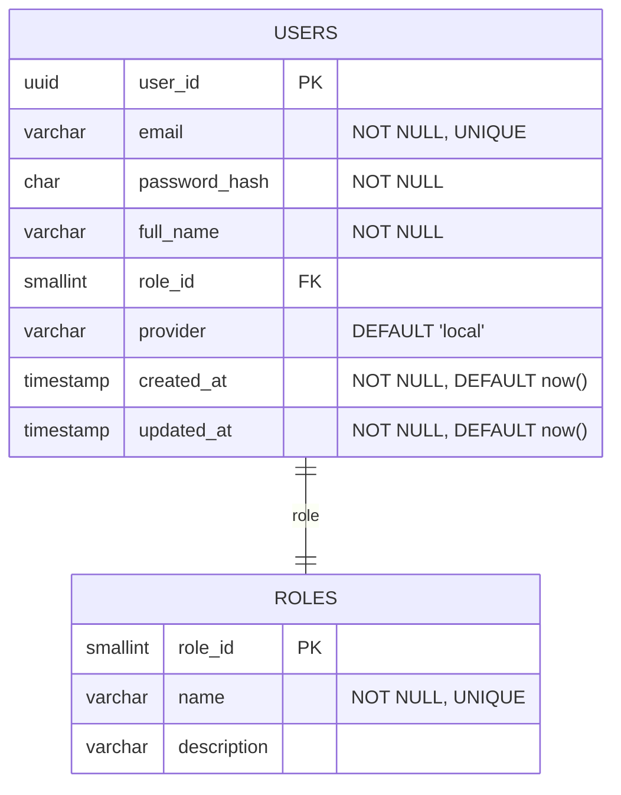
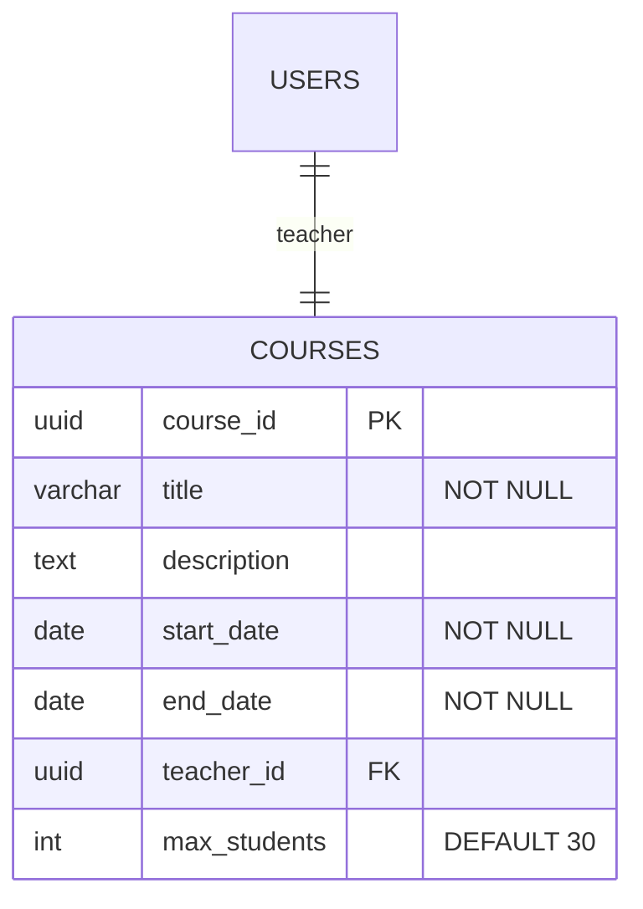
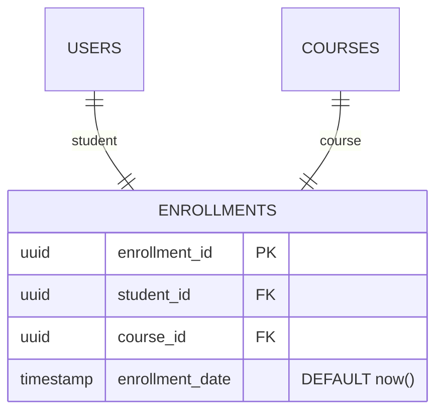
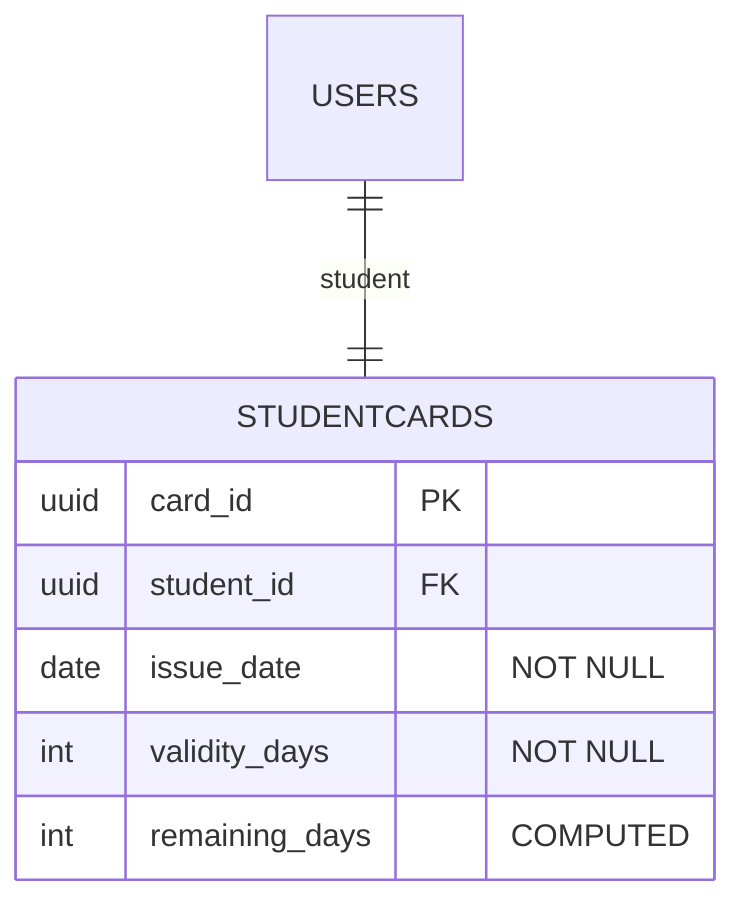
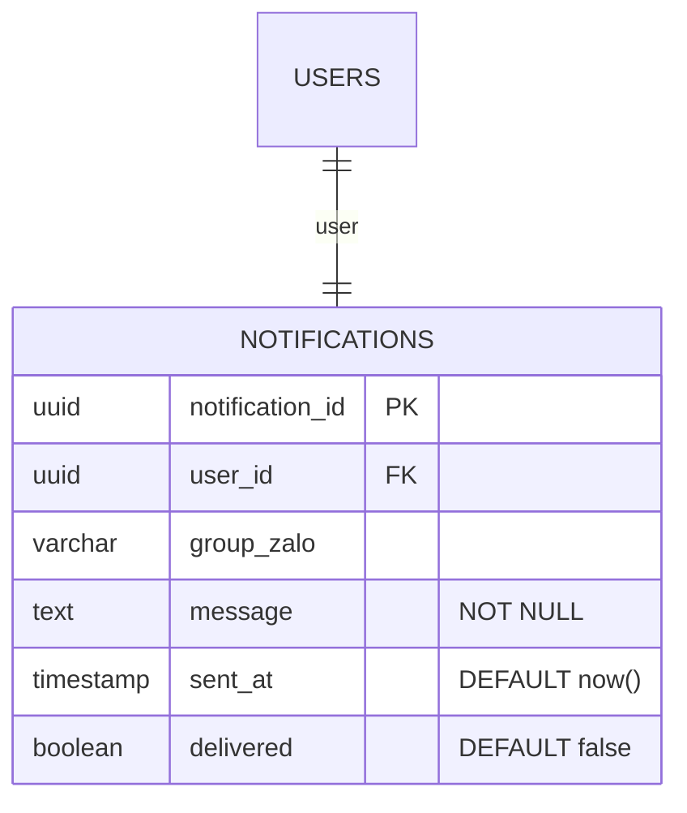
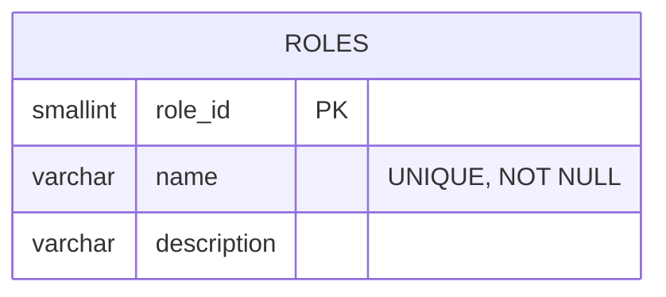
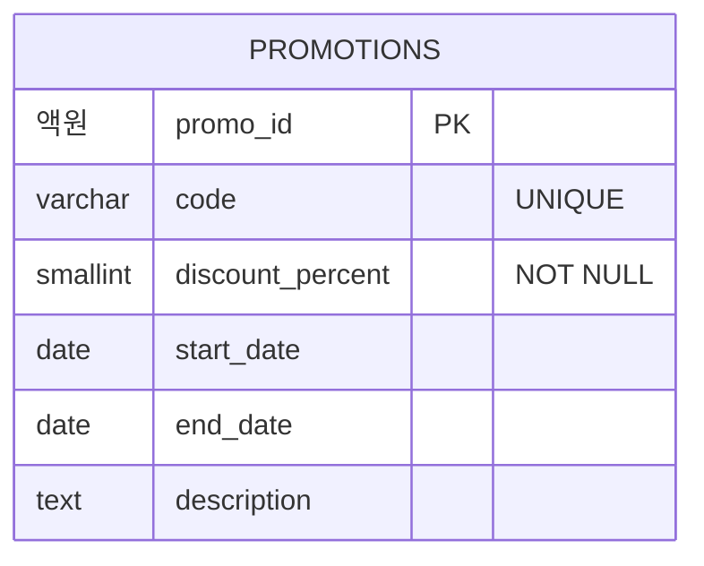
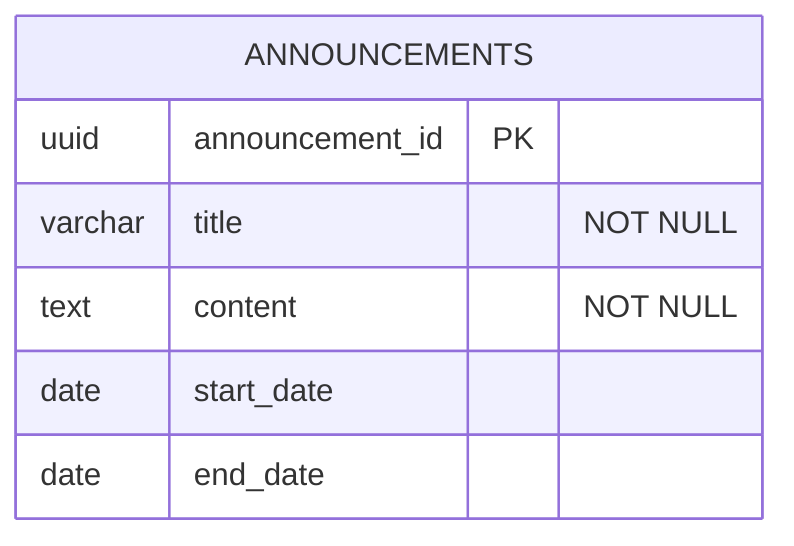
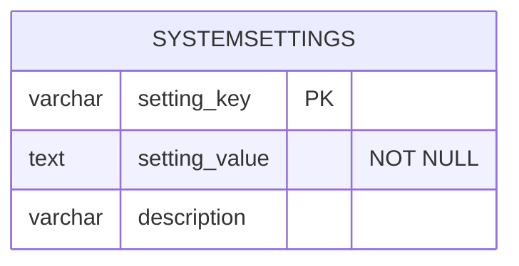

# SOFTWARE REQUIREMENTS SPECIFICATION: membership-hub

## 1. PROJECT OVERVIEW & GLOBAL ARCHITECTURE

- **Product Objectives & Core Values**  
  - Cung cấp nền tảng thống nhất cho quản lý thành viên đa trung tâm.  
  - Bảo đảm theo dõi điểm danh thời gian thực bằng mã QR.  
  - Cung cấp thẻ thành viên kỹ thuật số có tính năng đếm ngày hợp lệ.  
  - Hỗ trợ giao tiếp đa kênh (web, mobile, nhóm Zalo).  
  - Giá trị cốt lõi: tin cậy, mở zajedno, an ninh, thân thiện, Thumb/ đa ngôn ngữ.

- **Target User Personas**  
  - System Admin (quản trị viên toàn cục)  
  - Center Admin (quản lý trung tâm)  
  - Manager (sub‑admin, quyền hạn hạn chế)  
  - Teacher (chỉ đọc lịch học)  
  - Student (khảo sát, đăng ký, xem thẻ)  
  - Mobile App User (cùng các vai trò, giao diện đáp ứng)

- **Global Role-Based Access Control (RBAC) Matrix**  
  - **[ARC-001]** System Admin: toàn quyền trên mọi trung tâm.  
  - **[ARC-002]** Center Admin: toàn quyền trong trung tâm của họ, không ảnh hưởng tới trung tâm khác.  
  - **[ARC-003]** Manager: tạo thông báo, quản lý sinh viên, gắn sinh viên vào khoá học, xem danh sách khoá học, không sửa khoá học hay gán giáo viên.  
  - **[ARC-004]** Teacher: xem khoá học của mình, danh sách sinh viên, lịch trình; chỉ đọc.  
  - **[ARC-005]** Student: duyệt khoá học, đăng ký khoá học mới, xem thẻ thành viên (ngày còn lại), gia hạn thẻ.

- **Global Tech Stack Constraints & Infrastructure Blueprint**  
  - **[ARC-006]** Authentication Flow: email/password, Firebase, Google, Facebook OAuth2; JWT 15‑phút, refresh token.  
  - **[ARC-007]** Attendance QR Processing Flow: mobile scan → backend; idempotent attendance record.  
  - **[ARC-008]** Notification Delivery Flow: push tới mobile, đăng bài vào nhóm Zalo; các thành viên nhận thông báo.  
  - **[ARC-009]** Mobile App Backend Integration Flow: Next.js frontend, REST API, bearer token, offline caching.

---

## 2. ENHANCED EPIC MODULES

### 2.1 User Management

#### [REQ-001] User Registration  
Nhận email, mật khẩu và tùy chọn giao dịch tài khoản.

**Acceptance Criteria**
```gherkin
Given a prospective user submits email, password, terms
When the registration form is posted
Then the system validates input, creates a User record with role 'Student', returns success with JWT
```

#### [REQ-002] Social Authentication  
Đăng nhập/đăng ký qua Firebase, Google, Facebook.

**Acceptance Criteria**
```gherkin
Given a user selects a social provider
When the provider returns an OAuth2 code
Then the system exchanges code for profile, creates/updates User, issues JWT
```

#### [REQ-003] User Role Assignment  
Thay đổi vai trò người dùng.

**Acceptance Criteria**
```gherkin
Given an admin selects a user and a new role
When the role is confirmed
Then the User.role_id is updated, audit log recorded
```

---

### 2.2 Center Management

#### [REQ-004] Center List View  
Hiển thị danh sách trung tâm.

**Acceptance Criteria**
```gherkin
Given an authenticated user requests Centers
When the request completes
Then a table of Name, Address, TaxID, AdminContact is returned
```

#### [REQ-005] Center Create/Update/Delete  
Quản lý thông tin trung tâm.

**Acceptance Criteria**
```gherkin
Given a System Admin provides center details
When the save action is executed
Then the center is persisted; duplicate TaxID returns conflict
```

#### [REQ-006] Center Admin Assignment  
Gán/huỷ Center Admin.

**Acceptance Criteria**
```gherkin
Given a System Admin selects a user and center
When assign is confirmed
Then the User.role_id becomes 'Center Admin', center_id recorded; unassign reverses
```

---

### 2.3 Course Management

#### [REQ-007] Course List View  
Hiển thị danh sách khoá học.

**Acceptance Criteria**
```gherkin
Given a user visits Courses page
When the request completes
Then a grid of CourseID, Title, StartDate, EndDate, TeacherName is displayed
```

#### [REQ-008] Course Create/Update/Delete (Conflict Avoidance)  
Thêm/ sửa/ xoá khoá học với kiểm tra lịch trùng.

**Acceptance Criteria**
```gherkin
Given an admin provides CourseTitle, StartDate, EndDate, TeacherID
When the save action triggers
Then the system validates no teacher overlap; on conflict returns error; else persists
```

#### [REQ-009] Teacher Assignment to Course  
Gán/huỷ giáo viên cho khoá học.

**Acceptance Criteria**
```gherkin
Given an admin selects a course and teacher
When assign is executed
Then CourseTeacher mapping created, notification enqueued; unassign removes mapping
```

---

### 2.4 Student Enrollment & Registration

#### [REQ-010] Course Browse  
Duyệt khoá học còn trống.

**Acceptance Criteria**
```gherkin
Given a Student navigates Browse Courses
When request completes
Then list of courses with capacity and schedule excluding already enrolled shown
```

#### [REQ-011] Student Course Registration  
Đăng ký khoá học, tạo tài khoản nếu chưa có.

**Acceptance Criteria**
```gherkin
Given a Student selects a course
When backend processes request
Then Enrollment record created; if Student has no account, create with role 'Student'; notification queued
```

---

### 2.5 Attendance & QR Scanning

#### [REQ-012] QR Attendance Capture  
Quét mã QR œuvres.

**Acceptance Criteria**
```gherkin
Given a Student scans QR, confirms attendance
When API receives payload
Then system validates enrollment, creates Attendance record, returns success; duplicate on same day ignored
```

#### [REQ-013] Attendance Idempotency  
Kiểm tra trùng lặp.

**Acceptance Criteria**
```gherkin
Given a student scans QR twice within a minute
When both requests processed
Then only one Attendance row; subsequent returns success with ‘duplicate’ flag
```

---

### 2.6 Student Card Management

#### [REQ-014] Card Validity Display  
Hiển thị thẻ thành viên.

**Acceptance Criteria**
```gherkin
Given a Student opens Card page
When data loads
Then UI shows total validity days, days used, days remaining derived from StudentCard
```

#### [REQ-015] Card Renewal  
Gia hạn thẻ bằng phí.

**Acceptance Criteria**
```gherkin
Given a Student selects renewal period
When payment confirmed
Then StudentCard.EndDate updated; confirmation notification sent
```

---

### 2.7 Notifications & Communications

#### [REQ-016] Notification Trigger  
Tự động gửi thông báo khi hành động.

**Acceptance Criteria**
```gherkin
Given an admin creates announcement, assigns teacher, or registers student
When action saved
Then Notification record created, push queued, Zalo message sent
```

---

### 2.8 Promotions & Announcements Management

#### [REQ-017] Promotion Management  
Tạo, sửa, xoá khuyến mãi.

**Acceptance Criteria**
```gherkin
Given an admin provides PromotionName, description, conditions, start/end dates
When saved
Then promotion appears for students; omit endDate → perpetual
```

#### [REQ-018] Announcement Management  
Tạo, sửa, xoá thông báo.

**Acceptance Criteria**
```gherkin
Given an admin inputs AnnouncementTitle, content, optional expiry
When saved
Then announcement displayed site‑wide; auto‑disappear after expiry
```

---

### 2.9 AI Customer Service Chatbot

#### [REQ-019] AI Chatbot Integration  
Trả lời câu hỏi người dùng.

**Acceptance Criteria**
```gherkin
Given a user asks a question via chat widget
When processed
Then AI returns answer or escalates to human support if confidence low
```

---

### 2.10 Mobile App Core Features

#### [REQ-020] Mobile App Role‑Specific UI  
Hiển thị giao diện phù hợp.

**Acceptance Criteria**
```gherkin
Given a user logs in on Android/iOS
When app loads
Then navigation menu and screens displayed per role
```

#### [REQ-021] Mobile Push Notifications  
Gửi tin nhắn tới thiết bị.

**Acceptance Criteria**
```gherkin
Given a backend event triggers push
When device token registered
Then notification delivered via FCM/APNs
```

---

### 2.11 Localization & SEO

#### [REQ-022] Default Locale Detection  
Chọn ngôn ngữ dựa vào lịch sử.

**Acceptance Criteria**
```gherkin
Given a user visits site
When system evaluates locale
Then selects stored language or Accept‑Language header; UI updated
```

#### [REQ-023] Multi‑Language SEO  
Hỗ trợ SEO cho 3 ngôn ngữ.

**Acceptance Criteria**
```gherkin
Given a page requested with locale
When rendered
Then.At `<html lang='en'>` and hreflang links present
```

---

### 2.12 Reporting & Analytics

#### [REQ-024] Attendance Report Generation  
Xuất báo cáo CSV.

**Acceptance Criteria**
```gherkin
Given an admin selects center and date range
When report requested
Then CSV produced with StudentName, CourseName, AttendanceDate, Status
```

#### [REQ-025] Enrollment Summary Dashboard  
Hiển thị tổng quan theo thời gian thực.

**Acceptance Criteria**
```gherkin
Given an admin opens dashboard
When data refreshes
Then cards show totalStudents, activeCourses, upcomingSessions (next 7 days)
```

---

## 3. EXCEPTION FLOWS & EDGE CASES

- **[EXC-001]** Network & Connectivity Drops During QR Scan  
  - Nếu student scan QR nhưng mạng offline, khi app retry khi reconnect, attendance được ghi sau khi service reachable.

- **[EXC-002]** Duplicate Attendance Submission  
  - Nếu cùng student scan QR nhiều lần cùng ngày, khi hệ thống phát hiện trùng, trả về success với ‘already recorded’, không tạo thêm hàng.

- **[EXC-003]** Failed Notification Delivery  
  - Nếu push không được deliver (token invalid), system logs, retry up to 3 lần, rồi đánh dấu fail.

- **[EXC-004]** Invalid Input問題  
  - Nếu validation fail form, khi trả về lỗi, thông báo rõ field invalid và yêu cầu chỉnh sửa.

- **[EXC-005]** System Recovery After Outage  
  - Nếu service offline, khi phục hồi, các attendance scan pending được xử lý FIFO, người dùng nhận thông báo recover.

---

## 4. GLOBAL NON-FUNCTIONAL REQUIREMENTS

- **[NFR-001]** Performance Metrics  
  - API responses (auth, attendance, course list) ≤ 200 ms avg; DB reads sub‑second for 10 000 concurrent users.

- **[NFR-002]** Availability  
  - 99.9 % uptime; SLA: auto failover across GKE clusters.

- **[NFR-003]** Security  
  - TLS 1.3; AES‑256 at rest; JWT 15 min, refresh 7 day; OWASP Top 10 mitigations.

- **[NFR-004]** Scalability & Availability  
  - Quarkus services auto‑scale via Kubernetes HPA (CPU >70 % or latency >300 ms); PostgreSQL replicas for reporting.

- **[NFR-005]** Docker Image Size  
  - Base < 200 MB; final < 500 MB.

- **[NFR-006]** Logging & Audit  
  - All actions logged with timestamp, user ID, details; retention 1 year.

- **[NFR-007]** Multi‑Language Support  
  - UI strings externalized; support English, Vietnamese, Spanish; locale switching without reload.

- **[NFR-008]** GDPR/CCPA Compliance  
  - Xóa dữ liệu theo yêu cầu; xuất dữ liệu JSON; quản lý đồng ý marketing.

- **[NFR-009]** Backup & Disaster Recovery  
  - Daily PostgreSQLCAD; PITR 24 h; GKE cluster backup to another region.

---

## 5. PRELIMINARY DATA DICTIONARY

### [DAT-001] Users
| Field | Type | Constraints |
|-------|------|-------------|
| user_id | uuid | PK |
| email | varchar | "not null, unique" |
| password_hash | char | "not null" |
| full_name | varchar | "not null" |
| role_id | smallint | FK |
| provider | varchar | "default 'local'" |
| created_at | timestamp | "not null, default now()" |
| updated_at | timestamp | "not null, default now()" |



### [DAT-002] Centers
| Field | Type | Constraints |
|-------|------|-------------|
| center_id | uuid | PK |
| name | varchar | "not null" |
| address | varchar | "not null" |
| tax_id | varchar | "unique, not null" |
| contact_phone | varchar | "optional" |
| contact_email | varchar | "optional" |

```mermaid
erDiagram
    CENTERS {
        uuid center_id PK
        varchar name "NOT NULL"
        varchar address "NOT NULL"
        varchar tax_id "UNIQUE, NOT NULL"
        varchar contact_phone
        varchar contact_email
    }
    USERS {
        uuid user_id PK
        smallint role_id FK
 hars
    }
```

### [DAT-003] Courses
| Field | Type | Constraints |
|-------|------|-------------|
| course_id | uuid | PK |
| title | varchar | "not null" |
| description | text | "optional" |
| start_date | date | "not null" |
| end_date | date | "not null" |
| teacher_id | uuid | FK |
| max_students | int | "default 30 Línea" |



### [DAT-004] Enrollments
| Field | Type | Constraints |
|-------|------|-------------|
| enrollment_id | uuid | PK |
| student_id | uuid | FK |
| course_id | uuid | FK |
| enrollment_date | timestamp | "default now()" |



### [DAT-005] Attendance
| Field | Type | Constraints |
|-------|------|-------------|
| attendance_id | uuid | PK |
| student_id | uuid | FK |
| course_id | uuid | FK |
| attendance_date | date | "not null" |
| timestamp | timestamp | "default now()" |

```mermaid
erDiagram
    ATTENDANCE {
        uuid attendance_id PK
        uuid student_id FK
        uuid course_id FK
        date attendance_date "NOT NULL"
        timestamp timestamp "DEFAULT now()"
    }
    USERS ||ORM--|| ATTENDANCE : student
    COURSES ||ORM--|| ATTENDANCE : course
```

### [DAT-006] StudentCards
| Field | Type | Constraints |
|-------|------|-------------|
| card_id | uuid | PK |
| student_id | uuid | FK |
| issue_date | date | "not null" |
| validity_days | int | "not null" |
| remaining_days | int | "computed" |



### [DAT-007] Notifications
| Field | Type | Constraints |
|-------|------|-------------|
| notification_id | uuid | PK |
| user_id | uuid | FK, optional |
| വകുപ്പ്_zalo | varchar | "optional" |
| message | text | "not null" |
| sent_at | timestamp | "default now()" |
| delivered | boolean | "default false" |



### [DAT-008] Roles
| Field | Type | Constraints |
|-------|------|-------------|
| role_id | smallint | PK |
| name | varchar | "unique, not null" |
| description | varchar | "optional" |



### [DAT-009] Promotions
| Field | Type | Constraints |
|-------|------|-------------|
| promo_id | uuid | PK |
| code | varchar | "unique" |
| discount_percent | smallint | "not null" |
| start_date | date | "optional" |
| end_date | date | "optional" |
| description | text | "optional" |



### [DAT-010] Announcements
| Field | Type | Constraints |
|-------|------|-------------|
| announcement_id | uuid | PK |
| title | varchar | "not null" |
| content | text | "not null" |
| start_date | date | "optional" |
| end_date | date | "optional" |



### [DAT-011] SystemSettings
| Field | Type | Constraints |
|-------|------|-------------|
| setting_key | varchar | PK |
| setting_value | text | "not null" |
| description | varchar | "optional" |



---